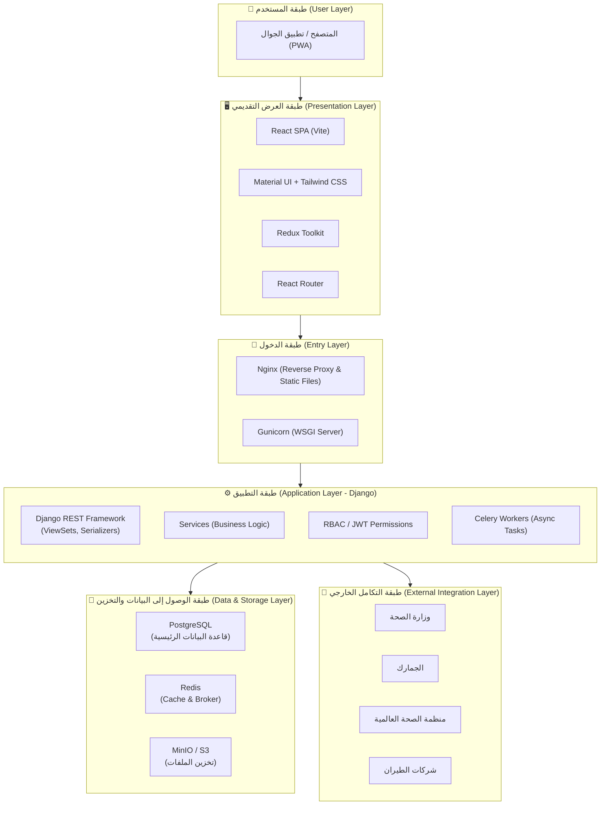
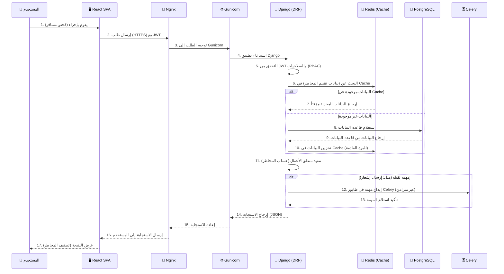

---

## 📄 `Architecture_Layers.md` (طبقات العمارة - المُحدّثة)

```markdown
# طبقات العمارة (Architecture Layers) - NQP

## 1. مقدمة
تم تصميم منصة الحجر الصحي القومي (NQP) وفق نموذج العمارة متعددة الطبقات (Multi-Layered Architecture)، حيث يتم فصل المسؤوليات بشكل واضح بين (العرض التقديمي، منطق الأعمال، الوصول إلى البيانات، والتكامل الخارجي). يضمن هذا الفصل قابلية الصيانة (Maintainability)، التوسع الأفقي (Horizontal Scalability)، والأمان. يعكس المخطط التالي التسلسل الهرمي لطبقات النظام والتفاعل بينها.



---

## 2. طبقة العرض التقديمي (Presentation Layer)

المسؤولية: واجهة المستخدم النهائية التي يتفاعل معها المستخدمون (المسافرين، الموظفين، الأطباء، الإدارة). تتواصل هذه الطبقة مع الخادم الخلفي عبر واجهات (REST APIs).

- التقنيات:
  - React 19: إطار العمل الأساسي لبناء واجهات المستخدم التفاعلية.
  - TypeScript: يضمن كتابة كود آمن وخالٍ من الأخطاء الشائعة.
  - Vite: أداة البناء السريعة لتطوير واجهات المستخدم.
  - React Router: إدارة التنقل بين صفحات التطبيق المختلفة.
  - Redux Toolkit: إدارة الحالة العالمية (مثل: بيانات المستخدم، إعدادات التطبيق، بيانات الجلسة).
  - React Hook Form + Zod: إدارة النماذج المعقدة والتحقق من صحة المدخلات (مثل: نموذج الفحص الصحي، نموذج التسجيل).
  - Material UI (MUI) + Tailwind CSS: بناء المكونات الأساسية (أزرار، حقول، بطاقات) وتنسيقها بسرعة وبشكل موحد.
  - Axios: استدعاء واجهات (APIs) الخلفية مع دعم (Interceptors) لإدارة (JWT) وإعادة المحاولة.
  - AG Grid: عرض الجداول الضخمة (مثل: قوائم المسافرين، الرحلات، الشحنات) مع دعم الفرز والتصفية.
  - Recharts: تقديم البيانات الإحصائية في لوحات القيادة (KPIs) كرسوم بيانية تفاعلية.
  - React Toastify: إظهار إشعارات فورية (نجاح، خطأ، تحذير) للمستخدم.
  - Vite PWA Plugin: تحويل التطبيق إلى (Progressive Web App) لدعم العمل دون اتصال (خاصة لتطبيق المتابعة الصحية).

---

## 3. طبقة الدخول (Entry / Gateway Layer)

المسؤولية: استقبال طلبات المستخدمين، توزيعها على الخادم الخلفي، تقديم الملفات الثابتة (Static/Media)، وإدارة (SSL/TLS).

- التقنيات:
  - Nginx (خادم الويب):
    - يعمل كـ (Reverse Proxy) لتوجيه الطلبات إلى (Gunicorn) أو إلى الملفات الثابتة.
    - يقدم (Static files) الخاصة بـ Django و (Build files) الخاصة بـ React مباشرة لتخفيف الحمل عن الخادم الخلفي.
    - يدير شهادات (SSL/TLS) لتأمين الاتصالات عبر (HTTPS).
    - يقوم بتوزيع الحمل (Load Balancing) إذا تم تشغيل نسخ متعددة من الخادم الخلفي.
  - Gunicorn (خادم التطبيقات WSGI):
    - خادم (WSGI) عالي الأداء لتشغيل تطبيق Django.
    - يدير (Worker Processes) للتعامل مع الطلبات المتزامنة بكفاءة.

---

## 4. طبقة التطبيق (Application Layer - Django)

المسؤولية: قلب المنصة، حيث يتم تنفيذ جميع منطق الأعمال (Business Logic)، ومعالجة الطلبات، والتحقق من الصلاحيات، وإدارة الجلسات. تتكون هذه الطبقة من عدة مكونات فرعية.

### 4.1. واجهة API (Django REST Framework)
- وحدات التحكم (ViewSets): استقبال طلبات HTTP (GET, POST, PUT, DELETE) وتوجيهها إلى الخدمات المناسبة.
- الـ Serializers: تحويل البيانات بين كائنات (Python) و (JSON) مع التحقق من صحة المدخلات.
- الـ Permissions: تطبيق نظام (RBAC - Role-Based Access Control) على مستوى كل نقطة نهاية.
- المصادقة (JWT): التحقق من هوية المستخدم عبر (Access Tokens) و (Refresh Tokens) باستخدام `djangorestframework-simplejwt`.

### 4.2. طبقة الخدمات (Services)
- خدمات الأعمال: دوال (Python) تحتوي على المنطق الأساسي للمنصة (مثل: حساب درجة المخاطر، معالجة قوائم الركاب، إصدار شهادات التعافي).
- فصل المسؤوليات: يتم فصل منطق الأعمال عن وحدات التحكم لتسهيل الصيانة وإعادة الاستخدام.

### 4.3. المهام غير المتزامنة (Celery)
- Celery Workers: تنفيذ المهام الثقيلة في الخلفية (مثل: معالجة قوائم الركاب الكبيرة، إرسال الإشعارات الجماعية، توليد التقارير الوطنية) دون تعطيل استجابة واجهات API.
- Celery Beat: جدولة المهام الدورية (مثل: مزامنة ICD-11، إرسال التقارير اليومية لوزارة الصحة، تذكيرات المتابعة الصحية).

---

## 5. طبقة الوصول إلى البيانات والتخزين (Data & Storage Layer)

المسؤولية: تخزين واسترجاع البيانات بشكل دائم، وإدارة التخزين المؤقت (Caching)، وتخزين الملفات المرفوعة.

### 5.1. قاعدة البيانات الرئيسية (PostgreSQL)
- التخزين الدائم: جميع البيانات الأساسية للمنصة (المسافرين، الفحوصات، السجلات الطبية، العينات، الشحنات الغذائية، المستخدمين، الصلاحيات).
- الميزات: الاستفادة من (JSONB) لتخزين البيانات غير المنتظمة، واستخدام (Indexes) و (Partitions) لتحسين أداء الاستعلامات.

### 5.2. التخزين المؤقت والرسائل (Redis)
- التخزين المؤقت (Cache): تخزين البيانات الأكثر طلباً (مثل: تصنيفات الدول، تعريفات الأمراض، نتائج تقييم المخاطر المتكررة) لتقليل الضغط على قاعدة البيانات وتحسين سرعة الاستجابة.
- طابور الرسائل (Broker): يعمل كـ (Broker) لـ Celery لإدارة طلبات المهام غير المتزامنة بين (Django) و (Workers).

### 5.3. تخزين الملفات (MinIO / S3)
- تخزين المستندات: جميع الملفات المرفوعة (صور جوازات السفر، شهادات التطعيم، الصور الطبية، شهادات الإفراج الغذائي، التقارير المصدرة بصيغة PDF).
- التقنيات: استخدام (MinIO) في بيئات التطوير/الاختبار و (Amazon S3) في بيئة الإنتاج.

---

## 6. طبقة التكامل الخارجي (External Integration Layer)

المسؤولية: تبادل البيانات مع الأنظمة الخارجية بشكل آمن وموثوق.

- وزارة الصحة (MoH): إرسال التقارير الوطنية (الفحوصات، الحالات، الإشغال) واستقبال تحديثات السياسات الصحية.
- الجمارك (Customs): إرسال شهادات الإفراج الصحي للشحنات الغذائية واستقبال تحديثات حالة الشحنات.
- منظمة الصحة العالمية (WHO): إرسال تقارير (IHR) و (PHEIC)، ومزامنة تحديثات (ICD-11).
- شركات الطيران (Airlines): استقبال قوائم الركاب (Passenger Manifest) وتحديثات جداول الرحلات.
- الاتصال: يتم عبر (REST APIs) مع (JWT) أو (API Keys)، واستخدام (Webhooks/SFTP) للتقارير الدورية.

---

## 7. الطبقات الشاملة / المشتركة (Cross-Cutting Layers)

المسؤولية: خدمات تدعم جميع الطبقات السابقة.

### 7.1. الأمن والصلاحيات (Security & Authorization)
- JWT: مصادقة جميع طلبات الـ API.
- RBAC: إدارة الصلاحيات بدقة لكل دور (Super Admin, Federal Admin, Port Officer, Doctor, Lab Tech, إلخ).
- CORS: السماح فقط للنطاقات (Domains) المسموح بها بالوصول إلى الـ API.

### 7.2. سجل التدقيق (Audit Logging)
- التسجيل: تسجيل جميع العمليات الحيوية (من قام، متى، ماذا فعل) في قاعدة بيانات منفصلة (جدول `audit_logs`).
- المسؤولية: تتبع الأنشطة لأغراض المراجعة والتحقيق الأمني.

### 7.3. المراقبة والتسجيل (Monitoring & Logging)
- مراقبة الأداء: استخدام (Prometheus + Grafana) لمراقبة (CPU، الذاكرة، عدد الطلبات، زمن الاستجابة).
- تسجيل الأخطاء: جمع جميع سجلات (Logs) من (Django، Gunicorn، Nginx، Celery) عبر (ELK Stack) لسهولة التصحيح والتحليل.

---

## 8. تفاعل الطبقات (Layer Interaction Flow)

يُظهر المخطط التالي رحلة الطلب النموذجية من المستخدم إلى قاعدة البيانات والعودة:



---

## 9. ملخص تقنيات كل طبقة (Technology Summary)

| الطبقة (Layer) | التقنيات (Technologies) |
| :--- | :--- |
| العرض التقديمي (Presentation) | React 19, TypeScript, Vite, Redux Toolkit, React Hook Form, Zod, Material UI, Tailwind CSS, AG Grid, Recharts, React Toastify, Vite PWA. |
| الدخول (Entry) | Nginx, Gunicorn. |
| التطبيق (Application) | Django 4.2+, Django REST Framework, Celery, Celery Beat. |
| البيانات والتخزين (Data & Storage) | PostgreSQL 16+, Redis 7+, MinIO / Amazon S3. |
| التكامل الخارجي (External) | REST APIs, Webhooks, SFTP, JWT, API Keys. |
| الشاملة (Cross-Cutting) | Prometheus, Grafana, ELK Stack, Sentry. |

---

تم تحديث ملف `Architecture_Layers.md` بنجاح ليتوافق تماماً مع التقنيات الجديدة ويقدم نظرة متكاملة لطبقات النظام.

هل ترغب في تحديث ملف `System_Overview.md` أو `Security_Architecture.md` أيضاً؟ أخبرني.