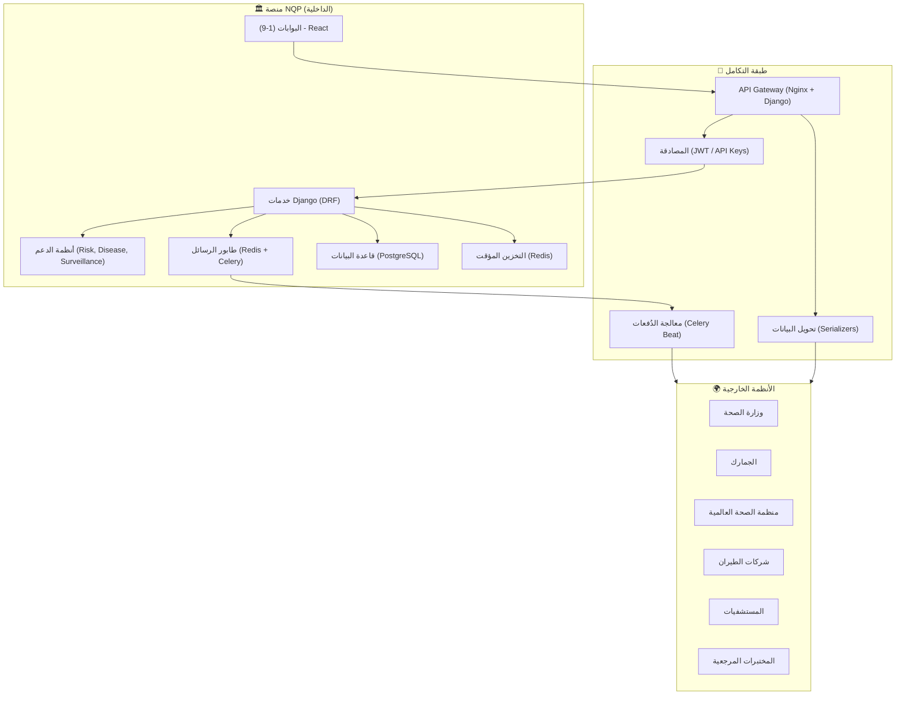
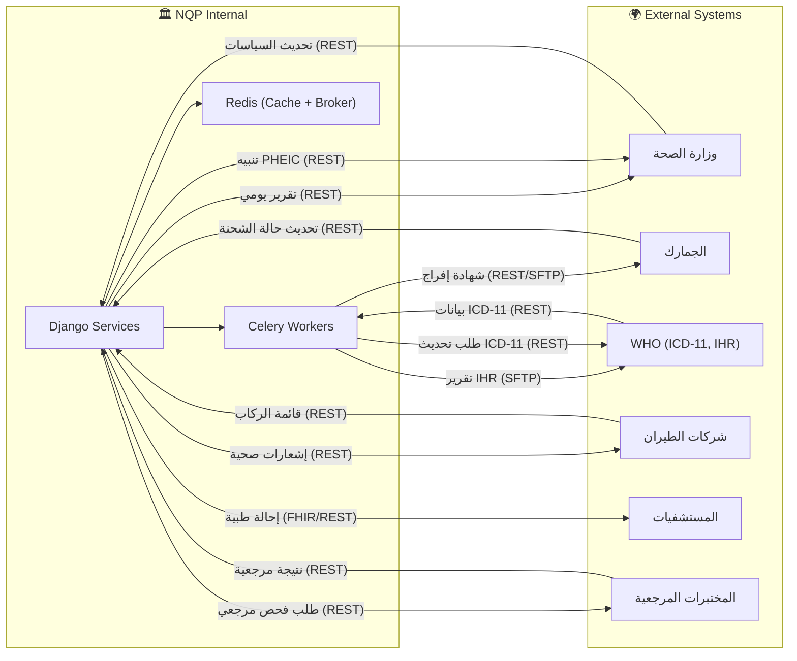

بالتأكيد! سأقوم بتحديث ملف **`Integration_Architecture.md`** ليعكس عمارة التكامل المتقدمة والمحدثة للمنصة مع مجموعة التقنيات الجديدة، مع التركيز على كيفية تبادل البيانات بين المكونات الداخلية والأنظمة الخارجية بشكل آمن وفعال.

---

## 📄 `Integration_Architecture.md` (عمارة التكامل - المُحدّثة)

```markdown
# عمارة التكامل (Integration Architecture) - NQP

## 1. مقدمة
توضح هذه الوثيقة كيفية تبادل البيانات بين مكونات منصة NQP الداخلية (البوابات، أنظمة الدعم، قاعدة البيانات) والأنظمة الخارجية (وزارة الصحة، الجمارك، منظمة الصحة العالمية، شركات الطيران، المستشفيات). تعتمد العمارة على مجموعة من الأنماط المعمارية (Integration Patterns) لضمان **المرونة (Flexibility)**، **قابلية التوسع (Scalability)**، **الأمان (Security)**، و **الموثوقية (Reliability)** في نقل البيانات.



---

## 2. أنماط التكامل المستخدمة (Integration Patterns)

| النمط (Pattern) | الوصف | مكان الاستخدام في NQP | التقنية المستخدمة |
| :--- | :--- | :--- | :--- |
| **طلب/استجابة (Request/Response)** | اتصال متزامن حيث ينتظر العميل رداً من الخادم. | تسجيل الدخول، استعلام البيانات الأساسية، عمليات الفحص والتقييم. | REST APIs (Django REST Framework) عبر HTTPS. |
| **أحداث/رسائل (Event/Message)** | اتصال غير متزامن حيث يقوم أحد المكونات بنشر حدث دون انتظار رد. | معالجة قوائم الركاب (Manifest)، إرسال الإشعارات الجماعية، توليد التقارير الثقيلة. | Celery + Redis (Broker). |
| **البث المباشر (WebSocket)** | اتصال ثنائي الاتجاه لحظي (Persistent Connection). | لوحات التحكم الحية لغرفة الطوارئ (EOC)، تحديث حالة المسافرين، التنبيهات الفورية. | Django Channels (WebSocket). |
| **الدفعات (Batch/ETL)** | نقل كميات كبيرة من البيانات في فترات زمنية محددة. | تقارير الترصد الوبائي الليلية لوزارة الصحة، مزامنة ICD-11 مع WHO. | Celery Beat (جدولة) + SFTP / REST API. |
| **مشاركة الملفات (File Sharing)** | نقل ملفات كبيرة (PDF، Excel، صور) بين الأنظمة. | شهادات الإفراج الغذائي للجمارك، تقارير PDF، صور المستندات. | MinIO / S3 (مع Signed URLs). |

---

## 3. التكامل الداخلي (Internal Integration)

### 3.1. البوابات (Frontend) ←→ الخادم الخلفي (Backend)
- **البروتوكول**: HTTPS (REST API) مع JSON.
- **المصادقة**: JWT (Bearer Token) يتم إرساله في (Authorization Header).
- **التوثيق**: OpenAPI (Swagger) عبر `drf-spectacular` لجميع نقاط النهاية.
- **آلية العمل**:
  1.  تطبيق React (Vite) يرسل طلباً إلى Nginx.
  2.  Nginx يقوم بتوجيه الطلب إلى Gunicorn (خادم WSGI).
  3.  Gunicorn يستدعي تطبيق Django.
  4.  Django يتحقق من صحة JWT والصلاحيات (RBAC).
  5.  يتم تنفيذ منطق الأعمال وإرجاع الاستجابة (JSON).

### 3.2. الخادم الخلفي (Django) ←→ قاعدة البيانات (PostgreSQL)
- **البروتوكول**: TCP/IP (مع SSL/TLS في الإنتاج).
- **التقنية**: Django ORM (مع تحسين الاستعلامات باستخدام `select_related` و `prefetch_related`).
- **التخزين المؤقت**: استخدام Redis لتخزين نتائج الاستعلامات المتكررة (مثل: تصنيفات الدول، تعريفات الأمراض).
- **آلية العمل**:
  1.  Django Service يستدعي ORM لتنفيذ استعلام.
  2.  قبل تنفيذ الاستعلام، يتم التحقق من وجود البيانات في Redis Cache.
  3.  إذا كانت موجودة، يتم إرجاعها مباشرة (توفير زمن الاستجابة).
  4.  إذا لم تكن موجودة، يتم تنفيذ الاستعلام على PostgreSQL، وتخزين النتيجة في Redis مع (TTL).

### 3.3. الخادم الخلفي (Django) ←→ المهام الخلفية (Celery)
- **البروتوكول**: AMQP (Advanced Message Queuing Protocol) عبر Redis (Broker).
- **التقنية**: Celery (مع Celery Beat للجدولة).
- **المهام النموذجية**:
  - `process_passenger_manifest`: معالجة قوائم الركاب الكبيرة.
  - `send_mass_notifications`: إرسال إشعارات جماعية (SMS/Push/Email).
  - `generate_national_report`: توليد التقارير الوطنية الثقيلة.
  - `sync_icd11_codes`: مزامنة ICD-11 مع WHO.
  - `send_daily_report_to_moh`: إرسال التقرير اليومي لوزارة الصحة.
- **آلية العمل**:
  1.  يقوم Django Service بإيداع مهمة في طابور Celery (Redis).
  2.  يقوم Celery Worker بسحب المهمة وتنفيذها في الخلفية.
  3.  يتم تسجيل حالة المهمة (نجاح/فشل) في قاعدة البيانات.
  4.  في حال الفشل، يتم إعادة المحاولة (Retry) مع فترات متزايدة (1 دقيقة، 5 دقائق، 30 دقيقة).

---

## 4. التكامل الخارجي (External Integration)

### 4.1. مصفوفة التكامل (Integration Matrix)

| النظام الخارجي | نوع التكامل | اتجاه التدفق | البيانات المتبادلة | البروتوكول | التنسيق | التوقيت |
| :--- | :--- | :--- | :--- | :--- | :--- | :--- |
| **وزارة الصحة (MoH)** | REST API | ثنائي (Two-way) | التقارير الوطنية، التنبيهات، تحديث السياسات. | HTTPS | JSON | يومي/فوري |
| **الجمارك (Customs)** | REST API / SFTP | صادر (Outbound) | شهادات الإفراج الصحي، تحديث حالة الشحنات. | HTTPS / SFTP | JSON / PDF | عند الطلب |
| **منظمة الصحة العالمية (WHO)** | REST API | وارد (Inbound) | تحديثات ICD-11، تصنيفات الدول. | HTTPS | JSON | يومي |
| **منظمة الصحة العالمية (WHO)** | SFTP / Webhook | صادر (Outbound) | تقارير IHR، تقارير PHEIC. | SFTP / HTTPS | XML / JSON | أسبوعي/فوري |
| **شركات الطيران (Airlines)** | REST API | وارد (Inbound) | قوائم الركاب (Manifest)، جداول الرحلات. | HTTPS | JSON / CSV | قبل 24 ساعة من الوصول |
| **شركات الطيران (Airlines)** | REST API | صادر (Outbound) | الإشعارات الصحية، تأكيد الاستلام. | HTTPS | JSON | عند التغيير |
| **المستشفيات (Hospitals)** | REST API | صادر (Outbound) | إحالات طبية (بيانات المريض، التشخيص، الفحوصات). | HTTPS | JSON (FHIR) | عند الطلب |
| **المختبرات المرجعية** | REST API | ثنائي (Two-way) | طلبات الفحوصات المرجعية، النتائج المعتمدة. | HTTPS | JSON | عند الطلب |
| **الجوازات والهجرة** | REST API | وارد (Inbound) | التحقق من صحة جوازات السفر. | HTTPS | JSON | فوري (متزامن) |
| **هيئة المواصفات** | REST API | وارد (Inbound) | المواصفات القياسية للمنتجات الغذائية. | HTTPS | JSON | عند الطلب |

---

## 5. تفاصيل التكامل مع الأنظمة الخارجية

### 5.1. وزارة الصحة (MoH)

**نوع التكامل**: REST API (ثنائي الاتجاه)

**التدفقات**:
1.  **من NQP إلى MoH**:
    - التقرير اليومي (الفحوصات، الحالات، الإشغال) - يُرسل عبر Celery Beat كل يوم الساعة 6 صباحاً.
    - التنبيهات الفورية (حالات PHEIC) - تُرسل فوراً عبر REST API.
    - تقارير الأداء الشهرية (KPIs).
2.  **من MoH إلى NQP**:
    - تحديث تعريفات الأمراض والبروتوكولات.
    - تحديث قوائم الدول الموبوءة ومتطلبات الحجر.
    - أوامر تعليق/استئناف الرحلات.

**المصادقة**: مفتاح API (`X-API-Key`) يُدار عبر Django Admin.

**نموذج التقرير اليومي**:
```json
{
  "report_date": "2024-07-26",
  "total_screenings": 1540,
  "positive_cases": 12,
  "occupancy_rate": 68.5,
  "ports": [
    {
      "port_code": "KRT",
      "name": "مطار الخرطوم",
      "screenings": 850,
      "positive": 8
    }
  ]
}
```

---

### 5.2. الجمارك (Customs)

**نوع التكامل**: REST API + SFTP (صادر)

**التدفقات**:
1.  **من NQP إلى الجمارك**:
    - شهادة الإفراج الصحي للشحنات الغذائية (PDF + JSON) تُرسل فور إصدارها عبر REST API.
    - (احتياطي) رفع الشهادة عبر SFTP في حال فشل REST API.

**المصادقة**: مفتاح API + SSH Key لـ SFTP.

**نموذج شهادة الإفراج (JSON)**:
```json
{
  "certificate_number": "FQ-2024-001",
  "manifest_number": "SHIP-2024-100",
  "supplier_name": "Global Meat Co.",
  "product_list": [
    {
      "name": "لحم بقري مجمد",
      "quantity": 1000,
      "unit": "كجم"
    }
  ],
  "release_date": "2024-07-26",
  "inspector": "أحمد محمد",
  "certificate_hash": "5d41402abc4b2a76b9719d911017c592"
}
```

---

### 5.3. منظمة الصحة العالمية (WHO)

**نوع التكامل**: REST API + SFTP (ثنائي الاتجاه)

**التدفقات**:
1.  **من NQP إلى WHO**:
    - تقارير IHR الأسبوعية (XML) تُرسل عبر SFTP كل يوم أحد الساعة 3 صباحاً.
    - تقارير PHEIC الفورية (JSON) تُرسل عبر REST API.
2.  **من WHO إلى NQP**:
    - تحديثات ICD-11 (JSON) تُجلب يومياً عبر REST API الساعة 2 صباحاً.
    - تصنيفات الدول الموبوءة (JSON).

**المصادقة**: مفتاح API + SSH Key لـ SFTP.

**نموذج تقرير IHR (XML)**:
```xml
<IHRReport xmlns="http://www.who.int/ihr/report/1.0">
    <Header>
        <Country>SDN</Country>
        <ReportingPeriod>2024-07-20 to 2024-07-26</ReportingPeriod>
    </Header>
    <Diseases>
        <Disease>
            <Code>RA01</Code>
            <Name>COVID-19</Name>
            <NewCases>45</NewCases>
        </Disease>
    </Diseases>
</IHRReport>
```

---

### 5.4. شركات الطيران (Airlines)

**نوع التكامل**: REST API (وارد بشكل أساسي)

**التدفقات**:
1.  **من Airlines إلى NQP**:
    - قائمة الركاب (Passenger Manifest) - تُرفع قبل 24 ساعة من الوصول (JSON/CSV).
    - جداول الرحلات (إضافة، تعديل، إلغاء).
2.  **من NQP إلى Airlines**:
    - الإشعارات الصحية (متطلبات دخول جديدة، تعليق رحلات).
    - تقرير التحقق من قائمة الركاب (الأخطاء، عدد الركاب المسجلين مسبقاً).

**المصادقة**: مفتاح API لكل شركة طيران.

**نموذج قائمة الركاب (JSON)**:
```json
{
  "flight_number": "KRT123",
  "carrier_code": "SUD",
  "scheduled_arrival": "2024-07-26T14:00:00Z",
  "passengers": [
    {
      "passport_number": "A1234567",
      "first_name": "Mohamed",
      "last_name": "Ahmed",
      "date_of_birth": "1990-05-15",
      "nationality_code": "SD",
      "seat_number": "12A"
    }
  ]
}
```

---

### 5.5. المستشفيات (Hospitals)

**نوع التكامل**: REST API (صادر)

**التدفقات**:
1.  **من NQP إلى المستشفى**:
    - إحالة طبية (بيانات المريض، التشخيص، الفحوصات، الخطة العلاجية) بصيغة (FHIR JSON).

**المصادقة**: مفتاح API لكل مستشفى.

**نموذج الإحالة الطبية (FHIR JSON)**:
```json
{
  "resourceType": "Bundle",
  "type": "message",
  "entry": [
    {
      "resource": {
        "resourceType": "Patient",
        "name": [{"family": "Ahmed", "given": ["Mohamed"]}],
        "identifier": [{"system": "passport", "value": "A1234567"}]
      }
    },
    {
      "resource": {
        "resourceType": "DiagnosticReport",
        "code": {"coding": [{"system": "http://hl7.org/fhir/sid/icd-11", "code": "RA01"}]}
      }
    }
  ]
}
```

---

## 6. إدارة الأخطاء وإعادة المحاولة (Error Handling & Retry)

### 6.1. استراتيجية إعادة المحاولة (Retry Strategy)

| نوع الخطأ | الإجراء | عدد المحاولات | فترات الانتظار |
| :--- | :--- | :--- | :--- |
| **فشل الاتصال بالخادم الخارجي** | إعادة المحاولة مع فترات متزايدة (Exponential Backoff). | 3 | 5 دقائق، 30 دقيقة، ساعتين |
| **انتهاء المهلة (Timeout)** | إعادة المحاولة مع زيادة المهلة. | 2 | دقيقة واحدة، 5 دقائق |
| **بيانات غير صحيحة (Validation Error)** | تسجيل الخطأ وإشعار المسؤول (لا إعادة محاولة). | 0 | - |
| **معدل الطلبات (Rate Limit)** | الانتظار حتى انتهاء فترة الحظر (مع تسجيل الحدث). | 1 | حسب (Retry-After) Header |

### 6.2. التعامل مع فشل المهام في Celery
- **التسجيل**: يتم تسجيل كل مهمة فاشلة في جدول `external_integration_logs` مع (السبب، التوقيت، عدد المحاولات).
- **الإشعار**: إرسال إشعار (Email + Telegram) لمسؤول النظام عند فشل مهمة حيوية (مثل: إرسال التقرير اليومي لوزارة الصحة).
- **المهام المعلقة**: يتم إعادة محاولة المهام الفاشلة تلقائياً في الدورة التالية (إذا كانت دورية).

---

## 7. مراقبة التكامل (Integration Monitoring)

### 7.1. مقاييس التكامل (Integration Metrics)

| المقياس | الأداة | الهدف |
| :--- | :--- | :--- |
| **عدد الطلبات الناجحة/الفاشلة** | Prometheus + Django Prometheus | مراقبة صحة التكاملات. |
| **زمن استجابة التكامل** | Prometheus + Grafana | مراقبة أداء التكاملات. |
| **عدد المهام في طابور Celery** | Celery Flower | مراقبة ازدحام المهام. |
| **حالة التكاملات الخارجية (Up/Down)** | Uptime Kuma | مراقبة توفر الأنظمة الخارجية. |

### 7.2. التنبيهات (Alerts)

| التنبيه | الشرط | الإجراء |
| :--- | :--- | :--- |
| **فشل التكامل مع وزارة الصحة > 5%** | في آخر 5 دقائق | إرسال إشعار لـ (DevOps + Federal Admin). |
| **طابور Celery > 100 مهمة** | في أي لحظة | إرسال إشعار لـ (DevOps) وإضافة Celery Workers إضافية تلقائياً. |
| **انقطاع خدمة WHO API** | فشل Ping لمدة 5 دقائق | إرسال إشعار لـ (DevOps + IHR Focal Point). |

---

## 8. أمن التكامل (Integration Security)

| الإجراء | الوصف |
| :--- | :--- |
| **TLS 1.3** | تشفير جميع الاتصالات الخارجية. |
| **مفاتيح API (API Keys)** | لكل نظام خارجي مفتاح فريد، يتم إدارته عبر (Django Admin). |
| **JWT للمصادقة** | لطلبات المستخدمين الداخليين. |
| **تسجيل التدقيق (Audit Log)** | تسجيل جميع عمليات التكامل (من قام، متى، ماذا). |
| **تقييد (IP Whitelisting)** | (اختياري) السماح فقط بعناوين IP معينة للاتصال بـ NQP. |
| **تشفير الملفات** | تشفير الملفات المتبادلة عبر SFTP (AES-256). |

---

## 9. خريطة التكامل التفصيلية (Detailed Integration Map)



---

## 10. ملخص التقنيات المستخدمة في التكامل

| المكون | التقنية |
| :--- | :--- |
| **API Gateway** | Nginx + Django REST Framework |
| **المصادقة** | JWT (Simple JWT) + API Keys |
| **طابور الرسائل** | Redis (Broker) + Celery |
| **المهام الخلفية** | Celery + Celery Beat |
| **تنسيق البيانات** | JSON (رئيسي)، XML (للـ IHR)، CSV (لقوائم الركاب) |
| **نقل الملفات** | SFTP (للـ PDF، التقارير الكبيرة) |
| **مراقبة التكامل** | Prometheus + Grafana + Celery Flower |
| **سجلات التكامل** | PostgreSQL (جدول external_integration_logs) |
| **التوثيق** | OpenAPI (Swagger) عبر drf-spectacular |

---

**تم تحديث ملف `Integration_Architecture.md` بنجاح ليعكس عمارة التكامل المتكاملة والمحدثة للمنصة.**

**هل ترغب في تحديث ملف `Network_Diagram.drawio` أو `Deployment_Diagram.drawio` أيضاً؟** أخبرني.