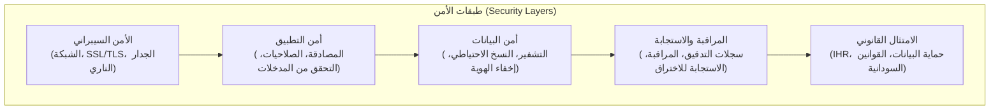
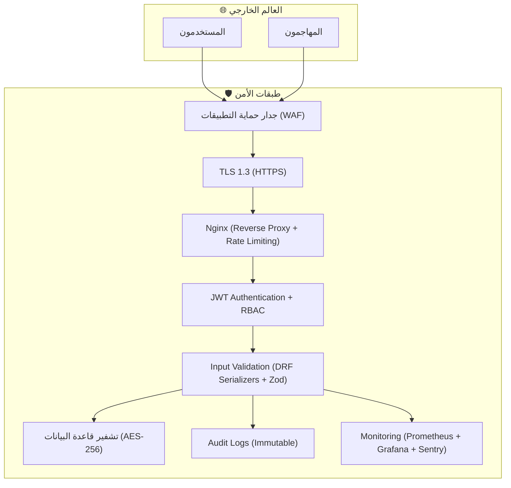

---

## 📄 `Security_Architecture.md` (عمارة الأمن السيبراني - المُحدّثة)

```markdown
# عمارة الأمن السيبراني (Security Architecture) - NQP

## 1. مقدمة
تمثل عمارة الأمن السيبراني حجر الزاوية لمنصة الحجر الصحي القومي (NQP)، نظراً لحساسية البيانات التي تتعامل معها (بيانات صحية، بيانات شخصية، بيانات سفر، بيانات غذائية). تهدف هذه العمارة إلى حماية سرية (Confidentiality)، سلامة (Integrity)، و توفر (Availability) البيانات والخدمات من خلال تطبيق مبادئ (الأمن في العمق - Defense in Depth) و (أقل امتياز - Least Privilege) و (الخصوصية في التصميم - Privacy by Design).



---

## 2. مبادئ الأمن الأساسية (Core Security Principles)

| المبدأ | الوصف | التطبيق في NQP |

| :---      | :---  | :---    |

| الدفاع في العمق (Defense in Depth) | تطبيق طبقات أمنية متعددة بحيث إذا اخترقت إحداها، تبقى الطبقات الأخرى لحماية النظام. | شبكة، خادم، تطبيق، قاعدة بيانات، تشفير، مراقبة. |

| أقل امتياز (Least Privilege) | منح المستخدمين والخدمات أقل صلاحيات ممكنة لأداء مهامهم. | RBAC (إدارة الصلاحيات القائمة على الأدوار)، فصل الصلاحيات في Django. |

| الخصوصية في التصميم (Privacy by Design) | دمج حماية البيانات في تصميم النظام منذ البداية، وليس كإضافة لاحقة. | إخفاء الهوية في التقارير، التشفير، سياسات الاحتفاظ بالبيانات، موافقة المستخدم. |

| الفصل بين المسؤوليات (Separation of Duties) | منع أي شخص من تنفيذ إجراءات حرجة بمفرده. | المصادقة المزدوجة (Dual Authorization) لـ Kill Switch، فصل صلاحيات الفني والمشرف في المختبر. |

| الشفافية والمراقبة (Transparency & Monitoring) | تسجيل جميع الأنشطة ومراقبتها لكشف السلوكيات الشاذة. | سجلات التدقيق (Audit Logs)، المراقبة عبر Prometheus/Grafana. |

---

## 3. أمن الشبكة والبنية التحتية (Network & Infrastructure Security)

### 3.1. الجدار الناري (Firewall)
- جدار حماية الشبكة: يسمح فقط بالمنافذ المطلوبة (443 للـ HTTPS، 22 للـ SSH، ومنافذ داخلية محددة بين الخدمات).
- جدار حماية تطبيقات الويب (WAF): لحماية النظام من هجمات (SQL Injection، XSS، CSRF) باستخدام حل مثل (ModSecurity) أو (Cloudflare WAF).

### 3.2. تشفير الاتصالات (TLS/SSL)
- البروتوكول: TLS 1.3 فقط لجميع الاتصالات الخارجية.
- شهادات SSL: يتم إدارتها عبر (Let's Encrypt) مع تجديد تلقائي.
- التكوين: استخدام خوارزميات تشفير قوية (Perfect Forward Secrecy) وتعطيل البروتوكولات الضعيفة (SSLv3, TLS 1.0/1.1).

### 3.3. الشبكات الداخلية (Internal Networking)
- VPN: للاتصال بين الخوادم الداخلية (في البيئات السحابية أو مراكز البيانات) عبر (WireGuard) أو (OpenVPN).
- تقسيم الشبكة: عزل الخدمات الحساسة (قاعدة البيانات، Redis) في شبكات فرعية خاصة لا يمكن الوصول إليها إلا من الخادم الخلفي.

---

## 4. أمن التطبيق (Application Security)

### 4.1. المصادقة (Authentication) - JWT
- البروتوكول: JWT (JSON Web Tokens) مع (Refresh Tokens) باستخدام `djangorestframework-simplejwt`.
- صلاحية Token: (Access Token) لمدة 30 دقيقة، (Refresh Token) لمدة 7 أيام.
- التخزين الآمن: يُفضل تخزين (Access Token) في الذاكرة و (Refresh Token) في (HttpOnly Cookies) لمنع هجمات (XSS).
- مصادقة العاملين: دعم المصادقة الثنائية (MFA) عبر (TOTP) للمسؤولين وموظفي الطوارئ.
- تسجيل الدخول الفاشل: تسجيل كل محاولة فاشلة في (Audit Log) مع (IP) و (User Agent).

### 4.2. الصلاحيات (Authorization) - RBAC
- النظام: Role-Based Access Control (RBAC) يتم تطبيقه عبر (Django Permissions) و (DRF Permission Classes).
- الأدوار الرئيسية (محددة مسبقاً): `SUPER_ADMIN`, `FEDERAL_ADMIN`, `SECTOR_MANAGER`, `PORT_OFFICER`, `DOCTOR`, `LAB_TECH`, `LAB_SUPERVISOR`, `FOOD_INSPECTOR`, `EOC_OPERATOR`, `CARRIER_REP`, `TRAVELER`.
- الصلاحيات الدقيقة: بالإضافة إلى الأدوار، يمكن تعيين صلاحيات دقيقة (مثل: `can_approve_lab_results`, `can_activate_kill_switch`).
- التطبيق: يتم تطبيق الصلاحيات على مستوى (ViewSets) و (Services) في Django.

### 4.3. حماية المدخلات (Input Validation)
- Backend (Django): استخدام (Django Serializers) و (DRF Serializers) مع (Validators) مدمجة للتحقق من صحة المدخلات ومنع (SQL Injection) و (XSS).
- Frontend (React): استخدام (Zod) للتحقق من صحة المدخلات في النماذج قبل إرسالها إلى الخادم.
- تنقية المدخلات (Sanitization): تنقية جميع المدخلات النصية من (HTML) و (Scripts) الضارة باستخدام (bleach) في Django.

### 4.4. حماية (CSRF)
- Backend: تفعيل (CSRF Middleware) في Django لجميع نقاط النهاية، باستثناء نقاط (API) التي تستخدم (JWT) حيث تكون (Stateless).
- Frontend: تضمين (CSRF Token) في الطلبات (خاصة لنماذج Django).

### 4.5. حماية (XSS)
- Backend: تنقية المدخلات وتشفير المخرجات (Auto-escaping) في قوالب Django.
- Frontend: استخدام (React) الذي يقوم بتشفير المخرجات تلقائياً، مع تجنب استخدام (dangerouslySetInnerHTML) إلا عند الضرورة القصوى مع تنقية المحتوى.

### 4.6. حماية (SQL Injection)
- Django ORM: استخدام (ORM) الذي يقوم بتجميع الاستعلامات (Parameterized Queries) تلقائياً، مما يمنع (SQL Injection) بشكل فعال.
- الاستعلامات الخام (Raw Queries): في حال استخدام استعلامات خام (نادر)، يتم تمرير المعلمات بشكل آمن.

### 4.7. حماية (Rate Limiting)
- التطبيق: استخدام (DRF Throttling) و (django-ratelimit) لحماية واجهات API من هجمات (Brute Force) و (DDoS).
- الحدود:
  - العامة (Public): 100 طلب في الدقيقة.
  - المسجلة (Authenticated): 500 طلب في الدقيقة.
  - الإدارية (Admin): 1000 طلب في الدقيقة.
  - نقاط حساسة (مثل: تسجيل الدخول): 5 محاولات في الدقيقة.

---

## 5. أمن البيانات (Data Security)

### 5.1. تصنيف البيانات (Data Classification)

| مستوى الحساسية | أنواع البيانات | الإجراءات الأمنية |
| :--- | :--- | :--- |
| عالية (High) | البيانات الصحية (التشخيصات، نتائج المختبر)، البيانات الشخصية (جواز السفر، الاسم الكامل، رقم الجوال). | تشفير AES-256 عند السكون، التحكم الصارم في الوصول (RBAC)، إخفاء الهوية في التقارير. |
| متوسطة (Medium) | بيانات الرحلات، بيانات الشحنات الغذائية، بيانات الاتصال. | تشفير عند النقل (TLS)، التحكم في الوصول (RBAC). |
| منخفضة (Low) | البيانات العامة (الأخبار، الأسئلة الشائعة، متطلبات السفر). | حماية أساسية (HTTPS). |

### 5.2. تشفير البيانات أثناء النقل (In Transit)
- البروتوكول: TLS 1.3 لجميع الاتصالات (HTTPS).
- الشهادات: من (Let's Encrypt) مع تجديد تلقائي.
- التطبيقات:
  - جميع واجهات API (Django) محمية بـ HTTPS.
  - تطبيق React (Frontend) محمي بـ HTTPS.
  - الاتصال بقاعدة البيانات (PostgreSQL) يتم عبر (SSL/TLS).

### 5.3. تشفير البيانات أثناء السكون (At Rest)
- قاعدة البيانات (PostgreSQL): يتم تشفير الأقراص (Disk Encryption) باستخدام (LUKS) أو (AWS EBS Encryption).
- الحقول الحساسة: يتم تشفير الحساسة (مثل: الأسماء، أرقام الجوازات) على مستوى التطبيق باستخدام (Django Fernet Fields) أو (django-cryptography).
- الملفات المرفوعة (MinIO/S3): يتم تشفيرها تلقائياً باستخدام (Server-Side Encryption - SSE-S3 أو SSE-C).

### 5.4. إخفاء الهوية (Anonymization)
- عند التصدير: يتم إخفاء الهوية (Anonymization) للبيانات المرسلة إلى نظام الترصد الوبائي ومنظمة الصحة العالمية (استبدال الأسماء والأرقام بـ UUIDs).
- التقارير: جميع التقارير الوطنية الصادرة عن المنصة لا تحتوي على بيانات شخصية قابلة للتعريف (PII) بشكل مباشر.

### 5.5. إدارة دورة حياة البيانات (Data Lifecycle Management)
- الاحتفاظ: الاحتفاظ بالبيانات الصحية لمدة 5 سنوات (وفقاً للمعايير الطبية والقانونية).
- الأرشفة: نقل البيانات القديمة (أكثر من سنة) إلى (Cold Storage) مع الاحتفاظ بالفهرس.
- الحذف الآمن: حذف البيانات بشكل آمن (Secure Deletion) عند انتهاء فترة الاحتفاظ، مع توثيق عملية الحذف.

---

## 6. أمن واجهات APIs (API Security)

### 6.1. المصادقة (Authentication)
- الآلية: JWT (Bearer Token) لجميع الطلبات المحمية.
- نقاط النهاية العامة: (تسجيل الدخول، التسجيل، استعادة كلمة المرور) لا تحتاج مصادقة.

### 6.2. التفويض (Authorization)
- الصلاحيات: يتم التحقق من صلاحيات المستخدم (RBAC) لكل طلب عبر (Django Permission Classes).

### 6.3. حماية (CORS)
- السياسة: السماح فقط للنطاقات (Domains) المسموح بها (مثل: `https://nqp.gov.sd`, `https://api.nqp.gov.sd`) باستخدام (django-cors-headers).

### 6.4. حماية (Rate Limiting)
- كما هو موضح في القسم 4.7: تقييد عدد الطلبات لمنع (Brute Force) و (DDoS).

### 6.5. توثيق APIs (OpenAPI/Swagger)
- الغرض: توثيق جميع نقاط النهاية (المسارات، المعاملات، نماذج الطلبات والاستجابات) باستخدام (drf-spectacular).
- التحكم في الوصول: جعل واجهة (Swagger) متاحة فقط للمطورين المسجلين (عبر JWT).

---

## 7. سجلات التدقيق والمراقبة (Audit Logging & Monitoring)

### 7.1. سجل التدقيق (Audit Log)
- نطاق التسجيل: تسجيل جميع العمليات الحيوية:
  - المصادقة (تسجيل الدخول، الخروج، محاولات فاشلة).
  - تغييرات البيانات الحساسة (تعديل الملف الصحي، اعتماد نتائج المختبر).
  - العمليات الإدارية (إنشاء/تعديل/حذف المستخدمين، تغيير الصلاحيات).
  - عمليات الطوارئ (تفعيل Kill Switch، توجيه فرق RRT، الإشعارات الجماعية).
  - التكامل الخارجي (إرسال التقارير، مزامنة ICD-11).
- هيكل السجل (Django Model `AuditLog`):
  - `user`: المستخدم الذي قام بالعملية.
  - `action_type`: نوع العملية (login, create_traveler, approve_lab_result).
  - `resource_type`: نوع المورد (Traveler, LabSample, User).
  - `resource_id`: معرف المورد.
  - `old_value`: القيمة القديمة (JSON).
  - `new_value`: القيمة الجديدة (JSON).
  - `ip_address`: عنوان IP.
  - `user_agent`: متصفح المستخدم.
  - `timestamp`: ختم زمني.
- الحماية: سجل التدقيق غير قابل للتعديل (Immutable) باستخدام (Permissions) لمنع الحذف أو التعديل.

### 7.2. المراقبة (Monitoring)
- أدوات المراقبة:
  - Prometheus + Grafana: مراقبة أداء النظام (CPU، الذاكرة، عدد الطلبات، زمن الاستجابة، استخدام قاعدة البيانات).
  - Sentry: مراقبة الأخطاء (Exceptions) في (Django) و (React) وإرسال تنبيهات فورية.
  - Uptime Kuma: مراقبة توفر الخدمات (Ping/HTTPS) وإرسال تنبيهات (عبر Telegram/Slack) في حال الانقطاع.
- التنبيهات:
  - إنذار أحمر: فشل خدمة حيوية (مثل: عدم استجابة API Gateway).
  - إنذار أصفر: زيادة في عدد الأخطاء (> 5% في 5 دقائق).
  - إنذار أزرق: تباطؤ في الأداء (زمن استجابة > 2 ثانية).

---

## 8. الاستجابة للاختراق والطوارئ (Incident Response)

### 8.1. فريق الاستجابة للطوارئ (CSIRT)
- التشكيل: فريق متخصص من (مسؤولي الأمن، مطورين، إداريين) للتعامل مع الحوادث الأمنية.
- خطة الاستجابة (Incident Response Plan):
  1.  الاكتشاف: تحديد الحادث عبر المراقبة أو الإبلاغ.
  2.  الاحتواء: عزل النظام المخترق أو تعطيل الخدمات المتأثرة.
  3.  التحليل: تحليل الحادث لتحديد السبب الجذري ونطاق التأثير.
  4.  الإزالة: إزالة الاختراق (مثل: حذف الملفات الضارة، تغيير كلمات المرور).
  5.  الاستعادة: استعادة الخدمات والبيانات من النسخ الاحتياطية.
  6.  الدروس المستفادة: توثيق الحادث وتحسين الإجراءات الأمنية.

### 8.2. الإبلاغ عن الاختراق (Breach Notification)
- الجهات: إبلاغ (الهيئة القومية للاتصالات، وزارة الصحة، الجهات القضائية) خلال 72 ساعة من اكتشاف الاختراق الذي يؤثر على البيانات الشخصية.
- المستخدمين: إبلاغ المستخدمين المتأثرين بسرعة مع تقديم توصيات (مثل: تغيير كلمات المرور).

### 8.3. النسخ الاحتياطي والاستعادة (Backup & Recovery)
- التكرار: نسخ احتياطية يومية لقاعدة البيانات (PostgreSQL) وملفات (MinIO/S3).
- التخزين: تخزين النسخ الاحتياطية في موقع جغرافي مختلف (مع تشفير AES-256).
- الاستعادة: خطة استعادة (Disaster Recovery Plan) مع (RTO < 4 ساعات) و (RPO < 15 دقيقة).
- اختبار الاستعادة: إجراء اختبار استعادة كامل كل 3 أشهر.

---

## 9. الامتثال القانوني والتنظيمي (Regulatory Compliance)

| المعيار/القانون | الوصف | متطلبات الأمن في NQP |
| :--- | :--- | :--- |
| قانون حماية البيانات الشخصية (السودان) | ينظم جمع ومعالجة البيانات الشخصية. | الموافقة المسبقة، حق الوصول والتصحيح، حق النسيان، الإبلاغ عن الاختراق. |
| IHR 2005 (اللوائح الصحية الدولية) | يلزم الدول بالإبلاغ عن الفاشيات. | سرية البيانات الصحية في التقارير الدولية، إخفاء الهوية. |
| GDPR (الاتحاد الأوروبي) | حماية بيانات المواطنين الأوروبيين (إن وجدوا). | الامتثال لـ (GDPR) في حال التعامل مع بيانات أوروبية. |
| HIPAA (الولايات المتحدة) | حماية البيانات الصحية (إن وجدت). | الامتثال لـ (HIPAA) في حال التعامل مع بيانات أمريكية. |

---

## 10. ملخص إجراءات الأمن السيبراني (Security Controls Summary)

| الفئة | الإجراءات الأمنية |
| :--- | :--- |
| الشبكة والبنية التحتية | جدار ناري، WAF، TLS 1.3، VPN، تقسيم الشبكة. |
| المصادقة والصلاحيات | JWT، RBAC، MFA، تسجيل محاولات الدخول الفاشلة. |
| حماية التطبيق | التحقق من المدخلات (Serializer, Zod)، حماية CSRF, XSS, SQL Injection, Rate Limiting. |
| حماية البيانات | تشفير AES-256 (في السكون)، TLS 1.3 (في النقل)، إخفاء الهوية، إدارة دورة الحياة. |
| المراقبة والتدقيق | Audit Logs (غير قابلة للتعديل)، Prometheus + Grafana، Sentry، Uptime Kuma، التنبيهات. |
| الاستجابة للطوارئ | فريق CSIRT، خطة الاستجابة للاختراق، الإبلاغ عن الاختراق، نسخ احتياطي مشفر. |
| الامتثال | الالتزام بالقوانين السودانية، IHR، GDPR (حيث ينطبق). |

---

## 11. خريطة الأمن (Security Map) - التفاعل بين الطبقات



---

## 12. الصلاحيات الأمنية في Django (Permissions Implementation)

```python
# apps/accounts/permissions.py
from rest_framework.permissions import BasePermission

class IsSuperAdmin(BasePermission):
    def has_permission(self, request, view):
        return request.user.is_authenticated and request.user.role == 'SUPER_ADMIN'

class IsFederalAdmin(BasePermission):
    def has_permission(self, request, view):
        return request.user.is_authenticated and request.user.role == 'FEDERAL_ADMIN'

class IsPortOfficer(BasePermission):
    def has_permission(self, request, view):
        return request.user.is_authenticated and request.user.role == 'PORT_OFFICER'

class IsDoctor(BasePermission):
    def has_permission(self, request, view):
        return request.user.is_authenticated and request.user.role == 'DOCTOR'

class IsLabSupervisor(BasePermission):
    def has_permission(self, request, view):
        return request.user.is_authenticated and request.user.role == 'LAB_SUPERVISOR'

class CanActivateKillSwitch(BasePermission):
    def has_permission(self, request, view):
        return (request.user.is_authenticated and 
                request.user.has_perm('emergency_eoc.can_activate_kill_switch'))
```

---

