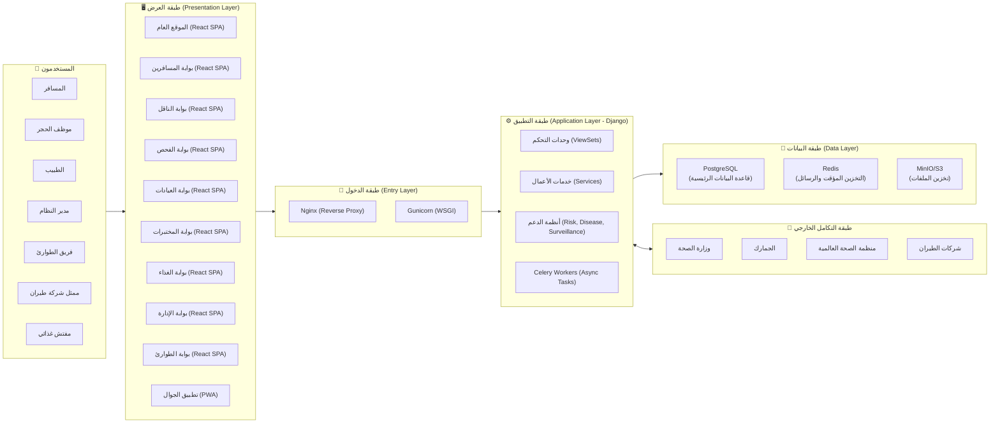
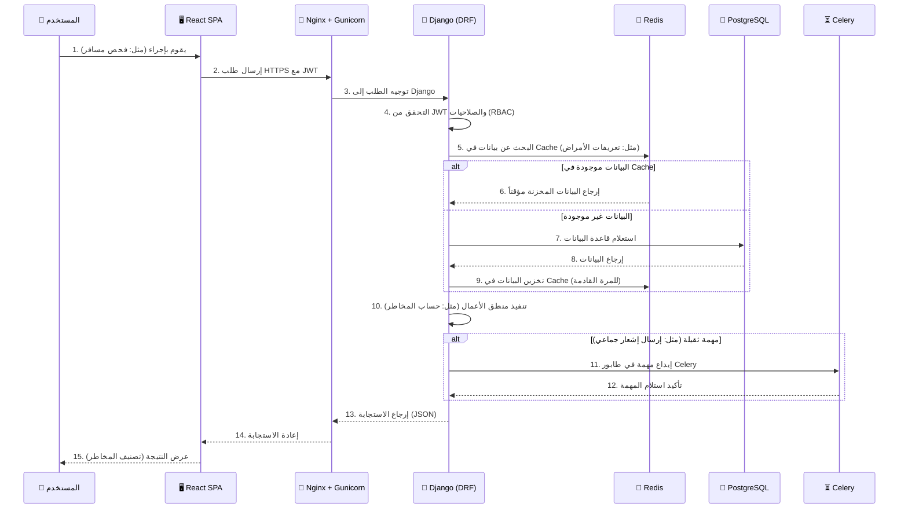
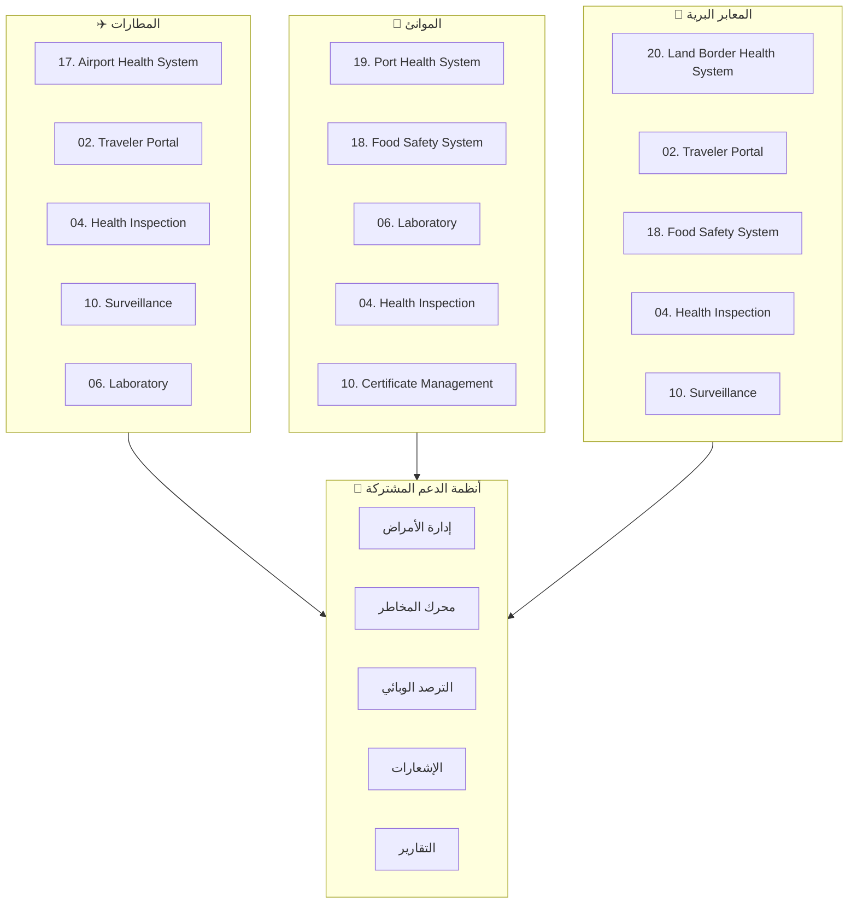

---

## 📄 `System_Overview.md` (نظرة عامة على النظام - المُحدّثة)

```markdown
# نظرة عامة على النظام (System Overview) - NQP

## 1. الهدف من هذه الوثيقة
تقديم نظرة شاملة عالية المستوى (High-Level) لمنصة الحجر الصحي القومي (NQP) لجميع أصحاب المصلحة (المطورين، الإدارة، الشركاء). توضح هذه الوثيقة مكونات النظام الأساسية، والتفاعلات بينها، والبيئة التشغيلية، والتقنيات المستخدمة، لتكون نقطة انطلاق لفهم العمارة العامة للمنصة.

---

## 2. رؤية النظام المعماري
تعتمد المنصة على عمارة الخدمات المتجانسة المعيارية (Modular Monolith) في مرحلتها الأولى، مع إمكانية التحول إلى الخدمات المصغرة (Microservices) في المستقبل عند الحاجة. تم اختيار هذه العمارة لتحقيق التوازن بين:
- سرعة التطوير: تطوير نظام واحد أسرع من تطوير خدمات متعددة.
- سهولة النشر: نشر تطبيق واحد أسهل من نشر عدة خدمات.
- التكامل السلس: التواصل بين الوحدات (Django Apps) أسهل (استدعاء دوال مباشر بدلاً من HTTP).
- قابلية التوسع: يمكن تحويل كل وحدة (Django App) إلى خدمة مستقلة لاحقاً إذا لزم الأمر.
- الفصل الواضح: يتم فصل المسؤوليات عبر طبقات واضحة (العرض، منطق الأعمال، الوصول إلى البيانات، التكامل).



---

## 3. المكونات الرئيسية (High-Level Components)

| المكون | الوصف | التقنية المستخدمة |

| :---          | :--- | :--- |

| طبقة العرض (Frontend) | واجهات المستخدم التفاعلية (9 بوابات + موقع عام + تطبيق جوال). | React 19, TypeScript, Vite, Material UI, Tailwind CSS, Redux Toolkit, React Hook Form, Zod, AG Grid, Recharts, React Toastify, Vite PWA. |

| طبقة الدخول (Gateway) | استقبال الطلبات، توزيعها على الخادم الخلفي، تقديم الملفات الثابتة، وإدارة SSL/TLS. | Nginx (Reverse Proxy), Gunicorn (WSGI Server). |

| طبقة التطبيق (Backend) | تنفيذ منطق الأعمال، معالجة الطلبات، التحقق من الصلاحيات، إدارة الجلسات، والمهام غير المتزامنة. | Django 4.2+, Django REST Framework, Celery, Celery Beat, JWT (Simple JWT). |

| طبقة البيانات (Data) | تخزين واسترجاع البيانات بشكل دائم، التخزين المؤقت، طابور الرسائل، وتخزين الملفات. | PostgreSQL 16+, Redis 7+, MinIO / Amazon S3. |

| طبقة التكامل الخارجي (Integration) | تبادل البيانات مع الأنظمة الخارجية (وزارة الصحة، الجمارك، WHO، شركات الطيران). | REST APIs, Webhooks, SFTP, JWT, API Keys. |

| البنية التحتية (Infrastructure) | إدارة الحاويات، النشر المستمر، المراقبة، والتسجيل. | Docker, Kubernetes, GitHub Actions, Prometheus, Grafana, ELK Stack. |

---

## 4. مبادئ التصميم الرئيسية (Key Design Principles)

1.  الفصل بين المسؤوليات (Separation of Concerns): يتم فصل البوابات (Frontend) عن أنظمة الدعم (Backend) وعن طبقة البيانات، مما يسهل الصيانة والتطوير المتوازي.

2.  التصميم بالواجهات (API-First): جميع التفاعلات بين الطبقات تتم عبر واجهات برمجة موثقة (OpenAPI / Swagger)، مما يضمن قابلية التوسع والتكامل.

3.  الأمن المدمج (Security by Design): يتم تطبيق التشفير (TLS 1.3)، والمصادقة (JWT)، والصلاحيات (RBAC)، وسجلات التدقيق (Audit Logs) في كل طبقة من طبقات النظام.

4.  المرونة (Resilience): استخدام طوابير الرسائل (Redis + Celery) للتعامل مع المهام الثقيلة (مثل: معالجة قوائم الركاب، إرسال الإشعارات الجماعية) لضمان عدم تأثر استجابة واجهات API.

5.  قابلية التوسع (Scalability): تصميم النظام ليكون عديم الحالة (Stateless) باستثناء قاعدة البيانات، مما يسمح بإضافة نسخ (Instances) جديدة من الخادم الخلفي (Gunicorn) و (Celery Workers) بشكل أفقي لمواجهة الأحمال الكبيرة.

6.  المراقبة والشفافية (Observability): توفير أدوات مراقبة (Prometheus + Grafana) وسجلات مركزية (ELK Stack) لتتبع أداء النظام واكتشاف المشكلات مبكراً.

---

## 5. التقنيات الأساسية (Core Technologies)

| الطبقة | التقنية | الإصدار | الاستخدام |

| :---    | :---  |  :--- | :--- |

| الخادم الخلفي | Python, Django, DRF | 3.13+, 4.2+ | منطق الأعمال، واجهات API، إدارة قواعد البيانات. |

| الخادم الأمامي | React, TypeScript, Vite | 19, 5.5+, 5.4+ | واجهات المستخدم التفاعلية، إدارة الحالة، النماذج. |

| قاعدة البيانات | PostgreSQL | 16+ | تخزين البيانات الرئيسية (المسافرين، الفحوصات، السجلات الطبية، إلخ). |

| التخزين المؤقت | Redis | 7+ | التخزين المؤقت (Cache) وطابور الرسائل (Broker لـ Celery). |

| المهام الخلفية | Celery, Celery Beat | 5.4+ | تنفيذ المهام غير المتزامنة والمجدولة. |

| خادم الويب | Nginx | 1.24+ | Reverse Proxy، تقديم الملفات الثابتة، إدارة SSL/TLS. |

| خادم التطبيقات | Gunicorn | 22+ | تشغيل تطبيق Django (WSGI). |

| الحاويات | Docker, Kubernetes | 27+, 1.30+ | توحيد البيئات، إدارة الحاويات في الإنتاج. |

| CI/CD | GitHub Actions | - | أتمتة عمليات البناء، الاختبار، والنشر. |

| المراقبة | Prometheus, Grafana | 2.53+, 11.1+ | جمع وعرض مقاييس أداء النظام. |

| التسجيل | ELK Stack | 8.14+ | تجميع وتحليل سجلات النظام. |

---

## 6. تدفق البيانات الأساسي (Core Data Flow)



---

## 7. بيئة التشغيل (Runtime Environment)

- نظام التشغيل: Linux (Ubuntu 22.04 LTS) للإنتاج.
- الحاويات: يتم تشغيل جميع الخدمات (Django, React, PostgreSQL, Redis, Celery, Nginx) داخل حاويات (Docker) في بيئة (Kubernetes) للإنتاج.
- الشبكة: اتصالات مشفرة عبر (HTTPS) مع شهادات (SSL/TLS) مُدارة عبر (Let's Encrypt).
- النسخ الاحتياطي: يتم عمل نسخ احتياطية لقاعدة البيانات (PostgreSQL) بشكل يومي وتخزينها في موقع جغرافي مختلف (مع تشفير AES-256).
- المراقبة: مراقبة مستمرة لأداء النظام عبر (Prometheus + Grafana)، وسجلات (Logs) مركزية عبر (ELK Stack).

---

## 8. ملخص التقنيات (Technology Summary)

| الفئة | التقنيات |

| :--- | :--- |

| Backend | Python 3.13+, Django 4.2+, Django REST Framework, Celery, Celery Beat, JWT (Simple JWT), Gunicorn. |

| Frontend | React 19, TypeScript, Vite, Redux Toolkit, React Hook Form, Zod, Material UI, Tailwind CSS, AG Grid, Recharts, React Toastify, Vite PWA. |

| Database & Cache | PostgreSQL 16+, Redis 7+. |

| Storage | MinIO / Amazon S3 (تخزين الملفات). |

| Web Server | Nginx (Reverse Proxy). |

| Container & Orchestration | Docker, Kubernetes. |

| CI/CD | GitHub Actions. |

| Monitoring & Logging | Prometheus, Grafana, ELK Stack. |

| API Documentation | drf-spectacular (OpenAPI / Swagger). |

---

## 9. المراجع والوثائق ذات الصلة

- Architecture_Layers.md: شرح مفصل لطبقات العمارة.
- Technology_Stack.md: تفاصيل التقنيات وأسباب الاختيار.
- Security_Architecture.md: إطار الأمن السيبراني والصلاحيات.
- Deployment_Diagram.drawio: مخطط توزيع النظام في بيئة الإنتاج.

```

---


## 6. الهيكل التنظيمي حسب المنافذ



## 7. توزيع الوحدات حسب المنفذ

| المنفذ | الوحدات |
| :--- | :--- |
| **✈️ المطارات** | 17. Airport Health, 02. Traveler, 04. Inspection, 10. Surveillance, 06. Laboratory |
| **🚢 الموانئ** | 19. Port Health, 18. Food Safety, 06. Laboratory, 04. Inspection, 10. Certificates |
| **🚛 المعابر البرية** | 20. Land Border, 02. Traveler, 18. Food Safety, 04. Inspection, 10. Surveillance |
