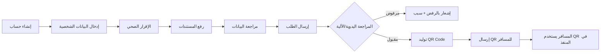

# 02_Traveler_Portal - بوابة المسافرين

## 1. الهدف الاستراتيجي
توفير واجهة ذاتية (Self-Service) للمسافرين (مواطنين، مقيمين، وزوار) لإدارة جميع إجراءات السفر الصحية مسبقاً، بدءاً من التسجيل، مروراً بالإقرار الصحي ورفع المستندات، وانتهاءً بالحصول على رمز QR الذي يسرّع إجراءات الوصول إلى المنافذ. تهدف البوابة إلى تقليل التكدس في المطارات بنسبة لا تقل عن 60%، وتقليل الأخطاء البشرية الناتجة عن التسجيل اليدوي.

## 2. الممثلون (Actors)
- **المسافر (Traveler)**: المستخدم الأساسي (غير موظف، لا يملك صلاحيات إدارية).
- **نظام المنصة (NQP)**: يقوم بالتحقق من البيانات، توليد الـ QR، وإرسال الإشعارات.
- **موظف الحجر الصحي (Port Officer)**: (تفاعل غير مباشر) يقوم بمسح الـ QR عند الوصول.

## 3. الميزات الرئيسية (Key Features)
| الميزة | الوصف | الأولوية |
| :--- | :--- | :--- |
| **التسجيل المسبق** | إنشاء حساب وإدخال البيانات الشخصية والصحية. | عالية |
| **الإقرار الصحي** | الإجابة على أسئلة الأعراض والتاريخ المرضي. | عالية |
| **رفع المستندات** | رفع صورة جواز السفر وشهادات التطعيم. | عالية |
| **رمز QR** | توليد وعرض وتنزيل رمز QR الخاص بالمسافر. | عالية |
| **تتبع الطلب** | متابعة حالة الطلب (قيد المراجعة، مكتمل، مرفوض). | متوسطة |
| **الملف الصحي** | عرض وتحديث التاريخ الصحي للمسافر. | متوسطة |
| **الإشعارات** | استلام إشعارات (بريد إلكتروني، SMS، Push) لحالة الطلب وتذكيرات السفر. | متوسطة |

## 4. دورة حياة المسافر في البوابة (Lifecycle)

## 5. نظام المصادقة (Authentication)

### 5.1. المعمارية
- **نوع الحساب:** حساب `accounts.User` برول `TRAVELER` (user_type=TRAVELER)
- **المصادقة:** JWT (Access Token 30 دقيقة + Refresh Token 7 أيام)
- **المسارات:** `/api/v1/travelers/auth/*`
- **واجهة الواجهة:** شاشات مستقلة في `/traveler/login|signup|forgot-password|reset-password`

### 5.2. نقاط النهاية
| الطريقة | المسار | الوصف | الصلاحيات |
|:---|:---|:---|:---|
| `POST` | `/auth/register/` | إنشاء حساب جديد | عام |
| `POST` | `/auth/login/` | تسجيل الدخول | عام (يُرفض للموظفين) |
| `POST` | `/auth/forgot-password/` | إرسال رابط إعادة التعيين | عام |
| `POST` | `/auth/reset-password/` | إعادة تعيين كلمة المرور | عام |
| `GET` | `/auth/me/` | بيانات المستخدم + المسافرين | مصادق عليه |
| `PATCH` | `/auth/me/` | تحديث البيانات الشخصية | مصادق عليه |

### 5.3. قفل الحساب (Account Lockout)
| الميزة | التفاصيل |
|:---|:---|
| الحد الأقصى للمحاولات | 5 محاولات خاطئة |
| مدة القفل | 15 دقيقة |
| التنبيه | يظهر "تبقى N محاولة" عند المحاولتين 3، 4 |
| إعادة التعيين | يُمسح تلقائياً عند الدخول الناجح أو إعادة تعيين كلمة المرور |

### 5.4. الربط التلقائي بالتسجيلات
- عند التسجيل بجواز سفر موجود مسبقاً (بدون `user`) → يُربط `Traveler.user` بالحساب الجديد
- عند تسجيل رحلة عبر المسافر المسجّل (`Bearer token`) → يُربط `Traveler.user` تلقائياً

### 5.5. شاشات الواجهة الأمامية
| الشاشة | المسار | محمية؟ |
|:---|:---|:---|
| تسجيل الدخول | `/traveler/login` | لا |
| إنشاء حساب | `/traveler/signup` | لا |
| نسيت كلمة المرور | `/traveler/forgot-password` | لا |
| إعادة تعيين كلمة المرور | `/traveler/reset-password` | لا |
| لوحة التحكم | `/traveler/dashboard` | نعم (`TravelerProtectedRoute`) |
| تتبع الطلب | `/traveler/tracking` | نعم |
| المستندات | `/traveler/documents` | نعم |
| الملف الصحي | `/traveler/profile` | نعم |

### 5.6. ملفات الكود
| الملف | الوصف |
|:---|:---|
| `apps/travelers/auth_serializers.py` | سيريالايزرز المصادقة |
| `apps/travelers/auth_views.py` | نقاط النهاية |
| `apps/travelers/urls.py` | توجيهات المسارات |
| `apps/travelers/tests/test_traveler_auth.py` | اختبارات (18 اختبار) |
| `apps/accounts/migrations/0011_...` | حقول القفل على User |
| `apps/accounts/migrations/0012_...` | بذر Role TRAVELER |
| `apps/accounts/models.py` | `failed_login_attempts`, `locked_until`, `is_locked` |
| `pages/traveler/TravelerLoginPage.tsx` | شاشة تسجيل الدخول |
| `pages/traveler/TravelerSignupPage.tsx` | شاشة إنشاء الحساب |
| `pages/traveler/ForgotPasswordPage.tsx` | شاشة نسيت كلمة المرور |
| `pages/traveler/ResetPasswordPage.tsx` | شاشة إعادة التعيين |
| `components/TravelerProtectedRoute.tsx` | حماية المسارات |