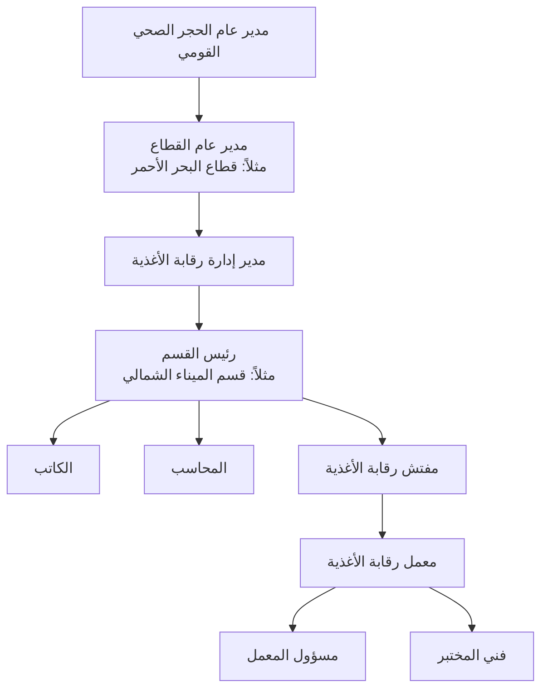
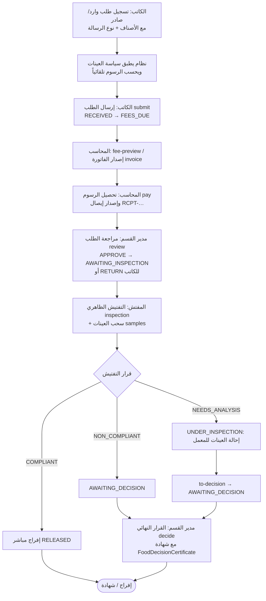

# 07_Food_Quarantine - بوابة الحجر الصحي للأغذية

> **علاقة هذه الوحدة بـ `18_Food_Safety_System`**: هذا المجلد هو **الدليل التشغيلي**
> (أدوار، سير عمل، رسوم، شاشات) لنظام رقابة الأغذية؛ مجلد **18** هو **المظلة المعمارية**
> (نظرة النظام، مخطط البيانات، الترصّد الغذائي، الإدارة والأمن). اقرأ 18 للفهم المعماري
> و7 للتنفيذ اليومي — كلاهما يصف **النظام نفسه**.

## 1. الهدف الاستراتيجي
توفير نظام رقمي متكامل لإدارة عمليات الحجر الصحي على الأغذية المستوردة والمصدرة في جميع المنافذ (الجوية، البحرية، البرية)، لضمان:
- **سلامة الغذاء**: التأكد من مطابقة الشحنات الغذائية للمواصفات القياسية الوطنية والدولية.
- **سرعة الإفراج**: تقليل زمن احتجاز الشحنات في الموانئ من خلال أتمتة إجراءات التفتيش وإصدار الشهادات.
- **الشفافية**: توفير سجل رقمي كامل لكل شحنة (من الوصول إلى الإفراج) لسهولة التتبع والتدقيق.
- **التكامل**: ربط العملية مع نظام الجمارك لتسريع الإجراءات الجمركية، ومع هيئة المواصفات والمقاييس للتحقق من المطابقة.

## 2. الهيكل الإداري


### 2.1. نظام وطني موحّد عبر جميع المنافذ
**نظام رقابة الأغذية نظام واحد يعمل في جميع المنافذ** (المطارات، الموانئ،
المعابر البرية)، والمنفذ مجرد **نوع موقع (Port Type)**:
- `AIRPORT` (مطار) / `SEAPORT` (ميناء بحري) / `LAND_PORT` (منفذ بري) في نموذج
  `masterdata.EntryPoint` (الحقل `kind`) — سجل المنافذ الموحد المشترك بين
  المطارات والموانئ والمعابر البرية (انظر §⚙️ حالة التنفيذ).
- كل شحنة مرتبطة بمنفذ عبر `FoodShipment.port`، وتُعرض في الواجهة والـ API
  أسماء المنافذ وأنواعها (`port_name`/`port_type`) مع إمكانية التصفية
  `?port_type=LAND_PORT`.
- إجراءات الرقابة وقواعد العمل والصلاحيات موحّدة في المنافذ جميعها، مما يسهّل
  التقارير والإحصاءات على مستوى الإدارة العامة للحجر الصحي القومي.

### 2.2. فصل وظائف المفتشين
| الدور | الاختصاص | الأمثلة |
| :--- | :--- | :--- |
| **مفتش رقابة الأغذية** | سلامة الأغذية والشحنات الغذائية | فحص الشحنات، التحقق من الوثائق، مطابقة البضائع، سحب العينات، إحالتها للمختبر، كتابة تقرير التفتيش، التوصية بالإفراج/الرفض/الحجز. |
| **مفتش الحجر الصحي** | الحجر الصحي على الأشخاص ووسائل النقل والمنافذ | تفتيش السفن/الطائرات/المركبات، فحص الحالة الصحية للمسافرين والأطقم، اشتراطات الحجر، إصدار/التوصية بشهادات الحجر، متابعة العزل والإحالة، تسجيل المخالفات. |
| **مفتش صحة البيئة** | الاشتراطات البيئية داخل المنافذ ومكافحة النواقل | فحص المخازن والمستودعات، جودة المياه، التخلص من النفايات، النظافة العامة، التفتيش على أماكن تداول الأغذية، مكافحة النواقل (البعوض/الذباب/القوارض)، تقارير صحة البيئة. |

> يتعاون المفتشون الثلاثة في الطلب الواحد عند الحاجة (مثال: شحنة غذائية تصل
> لمعبر بري → مفتش الحجر الصحي يتحقق من اشتراطات الحجر، ثم مفتش رقابة الأغذية
> يفحص الشحنة ويسحب العينات، والمختبر يحلل، ومفتش صحة البيئة يفحص المخازن
> والبيئة المحيطة عند اللزوم، ثم القرار النهائي).

### 2.3. المعبر البري (Land Border) — منفذ لنظامين منفصلين
المعبر البري يخدم نوعين مختلفين من العمليات ولا يُدمجان في نظام واحد:

```mermaid
flowchart TB
    HEAD[رئيس القسم] --> HQ[قسم الحجر الصحي<br/>(Land Border Health)]
    HEAD --> FQ[قسم رقابة الأغذية<br/>(Food Safety)]
    HQ --> HQK[كاتب]
    HQ --> HQI[مفتش الحجر الصحي]
    HQ --> CL[العيادة]
    CL --> DOC[الطبيب]
    FQ --> FQK[كاتب]
    FQ --> FQA[محاسب]
    FQ --> FQI[مفتش رقابة الأغذية]
    FQI --> FL[معمل رقابة الأغذية]
```

- **حركة المسافرين** ⟶ تتبع **Land Border Health System** (تسجيل البيانات ←
  مفتش الحجر الصحي ← العيادة عند اللزوم ← القرار النهائي).
- **الشحنات الغذائية** ⟶ تتبع **Food Safety System**، ويكون Land Border Health
  **نقطة دخول/إحالة فقط** ثم يُحيل الشحنة إلى نظام رقابة الأغذية عبر نقطة
  `POST /shipments/{id}/refer` (تسجيل `referred_from` + `referral_reference` +
  `referred_by`/`referred_at`).

### 2.1. توزيع الأدوار
| الدور | المسؤوليات |
| :--- | :--- |
| **مدير عام الحجر الصحي القومي** | الإشراف على جميع القطاعات، اعتماد السياسات، متابعة مؤشرات الأداء الوطنية. |
| **مدير عام القطاع** | إدارة إدارات القطاع، متابعة أداء الأقسام، رفع التقارير للإدارة العامة. |
| **مدير إدارة رقابة الأغذية** | الإشراف على أقسام رقابة الأغذية، متابعة الأداء، مراجعة التقارير، إدارة المستخدمين. |
| **رئيس القسم** | مراجعة الطلبات، تعيين المفتش، متابعة المعمل، مراجعة النتائج، إصدار القرار النهائي، اعتماد الشهادات. |
| **الكاتب** | تسجيل الطلبات، إدخال بيانات الشحنات، رفع المستندات، متابعة الحالة. |
| **المحاسب** | احتساب الرسوم، إصدار الفواتير، تحصيل المدفوعات، إصدار الإيصالات. |
| **مفتش رقابة الأغذية** | التفتيش الميداني، فحص الشحنة، سحب العينات، إعداد تقرير التفتيش، إرسال العينات للمعمل. |
| **مسؤول المعمل** | استلام العينات، مراجعة بياناتها، توزيعها على الفنيين، اعتماد النتائج، إرسالها للنظام. |
| **فني المختبر** | إجراء التحاليل الكيميائية والميكروبيولوجية، إدخال النتائج، توثيق الاختبارات. |

## 3. سير العمل (Workflow)

### 3.0. دورة الطلب التشغيلية (كرة الكاتب → المحاسب → مدير القسم → المفتش)


### 3.1. حالات الشحنة (الدورة الكاملة)
`RECEIVED` ← (submit) `FEES_DUE` ← (review) `AWAITING_INSPECTION` ← (inspection) `UNDER_INSPECTION` ← (to-decision) `AWAITING_DECISION` ← النهائية.

- مسار بديل من التفتيش: `COMPLIANT` → `RELEASED` مباشرة، و`NON_COMPLIANT` → `AWAITING_DECISION`.
- الحالة النهائية الممكنة: `RELEASED / CONDITIONAL_RELEASE / REJECTED / HOLD / RE_EXPORT / DESTROYED`.

### 3.2. قرارات القرار النهائي وشهاداتها
عند إصدار القرار النهائي تُسجَّل في نموذج `FoodDecisionCertificate` (من `decide`) مع نوع الشهادة،
وتُعيّن حالة الشحنة وفق الخريطة التالية (`status_map`) — ملاحظة: القرارات
`PARTIAL_RELEASE / TEMPORARY_RELEASE / TRANSFER` **لا تنشئ حالة نهائية مستقلة** بل تُسقط على
`CONDITIONAL_RELEASE` / `HOLD`:

| القرار (`final_decision`) | نوع الشهادة | حالة الشحنة الفعلية |
| :--- | :--- | :--- |
| `COMPLIANT` | مطابق / إفراج | `RELEASED` |
| `CONDITIONAL_RELEASE` | إفراج مشروط | `CONDITIONAL_RELEASE` |
| `PARTIAL_RELEASE` | إفراج جزئي | `CONDITIONAL_RELEASE` |
| `TEMPORARY_RELEASE` | إفراج مؤقت | `HOLD` |
| `REJECTED` | رفض | `REJECTED` |
| `HOLD` | حجز | `HOLD` |
| `RE_EXPORT` | إعادة تصدير | `RE_EXPORT` |
| `TRANSFER` | تحويل (منفذ/إدارة أخرى) | `HOLD` |
| `DESTROY` | إتلاف | `DESTROYED` |

**شروط إلزامية**:
- لا يمكن `decide`/`to-decision` إلا بعد سداد الرسوم (`fees_paid=true`).
- الشحنات المغلقة (`RELEASED` / `REJECTED`) تُرفض عند إعادة `decide`.
- **قرار التفتيش** (`FoodInspection.decision`): `COMPLIANT` (إفراج مباشر)، `NEEDS_ANALYSIS`
  (إحالة للعينات/المعمل)، `NON_COMPLIANT` (رفض → قرار). لا يُسمح بتكرار التفتيش على نفس الشحنة.

### 3.3. نوع الرسالة (Message Type) وأثره المالي
`FoodShipment.message_type`: `COMMERCIAL` (تجارية — الافتراضي) / `RELIEF` (إغاثة — **إعفاء كلي**
من الرسوم) / `EXEMPT` (إعفاء — **إعفاء من رسوم الشهادة فقط**).

## 4. نقاط النهاية الخلفية (API Endpoints)
| الطريقة | المسار | الوصف |
| :--- | :--- | :--- |
| `POST` | `/api/v1/food/shipments/` | تسجيل شحنة جديدة (الكاتب) + حساب العينات والرسوم تلقائياً. |
| `POST` | `/api/v1/food/shipments/{id}/refer` | استقبال شحنة كإحالة من المعبر/المنفذ إلى نظام رقابة الأغذية. |
| `GET` | `/api/v1/food/shipments/{id}/fee-preview` | عرض تفاصيل الرسوم لحظياً (المحاسب). |
| `GET` | `/api/v1/food/shipments/{id}/export-form` | استمارة كشف الموارد الغذائية الصادرة (سجل موحّد للطباعة). |
| `POST` | `/api/v1/food/shipments/{id}/submit` | إرسال الطلب `RECEIVED → FEES_DUE` وتسجيل `submitted_at` (الكاتب). |
| `POST` | `/api/v1/food/shipments/{id}/review` | مراجعة مدير القسم: `APPROVE` → `AWAITING_INSPECTION` أو `RETURN` للكاتب. |
| `POST` | `/api/v1/food/shipments/{id}/invoice` | إصدار فاتورة الرسوم (يفتح تلقائياً من تفاصيل الرسوم إن لم تُرسل البنود). |
| `POST` | `/api/v1/food/shipments/{id}/pay` | تسجيل الدفع وإصدار إيصال فريد `RCPT-…` (المحاسب). |
| `POST` | `/api/v1/food/shipments/{id}/assign-inspector` | تعيين المفتش (رئيس القسم). |
| `POST` | `/api/v1/food/shipments/{id}/inspection` | تسجيل التفتيش الظاهري (المفتش). |
| `POST` | `/api/v1/food/shipments/{id}/samples` | سحب عينات وإرسالها للمعمل (المفتش). |
| `POST` | `/api/v1/food/shipments/{id}/to-decision` | إحالة الشحنة لاتخاذ القرار (مدير القسم). |
| `POST` | `/api/v1/food/shipments/{id}/decide` | القرار النهائي وإنشاء `FoodDecisionCertificate` (رئيس القسم). |
| `POST` | `/api/v1/food/shipments/{id}/release` | إصدار شهادة إفراج (للقنوات السابقة). |
| `GET` | `/api/v1/food/shipments/accounting/?period=day/week/month` | تقرير المحاسب (مدفوع/معلّق/إجمالي/إيصالات/حركة يومية). |
| `GET/POST` | `/api/v1/food/sampling-policies/` | إدارة سياسات أخذ العينات (مشرف). |
| `GET` | `/api/v1/food/shipments/?port_type=LAND_PORT` | تصفية الشحنات حسب نوع المنفذ. |

## 5. المتطلبات التقنية (Technical Requirements)

    الواجهة الأمامية: React + Tailwind CSS (مسار /app/food و /app/food/shipments/:id و /app/food-ops).

    الخلفية: Django REST Framework (نقاط النهاية تحت /api/v1/food/).

    المصادقة: JWT مع صلاحيات محددة (الدور: FOOD_INSPECTOR، CLERK، ACCOUNTANT، STATION_HEAD).

    التكامل مع الجمارك: إرسال شهادات الإفراج عبر API (أو SFTP) إلى نظام الجمارك.

    التكامل مع المختبرات: استلام نتائج العينات من بوابة المختبرات (نفس آلية العينات الطبية).

    التخزين: يتم تخزين الملفات المرفوعة (صور الشحنات، شهادات التحليل) على MinIO/S3.

## 6. التكامل مع الأنظمة الأخرى

    بوابة المختبرات (6): إرسال عينات غذائية للتحليل واستلام النتائج.

    نظام الجمارك (External): إرسال شهادات الإفراج الصحي لتحديث حالة الشحنة في نظام الجمارك.

    هيئة المواصفات والمقاييس (External): استرجاع قائمة المواصفات القياسية للمقارنة الآلية لنتائج المختبر.

    نظام الفواتير (اختياري): إدارة الرسوم المستحقة على عمليات التفتيش وإصدار الشهادات.
---

## ⚙️ حالة التنفيذ مقابل الكود

| المكوّن | الحالة | ملاحظة التحقق |
| :--- | :--- | :--- |
| دورة الطلب (كاتب→محاسب→مدير→مفتش) | ✅ مطبَّق | كل الإجراءات الـ14 موجودة في `views.py` ومغطاة باختبارات flow |
| حالات الشحنة + خريطة القرارات | ✅ مطبَّق | مطابقة تمامًا لجدول §3.2 بما فيه الحالات المسقطة |
| الإحالة من المعبر البري (`refer`) | ✅ مطبَّق | `referred_from` + `referral_reference` |
| نوع الرسالة وأثره المالي | ✅ مطبَّق | إعفاء كلي للإغاثة، رسوم الشهادة فقط للإعفاء |
| استمارة التصدير (`export-form`) | ✅ مطبَّق | سجل موحد قابل للطباعة |
| المنفذ = Master Entity موحد | ✅ مطبَّق (محدث) | `masterdata.EntryPoint` بدل `ports.Port` المهمل — جسر بيانات في `ports/0003` |
| تكامل الجمارك (API/SFTP خارجي) | ❌ مؤجل | الشهادات تُصدر داخليًا فقط |
| تخزين المرفقات MinIO/S3 | ❌ مؤجل | لا رفع مرفقات بعد |
| بوابة المختبرات FCLIS | ⚠️ جزئي | المواصفة في `FCLIS-Specification.md`؛ اختباراتها مستثناة من السويت |
