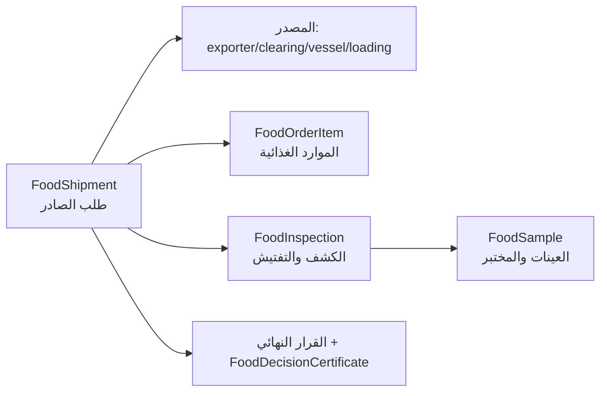

# استمارة كشف الموارد الغذائية الصادرة

## 1. الهدف
وثيقة رسمية قابلة للتتبع (Audit Trail) تخصّ **شحنات الصادر** في نظام رقابة الأغذية.
الاستمارة **ليست نموذجًا منفصلًا** بل سجل إلكتروني واحد يُجمّع البيانات من الارتباطات
القائمة دون إدخال مكرر: `FoodShipment` (طلب الصادر) ← `FoodOrderItem` (الموارد الغذائية) ←
`FoodInspection` (الكشف والتفتيش) ← `FoodSample` (العينات والفحص المخبري) ← القرار ←
`FoodDecisionCertificate` (شهادة الصادر).

## 2. مصدر البيانات (تعيين واحد لواحد)

## 3. نقطة النهاية الموحّدة
- **المسار**: `GET /api/v1/food/shipments/{id}/export-form`
- **الاستجابة**: حزمة `{ shipment, items, inspection, samples, decision, certificate }`
  (المقاطع الفارغة تعود `null` / `[]` بلا أخطاء).

### 3.1. أقسام الاستجابة (تطابق أقسام الاستمارة المطبوعة)
| المقطع | المحتوى |
| :--- | :--- |
| `shipment` | الرقم/البيان، الجمركي، شهادة الاعتماد، التواريخ، النوع، الرسالة، المنفذ، المورد/المصدر، الوسيلة الناقلة، ميناء الشحن، البوليصة، المخلّص، الوزن، عدد العينات، الحالة. |
| `items` | جدول الموارد: اسم المادة، الماركة، المنشأ، الوزن (كغ)، عدد الطرود، نوع التعبئة. |
| `inspection` | تاريخ الكشف، المفتش، النتيجة (`COMPLIANT`/`NEEDS_ANALYSIS`/`NON_COMPLIANT`)، الحرارة، تاريخي الإنتاج/الانتهاء، رقم التشغيلة، حالة الحاوية/العبوات، عدد ووزن التالف/السليم، الملاحظات. |
| `samples` | رقم/باركود العينة، النوع، سبب السحب (`ROUTINE`/`SUSPECTED`/`FIRST_ENTRY`)، المختبر (`bench`)، الحالة، وقت الاستلام. |
| `decision` | القرار النهائي، السبب، المُصدر، التاريخ. |
| `certificate` | رقم شهادة الصادر، النوع، الحالة، تاريخ الإصدار. |

## 4. الواجهة (FoodOpsPage — تبويب «استمارة الكشف الصادر»)
- يدرج **شحنات الصادر** (`shipment_type=EXPORT`) فقط.
- زر «فتح الاستمارة» يجلب `export-form` ويعرض نموذج ورقي تفاعلي بسبعة أقسام + رأس التوقيعات
  (المفتش ← رئيس القسم ← مدير إدارة رقابة الأغذية).
- زر **«طباعة / PDF»** يفتح نافذة مستقلة بوثيقة HTML RTL جاهزة و`window.print()`
  (نفس نمط طباعة QR في `RequestTrackingPage`) — لا حاجة لتبعية خادم PDF.

## 5. سير العمل
من طلب الصادر إلى الشهادة (البوابة القياسية): الكاتب يدخل الطلب بالأصناف ← المحاسب يخصّص
الرسوم ← مدير القسم يراجع ويعيّن المفتش ← المفتش يجرى الكشف (`inspection`) ويسحب العينات ←
المختبر يحلل ← `to-decision` ← مدير القسم يُصدر القرار الشهادة (`decide`). الاستمارة تعكس
هذه الرحلة لحظياً دون حقول يدوية.

## 6. نقاط النهاية الخلفية
| الطريقة | المسار | الوصف |
| :--- | :--- | :--- |
| `GET` | `/api/v1/food/shipments/{id}/export-form` | تجميع استمارة كشف الموارد الغذائية الصادرة. |

> ملاحظة: الاستمارة **قراءة فقط**؛ الكتابة تتم عبر endpoints العملية الحالية
> (`submit`, `inspection`, `samples`, `decide` … — راجع `07_Food_Quarantine.md`).