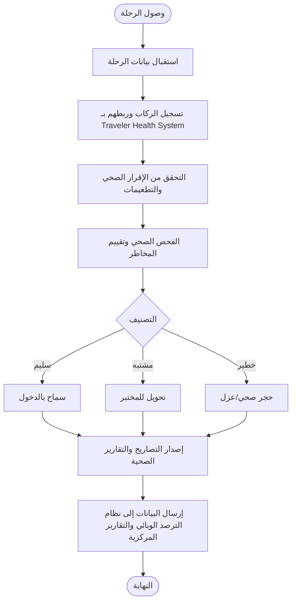
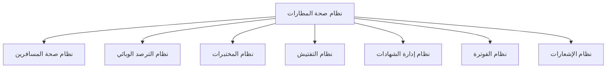

# 17_Airport_Health_System - نظام صحة المطارات

## 1. الهدف الاستراتيجي
نظام متخصص لإدارة جميع إجراءات الحجر الصحي والصحة العامة في المطارات الدولية، ويغطي دورة العمل منذ وصول الرحلة وحتى مغادرتها، مع التكامل مع بقية أنظمة **منصة الحجر الصحي القومي (National Quarantine Platform - NQP)**.

## 2. أهداف النظام
- إدارة الرحلات القادمة والمغادرة.
- تسجيل وفحص المسافرين.
- إدارة صحة أطقم الطائرات.
- التفتيش الصحي للطائرات.
- التحقق من الشهادات والتطعيمات.
- إدارة الحالات المشتبه بها.
- إصدار التصاريح والشهادات الصحية.
- دعم الترصد الوبائي.
- التكامل مع الجهات الحكومية بالمطار.

## 3. الهيكل الوظيفي (المكونات الـ 23)

```text
Airport Health System
│
├── Dashboard
├── Airport Management
├── Flight Management
├── Airline Management
├── Passenger Health Management
├── Crew Health Management
├── Health Declaration
├── Vaccination Verification
├── Medical Screening
├── Risk Assessment
├── Quarantine & Isolation
├── Medical Referral
├── Aircraft Health Inspection
├── Aircraft Sanitation Inspection
├── Food & Catering Inspection
├── Water Quality Inspection
├── Waste Management
├── Vector Surveillance
├── Emergency Management
├── Disease Surveillance
├── Certificate Management
├── Reporting & Dashboard
├── Notification Center
└── Integration Services
```

## 4. المكونات الرئيسية (Components)

| الرقم | المكون | الوصف | الأولوية |
| :--- | :--- | :--- | :--- |
| **1** | **Dashboard** | لوحة التحكم الرئيسية وعرض المؤشرات. | عالية |
| **2** | **Airport Management** | إدارة بيانات المطارات (IATA، ICAO، الصالات، محطات الحجر). | عالية |
| **3** | **Flight Management** | إدارة الرحلات القادمة والمغادرة. | عالية |
| **4** | **Airline Management** | إدارة شركات الطيران (الاسم، الرمز، الاتصال، التراخيص). | عالية |
| **5** | **Passenger Health Management** | إدارة بيانات المسافرين وربطها مع Traveler Health System. | عالية |
| **6** | **Crew Health Management** | إدارة صحة الطواقم (الطيارين، المضيفين، الفنيين). | عالية |
| **7** | **Health Declaration** | الإقرار الصحي الإلكتروني (الأعراض، الدول الزائرة، الأمراض). | عالية |
| **8** | **Vaccination Verification** | التحقق من شهادات التطعيم وصلاحيتها. | عالية |
| **9** | **Medical Screening** | الفحص الصحي (العلامات الحيوية، قياس الحرارة، تقييم الحالة). | عالية |
| **10** | **Risk Assessment** | تصنيف المسافر (Low, Medium, High, Critical). | عالية |
| **11** | **Quarantine & Isolation** | إدارة العزل والحجر الصحي للحالات المشتبه بها. | عالية |
| **12** | **Medical Referral** | تحويل الحالات إلى المستشفيات، المراكز الصحية، المختبرات. | عالية |
| **13** | **Aircraft Health Inspection** | تفتيش صحة الطائرة (المقصورة، دورات المياه، التهوية). | عالية |
| **14** | **Aircraft Sanitation Inspection** | التأكد من عمليات التطهير والتعقيم ومكافحة الآفات. | عالية |
| **15** | **Food & Catering Inspection** | فحص وجبات الطائرات، مخازن الأغذية، المطابخ، شركات التموين. | عالية |
| **16** | **Water Quality Inspection** | فحص جودة مياه الشرب وخزانات المياه. | عالية |
| **17** | **Waste Management** | إدارة النفايات الطبية والغذائية والتخلص الآمن. | متوسطة |
| **18** | **Vector Surveillance** | مكافحة البعوض، الذباب، القوارض، برامج الرش. | متوسطة |
| **19** | **Emergency Management** | إدارة الحالات الطارئة، الأوبئة، الطائرات المشتبه بها. | عالية |
| **20** | **Disease Surveillance** | الترصد الوبائي وربطه مع Disease Surveillance System. | عالية |
| **21** | **Certificate Management** | إصدار شهادات الإفراج الصحي، تقارير التفتيش، التقارير الطبية. | متوسطة |
| **22** | **Reporting & Dashboard** | عرض التقارير والإحصائيات (الرحلات، المسافرين، حالات الاشتباه). | متوسطة |
| **23** | **Notification Center** | إرسال الإشعارات (SMS، Email، إشعارات النظام). | متوسطة |

## 5. سير العمل الأساسي (Workflow)



## 6. التكامل مع الأنظمة الأخرى



### 6.1. الجهات الخارجية المتكاملة
- **وزارة الصحة الاتحادية السودانية**: تبادل التقارير والبيانات الصحية.
- **الإدارة العامة للحجر الصحي القومي**: الإشراف والتوجيه.
- **سلطة الطيران المدني**: تبادل بيانات الرحلات والطائرات.
- **إدارة المطار**: التنسيق التشغيلي.
- **شركات الطيران**: تبادل بيانات الركاب والطواقم.
- **الجوازات والهجرة**: التحقق من هويات المسافرين.
- **الجمارك**: التنسيق في إجراءات الإفراج.
- **المختبرات المرجعية**: تبادل نتائج الفحوصات.

## 7. المستخدمون (Actors)
- **طبيب الحجر الصحي**: يقوم بالفحص الطبي وتقييم الحالات.
- **مفتش الحجر الصحي**: يقوم بالتفتيش على الطائرات والمرافق.
- **مفتش صحة البيئة**: يتولى تفتيش الأغذية والمياه والمرافق.
- **مفتش سلامة الأغذية**: يتولى تفتيش الوجبات والمطابخ.
- **موظف تسجيل المسافرين**: يسجل بيانات المسافرين والإقرارات الصحية.
- **موظف العمليات بالمطار**: يدير العمليات التشغيلية.
- **مسؤول المختبر**: يدير العينات والفحوصات المخبرية.
- **مدير محطة الحجر الصحي**: يدير عمليات الحجر الصحي في المطار.
- **مدير الإدارة العامة للحجر الصحي**: يشرف على جميع العمليات.
- **مسؤول النظام**: يدير إعدادات النظام والصلاحيات.

## 8. مكان النظام داخل المنصة

```text
منصة الحجر الصحي القومي (National Quarantine Platform)
│
├── البوابة الوطنية للحجر الصحي (National Quarantine Portal)
├── نظام صحة المسافرين (Traveler Health System)
├── نظام صحة المطارات (Airport Health System) ← هذا النظام
├── نظام صحة الموانئ (Port Health System)
├── نظام صحة المعابر البرية (Land Border Health System)
├── نظام سلامة الغذاء (Food Safety System)
├── نظام إدارة التفتيش الصحي (Health Inspection Management System)
├── نظام المعلومات المخبرية للرقابة الغذائية (Food Control Laboratory Information System)
├── نظام الترصد الوبائي (Disease Surveillance System)
├── نظام إدارة الشهادات (Certificate Management System)
├── نظام الإشعارات (Notification System)
└── نظام التقارير والذكاء الأعمال (Reporting & Business Intelligence)
```

## 9. نطاق النظام
يركز نظام صحة المطارات على جميع الأنشطة الصحية داخل المطار، بدءًا من وصول الرحلة والمسافرين، مرورًا بالتفتيش الصحي والعزل والترصد الوبائي، وانتهاءً بالتكامل مع بقية أنظمة منصة الحجر الصحي القومي لضمان حماية الصحة العامة ومنع انتقال الأمراض عبر النقل الجوي.
