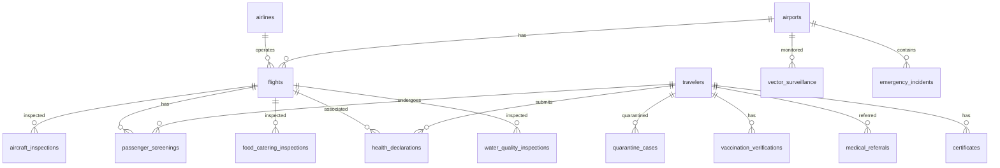

# 02_Database_Schema - مخطط قاعدة بيانات نظام صحة المطارات

## 1. الجداول الأساسية (Core Tables)

### `airports` (إدارة المطارات)
| العمود | النوع | الوصف |
| :--- | :--- | :--- |
| `id` | UUID | PRIMARY KEY |
| `airport_code` | VARCHAR(10) | رمز IATA |
| `icao_code` | VARCHAR(10) | رمز ICAO |
| `airport_name` | VARCHAR(200) | اسم المطار |
| `state` | VARCHAR(100) | الولاية |
| `country` | VARCHAR(100) | الدولة |
| `status` | VARCHAR(20) | (ACTIVE, INACTIVE) |

### `flights` (إدارة الرحلات)
| العمود | النوع | الوصف |
| :--- | :--- | :--- |
| `id` | UUID | PRIMARY KEY |
| `flight_number` | VARCHAR(20) | رقم الرحلة |
| `airline_id` | UUID | FOREIGN KEY (airlines) |
| `origin` | VARCHAR(100) | دولة القدوم |
| `destination` | VARCHAR(100) | الوجهة |
| `arrival_date` | DATE | تاريخ الوصول |
| `departure_date` | DATE | تاريخ المغادرة |
| `status` | VARCHAR(20) | (SCHEDULED, ARRIVED, DEPARTED) |

### `airlines` (إدارة شركات الطيران)
| العمود | النوع | الوصف |
| :--- | :--- | :--- |
| `id` | UUID | PRIMARY KEY |
| `airline_name` | VARCHAR(200) | اسم الشركة |
| `airline_code` | VARCHAR(10) | رمز الشركة |
| `contact_info` | JSONB | بيانات الاتصال |
| `licenses` | JSONB | التراخيص |

### `passenger_screenings` (فحص المسافرين)
| العمود | النوع | الوصف |
| :--- | :--- | :--- |
| `id` | UUID | PRIMARY KEY |
| `traveler_id` | UUID | FOREIGN KEY (travelers) |
| `flight_id` | UUID | FOREIGN KEY (flights) |
| `temperature` | FLOAT | درجة الحرارة |
| `symptoms` | JSONB | الأعراض |
| `risk_level` | VARCHAR(10) | (LOW, MEDIUM, HIGH, CRITICAL) |
| `decision` | VARCHAR(20) | (CLEARED, QUARANTINED, REFERRED) |

### `health_declarations` (الإقرار الصحي)
| العمود | النوع | الوصف |
| :--- | :--- | :--- |
| `id` | UUID | PRIMARY KEY |
| `traveler_id` | UUID | FOREIGN KEY (travelers) |
| `flight_id` | UUID | FOREIGN KEY (flights) |
| `symptoms` | JSONB | الأعراض |
| `travel_history` | JSONB | تاريخ السفر |
| `status` | VARCHAR(20) | (SUBMITTED, VERIFIED) |

### `quarantine_cases` (العزل والحجر الصحي)
| العمود | النوع | الوصف |
| :--- | :--- | :--- |
| `id` | UUID | PRIMARY KEY |
| `traveler_id` | UUID | FOREIGN KEY (travelers) |
| `reason` | TEXT | سبب العزل |
| `isolation_location` | VARCHAR(200) | موقع العزل |
| `start_date` | DATE | تاريخ البدء |
| `end_date` | DATE | تاريخ الانتهاء |
| `status` | VARCHAR(20) | (ACTIVE, COMPLETED) |

### `aircraft_inspections` (تفتيش الطائرات)
| العمود | النوع | الوصف |
| :--- | :--- | :--- |
| `id` | UUID | PRIMARY KEY |
| `flight_id` | UUID | FOREIGN KEY (flights) |
| `inspection_date` | DATE | تاريخ التفتيش |
| `inspector` | VARCHAR(100) | اسم المفتش |
| `inspection_type` | VARCHAR(50) | نوع التفتيش |
| `result` | VARCHAR(20) | (PASSED, FAILED) |
| `decision` | VARCHAR(20) | (CLEARED, QUARANTINED) |

### `vaccination_verifications` (التحقق من التطعيمات)
| العمود | النوع | الوصف |
| :--- | :--- | :--- |
| `id` | UUID | PRIMARY KEY |
| `traveler_id` | UUID | FOREIGN KEY (travelers) |
| `vaccine_name` | VARCHAR(100) | اسم اللقاح |
| `certificate_number` | VARCHAR(50) | رقم الشهادة |
| `issue_date` | DATE | تاريخ الإصدار |
| `expiry_date` | DATE | تاريخ الانتهاء |
| `verified_by` | UUID | FOREIGN KEY (users) |

### `medical_referrals` (الإحالات الطبية)
| العمود | النوع | الوصف |
| :--- | :--- | :--- |
| `id` | UUID | PRIMARY KEY |
| `traveler_id` | UUID | FOREIGN KEY (travelers) |
| `referral_type` | VARCHAR(20) | (HOSPITAL, CLINIC, LAB) |
| `referral_reason` | TEXT | سبب الإحالة |
| `referral_date` | DATE | تاريخ الإحالة |
| `status` | VARCHAR(20) | (PENDING, COMPLETED) |

### `food_catering_inspections` (تفتيش الأغذية والتموين)
| العمود | النوع | الوصف |
| :--- | :--- | :--- |
| `id` | UUID | PRIMARY KEY |
| `flight_id` | UUID | FOREIGN KEY (flights) |
| `inspection_date` | DATE | تاريخ التفتيش |
| `food_source` | VARCHAR(200) | مصدر الطعام |
| `result` | VARCHAR(20) | (PASSED, FAILED) |
| `notes` | TEXT | ملاحظات |

### `water_quality_inspections` (تفتيش جودة المياه)
| العمود | النوع | الوصف |
| :--- | :--- | :--- |
| `id` | UUID | PRIMARY KEY |
| `flight_id` | UUID | FOREIGN KEY (flights) |
| `inspection_date` | DATE | تاريخ التفتيش |
| `water_source` | VARCHAR(200) | مصدر المياه |
| `lab_results` | JSONB | نتائج المختبر |
| `status` | VARCHAR(20) | (COMPLIANT, NON_COMPLIANT) |

### `vector_surveillance` (مكافحة النواقل)
| العمود | النوع | الوصف |
| :--- | :--- | :--- |
| `id` | UUID | PRIMARY KEY |
| `airport_id` | UUID | FOREIGN KEY (airports) |
| `surveillance_date` | DATE | تاريخ المراقبة |
| `vector_type` | VARCHAR(50) | نوع الناقل |
| `findings` | TEXT | الملاحظات |
| `action_taken` | TEXT | الإجراء المتخذ |

### `emergency_incidents` (الحوادث الطارئة)
| العمود | النوع | الوصف |
| :--- | :--- | :--- |
| `id` | UUID | PRIMARY KEY |
| `airport_id` | UUID | FOREIGN KEY (airports) |
| `incident_type` | VARCHAR(30) | (OUTBREAK, SUSPECTED, BIOHAZARD) |
| `description` | TEXT | الوصف |
| `status` | VARCHAR(20) | (ACTIVE, RESOLVED) |
| `activated_at` | TIMESTAMPTZ | وقت التفعيل |
| `resolved_at` | TIMESTAMPTZ | وقت الحل |

### `notifications` (الإشعارات)
| العمود | النوع | الوصف |
| :--- | :--- | :--- |
| `id` | UUID | PRIMARY KEY |
| `recipient` | VARCHAR(255) | المستلم |
| `notification_type` | VARCHAR(20) | (SMS, EMAIL, SYSTEM) |
| `subject` | VARCHAR(255) | الموضوع |
| `message` | TEXT | الرسالة |
| `sent_at` | TIMESTAMPTZ | وقت الإرسال |
| `status` | VARCHAR(20) | (SENT, FAILED) |

### `certificates` (الشهادات)
| العمود | النوع | الوصف |
| :--- | :--- | :--- |
| `id` | UUID | PRIMARY KEY |
| `traveler_id` | UUID | FOREIGN KEY (travelers) |
| `certificate_type` | VARCHAR(50) | نوع الشهادة |
| `certificate_number` | VARCHAR(50) | رقم الشهادة |
| `issue_date` | DATE | تاريخ الإصدار |
| `expiry_date` | DATE | تاريخ الانتهاء |
| `qr_data` | JSONB | بيانات QR |
| `status` | VARCHAR(20) | (ACTIVE, REVOKED) |

## 2. العلاقات (Relationships)

## 3. الفهارس (Indexes)

| الجدول | العمود | نوع الفهرس |
| :--- | :--- | :--- |
| `flights` | `flight_number` | B-Tree |
| `flights` | `arrival_date` | B-Tree |
| `passenger_screenings` | `traveler_id` | B-Tree |
| `passenger_screenings` | `flight_id` | B-Tree |
| `health_declarations` | `traveler_id` | B-Tree |
| `quarantine_cases` | `status` | B-Tree |
| `aircraft_inspections` | `flight_id` | B-Tree |
| `vaccination_verifications` | `traveler_id` | B-Tree |
| `certificates` | `certificate_number` | UNIQUE B-Tree |
| `notifications` | `sent_at` | B-Tree |
| `emergency_incidents` | `status` | B-Tree |
