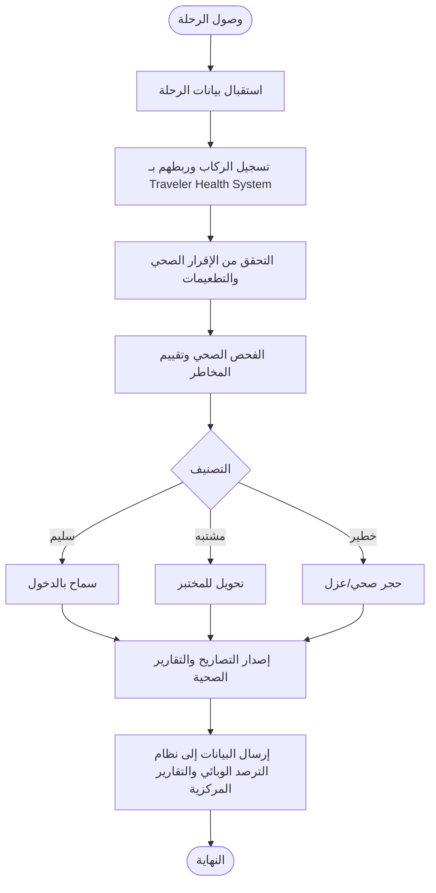
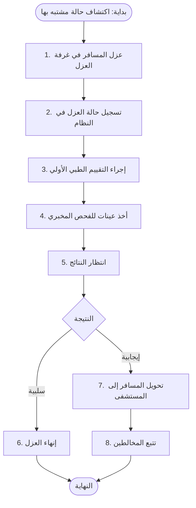
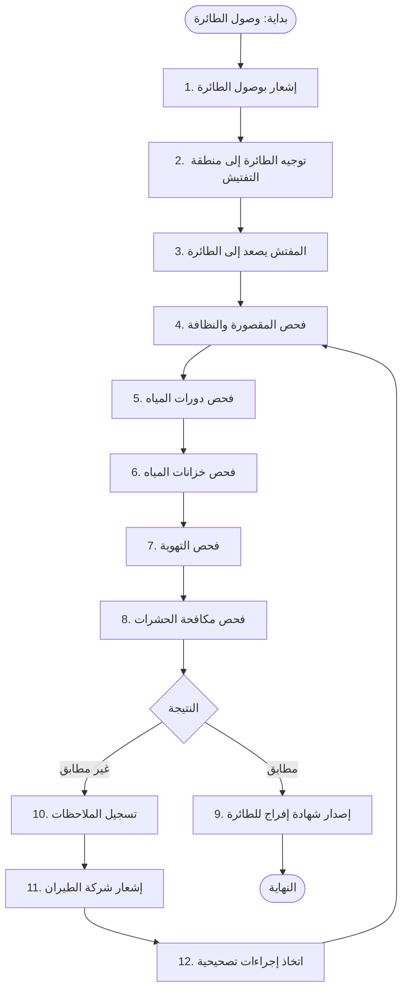

# 04_Airport_Workflow - سير العمل المتكامل في نظام صحة المطارات

## 1. سير العمل الأساسي (Main Workflow)



## 2. سير العمل: فحص المسافر القادم (Arrival Screening)

```mermaid
flowchart TD
    Start([بداية: هبوط الرحلة]) --> Step1[1. إشعار نظام المطار بوصول الرحلة]
    Step1 --> Step2[2. توجيه المسافرين إلى نقطة الفحص الصحي]
    Step2 --> Step3[3. مسح QR (أو إدخال رقم الجواز)]
    Step3 --> Step4[4. عرض بيانات المسافر من Traveler Health System]
    Step4 --> Step5[5. قياس الحرارة و SpO2]
    Step5 --> Step6[6. إدخال الأعراض الظاهرة]
    Step6 --> Step7[7. تقييم المخاطر (محرك المخاطر)]
    Step7 --> Decision1{التصنيف}
    Decision1 -- أخضر --> Step8[8. إفراج + تحديث حالة الرحلة]
    Decision1 -- أصفر/أحمر --> Step9[9. عزل مؤقت + إحالة للعيادة]
    Step9 --> Step10[10. إشعار غرفة الطوارئ في المطار]
    Step8 --> End([النهاية])
    Step10 --> End
```

## 3. سير العمل: العزل والحجر الصحي (Quarantine Management)



## 4. سير العمل: تتبع المخالطين (Contact Tracing)

```mermaid
flowchart TD
    Start([بداية: حالة مؤكدة]) --> Step1[1. تحديد الرحلة]
    Step1 --> Step2[2. استخراج قائمة الركاب]
    Step2 --> Step3[3. تحديد المخالطين (المقاعد المجاورة)]
    Step3 --> Step4[4. إرسال تنبيهات للمخالطين]
    Step4 --> Step5[5. متابعة حالات المخالطين]
    Step5 --> End([النهاية])
```

## 5. سير العمل: الطوارئ في المطار (Emergency Response)

```mermaid
flowchart TD
    Start([بداية: اكتشاف حالة خطيرة]) --> Step1[1. إشعار غرفة عمليات المطار]
    Step1 --> Step2[2. تفعيل خطة الطوارئ]
    Step2 --> Step3[3. تحديد المنطقة المتأثرة]
    Step3 --> Step4[4. إرسال الفرق الطبية إلى الموقع]
    Step4 --> Step5[5. عزل المنطقة ومنع الدخول/الخروج]
    Step5 --> Step6[6. إجراء فحوصات للمخالطين]
    Step6 --> Decision1{السيطرة على الوضع؟}
    Decision1 -- نعم --> Step7[7. رفع الحظر وإعادة التشغيل]
    Decision1 -- لا --> Step8[8. تصعيد إلى غرفة الطوارئ الوطنية (EOC)]
    Step7 --> End([النهاية])
    Step8 --> End
```

## 6. سير العمل: تفتيش الطائرات (Aircraft Inspection)



## 7. نقاط القرار الرئيسية (Decision Points)
- **تصنيف المخاطر**: (أخضر، أصفر، أحمر) – يحدد الإفراج أو العزل أو الإحالة.
- **نتيجة الفحص المخبري**: (سلبية، إيجابية) – يحدد الإفراج أو التحويل.
- **حالة المطار**: (طبيعي، تنبيه، طوارئ) – يحدد مستوى الاستجابة.
- **نوع المسافر**: (قادم، مغادر، عابر، طاقم) – يحدد مسار الفحص.
- **نتيجة تفتيش الطائرة**: (مطابق، غير مطابق) – يحدد الإفراج أو الإجراءات التصحيحية.
