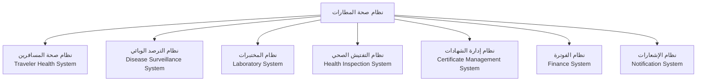

# 05_Airport_Integration - التكامل مع الأنظمة الأخرى

## 1. نظرة عامة
يتكامل نظام صحة المطارات مع العديد من الأنظمة الداخلية والخارجية لضمان سير العمل بسلاسة وتبادل البيانات بكفاءة.

## 2. التكامل مع الأنظمة الداخلية

## 3. التكامل مع الجهات الخارجية

| الجهة | نوع التكامل | البيانات المتبادلة |
| :--- | :--- | :--- |
| **وزارة الصحة الاتحادية** | REST API / SFTP | التقارير الصحية، التنبيهات |
| **سلطة الطيران المدني** | REST API | جداول الرحلات، بيانات الطائرات |
| **إدارة المطار** | REST API | التنسيق التشغيلي |
| **شركات الطيران** | REST API | بيانات الركاب والطواقم |
| **الجوازات والهجرة** | REST API | التحقق من هويات المسافرين |
| **الجمارك** | REST API | إجراءات الإفراج |
| **المختبرات المرجعية** | REST API | نتائج الفحوصات |

## 4. نقاط التكامل (Integration Points)

| النقطة | الوصف | البروتوكول |
| :--- | :--- | :--- |
| **استقبال الرحلات** | استقبال بيانات الرحلات من سلطة الطيران المدني | REST API |
| **استقبال المسافرين** | استقبال بيانات المسافرين من Traveler Health System | REST API |
| **إرسال الفحوصات** | إرسال عينات إلى نظام المختبرات | REST API |
| **استلام النتائج** | استلام نتائج المختبر من Laboratory System | REST API |
| **إصدار الشهادات** | إرسال الشهادات إلى Certificate Management System | REST API |
| **إرسال الإشعارات** | إرسال إشعارات عبر Notification System | REST API / SMS / Email |
| **التقارير** | إرسال التقارير إلى وزارة الصحة | SFTP / REST API |
| **الترصد** | إرسال بيانات الحالات إلى Disease Surveillance System | REST API |

## 5. معايير التكامل
- **المصادقة**: JWT / API Keys
- **التشفير**: TLS 1.3
- **تنسيق البيانات**: JSON / XML
- **تسجيل الأخطاء**: Audit Logging
- **إعادة المحاولة**: Exponential Backoff
