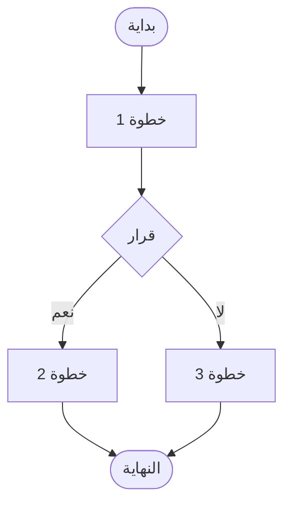

**كيفية إضافة وحدة جديدة (New Module) إلى منصة NQP**، 
مع توضيح جميع الخطوات المطلوبة والتغييرات التي يجب إجراؤها في جميع ملفات المشروع.

---

## 📄 `ADDING_NEW_MODULE.md` (دليل إضافة وحدة جديدة)

```markdown
# دليل إضافة وحدة جديدة إلى منصة NQP

## 1. مقدمة
يشرح هذا الدليل الخطوات المطلوبة لإضافة وحدة (Module) جديدة إلى منصة الحجر الصحي القومي (NQP). الوحدة الجديدة تمثل نظاماً فرعياً جديداً يضاف إلى المنصة (مثل: نظام التأمين الصحي، نظام المختبرات الإقليمية، إلخ).

اتباع هذه الخطوات يضمن:
- **الاتساق**: جميع الملفات تُحدث بنفس الطريقة.
- **التكامل**: الوحدة الجديدة تتكامل مع بقية المنصة.
- **التوثيق**: جميع الوثائق تعكس الهيكل الجديد.

---

## 2. قائمة التحقق (Checklist)

| # | المهمة | الملف/المسار | الحالة |

| 1 | إنشاء مجلد الوحدة | `docs/04_Modules/XX_Module_Name/` | ☐ |

| 2 | إنشاء ملفات الوحدة الأساسية | `01_System_Overview.md`, `02_Database_Schema.md`... | ☐ |

| 3 | تحديث `PROJECT_TREE.md` | `docs/02_Architecture/PROJECT_TREE.md` | ☐ |

| 4 | تحديث `System_Overview.md` | `docs/02_Architecture/System_Overview.md` | ☐ |

| 5 | تحديث `Technology_Stack.md` (إن لزم) | `docs/02_Architecture/Technology_Stack.md` | ☐ |

| 6 | إنشاء ملف API | `docs/05_API/Module_API.md` | ☐ |

| 7 | تحديث `api.md` | `docs/05_API/api.md` | ☐ |

| 8 | تحديث `OpenAPI.yaml` | `docs/05_API/OpenAPI.yaml` | ☐ |

| 9 | إنشاء مجلد UI/UX | `docs/06_UI_UX/XX_Module_Name/` | ☐ |

| 10 | تحديث `00-UX-UI-Screens.md` | `docs/06_UI_UX/00-UX-UI-Screens.md` | ☐ |

| 11 | إنشاء ملف Workflow | `docs/07_Workflows/Module_Workflow.md` | ☐ |

| 12 | تحديث `workflows.md` | `docs/07_Workflows/workflows.md` | ☐ |

| 13 | تحديث `ReadMe.md` (قاعدة البيانات) | `docs/03_Database/ReadMe.md` | ☐ |

| 14 | تحديث `init.sql` | `docs/03_Database/init.sql` (أو المنفصل) | ☐ |

| 15 | تحديث `Tables.md` | `docs/03_Database/Tables.md` | ☐ |

| 16 | تحديث `Relationships.md` | `docs/03_Database/Relationships.md` | ☐ |

| 17 | تحديث `Indexes.md` | `docs/03_Database/Indexes.md` | ☐ |

| 18 | تحديث `Constraints.md` | `docs/03_Database/Constraints.md` | ☐ |

| 19 | تحديث `Data_Dictionary.md` | `docs/03_Database/Data_Dictionary.md` | ☐ |

| 20 | إنشاء تطبيق Django (Backend) | `backend/apps/module_name/` | ☐ |

| 21 | تحديث `backend/settings.py` | إضافة التطبيق إلى `INSTALLED_APPS` | ☐ |

| 22 | تحديث `backend/urls.py` | إضافة مسارات التطبيق | ☐ |

| 23 | إنشاء صفحات Frontend (React) | `frontend/src/pages/ModuleName/` | ☐ |

| 24 | تحديث `frontend/src/routes.tsx` | إضافة المسارات الجديدة | ☐ |

---

## 3. خطوات التفصيلية

### الخطوة 1: إنشاء مجلد الوحدة في `04_Modules`

**المسار**: `docs/04_Modules/XX_Module_Name/`

**ملفات المطلوب إنشاؤها** (الحد الأدنى):

| الملف | الوصف | محتوى أساسي |
| :--- | :--- | :--- |
| `01_System_Overview.md` | نظرة عامة على النظام (الأهداف، الممثلون، الميزات). | انظر النموذج أدناه |
| `02_Database_Schema.md` | مخطط قاعدة البيانات (الجداول والعلاقات). | انظر النموذج أدناه |
| `03_Module_API.md` | (اختياري) وصف واجهات API (يمكن نقلها إلى `05_API`). | وصف نقاط النهاية |
| `04_Module_Workflow.md` | (اختياري) سير العمل (يمكن نقله إلى `07_Workflows`). | مخطط Mermaid |

**نموذج `01_System_Overview.md`**:
```markdown
# XX_Module_Name - [عنوان النظام]

## 1. الهدف الاستراتيجي
[وصف الهدف من النظام]

## 2. الممثلون (Actors)
- [المستخدم 1]
- [المستخدم 2]

## 3. الميزات الرئيسية
| الميزة | الوصف | الأولوية |
| :--- | :--- | :--- |
| [ميزة 1] | [وصف] | عالية |

## 4. التكامل مع الأنظمة الأخرى
- [النظام 1]: [نوع التكامل]
- [النظام 2]: [نوع التكامل]

## 5. المتطلبات التقنية
- **الواجهة الأمامية**: React + Tailwind CSS
- **الخلفية**: Django REST Framework
- **المصادقة**: JWT
```

---

### الخطوة 2: تحديث `PROJECT_TREE.md`

**المسار**: `docs/02_Architecture/PROJECT_TREE.md`

**التغيير**: أضف المجلد الجديد في قائمة `04_Modules`.

```text
├── 📁 04_Modules/
│   ... (الوحدات السابقة) ...
│   └── 📁 XX_Module_Name/       # (جديد)
│       ├── 01_System_Overview.md
│       ├── 02_Database_Schema.md
│       ├── 03_Module_API.md
│       └── 04_Module_Workflow.md
```

---

### الخطوة 3: تحديث `System_Overview.md`

**المسار**: `docs/02_Architecture/System_Overview.md`

**التغيير**: أضف النظام الجديد في جدول المكونات الرئيسية (High-Level Components).

```markdown
| **XX_Module_Name** | [وصف النظام] | [التقنيات المستخدمة] |
```

---

### الخطوة 4: تحديث `Technology_Stack.md` (إن لزم)

**المسار**: `docs/02_Architecture/Technology_Stack.md`

**التغيير**: إذا كان النظام يستخدم تقنيات جديدة (مثل: مكتبة جديدة، أداة جديدة)، أضفها إلى الجداول المناسبة.

---

### الخطوة 5: إنشاء ملف API

**المسار**: `docs/05_API/Module_API.md`

**المحتوى الأساسي**:

```markdown
# Module_API - واجهات [اسم النظام]

## 1. نظرة عامة
[وصف واجهات API]

## 2. المسارات (Endpoints)

### 2.1. [مجموعة الواجهات 1]
| الطريقة | المسار | الوصف | الصلاحية |
| :--- | :--- | :--- | :--- |
| `GET` | `/api/v1/module/` | قائمة | [الدور] |
| `POST` | `/api/v1/module/` | إنشاء | [الدور] |

## 3. نماذج الطلبات والاستجابات

### 3.1. [نموذج الطلب]
```json
{
  "field1": "value1",
  "field2": "value2"
}
```

## 4. رموز الاستجابة (Status Codes)
| الكود | الوصف |
| :--- | :--- |
| `200 OK` | نجاح العملية |
| `201 Created` | تم إنشاء المورد |
| `400 Bad Request` | طلب غير صحيح |
```

---

### الخطوة 6: تحديث `api.md`

**المسار**: `docs/05_API/api.md`

**التغيير**: أضف التصنيف (Tag) الجديد في جدول التصنيفات.

```markdown
| **Module** | [وصف النظام] | `Module_API.md` |
```

---

### الخطوة 7: تحديث `OpenAPI.yaml`

**المسار**: `docs/05_API/OpenAPI.yaml`

**التغييرات**:
1.  أضف التصنيف الجديد في قسم `tags`.
2.  أضف المسارات الجديدة في قسم `paths`.

```yaml
tags:
  - name: Module
    description: [وصف النظام]

paths:
  /module/:
    get:
      tags: [Module]
      summary: قائمة [المورد]
      responses:
        '200': { description: قائمة }
```

---

### الخطوة 8: إنشاء مجلد UI/UX

**المسار**: `docs/06_UI_UX/XX_Module_Name/`

**ملفات المطلوب إنشاؤها**:
- `Dashboard.md` (لوحة التحكم)
- `[Feature].md` (شاشات أخرى حسب الحاجة)

---

### الخطوة 9: تحديث `00-UX-UI-Screens.md`

**المسار**: `docs/06_UI_UX/00-UX-UI-Screens.md`

**التغيير**: أضف المجلد الجديد في الفهرس.

```markdown
## XX. Module Name (اسم النظام)
- `XX_Module_Name/Dashboard.md` - لوحة التحكم
- `XX_Module_Name/[Feature].md` - [الوصف]
```

---

### الخطوة 10: إنشاء ملف Workflow

**المسار**: `docs/07_Workflows/Module_Workflow.md`

**المحتوى الأساسي**:

```markdown
# WF-XX: [اسم سير العمل]

## 1. الهدف
[وصف سير العمل]

## 2. الممثلون (Actors)
- [المستخدم 1]
- [المستخدم 2]

## 3. تدفق العملية



## 4. المسارات البديلة
- **A1**: [وصف]
- **A2**: [وصف]

## 5. نقاط القرار الرئيسية
- **نقطة 1**: [وصف]
- **نقطة 2**: [وصف]
```

---

### الخطوة 11: تحديث `workflows.md`

**المسار**: `docs/07_Workflows/workflows.md`

**التغييرات**:

#### أ. أضف سطراً جديداً في جدول المصفوفة (Workflows Matrix):

| المعرف | سير العمل | الوحدة المرجعية | الملف المرجعي |
| :--- | :--- | :--- | :--- |
| **WF-XX** | [اسم سير العمل] | XX_Module_Name | `Module_Workflow.md` |

#### ب. حدّث مخطط العلاقات (Dependencies):

```mermaid
    WFXX[WF-XX: اسم سير العمل] --> WF01
```

#### ج. أضف الوحدة الجديدة في جدول العلاقات حسب الوحدات المرجعية:

| XX_Module_Name | WF-XX |
| :--- | :--- |

---

### الخطوة 12: تحديث قاعدة البيانات (03_Database)

#### أ. تحديث `ReadMe.md`
**المسار**: `docs/03_Database/ReadMe.md`

أضف الفئة الجديدة في خريطة الجداول:

| الفئة (Category) | الجداول الرئيسية | الغرض |
| :--- | :--- | :--- |
| **[اسم النظام]** | `table1`, `table2`, `table3` | [الغرض] |

#### ب. تحديث `init.sql`
**المسار**: `docs/03_Database/init.sql` (أو `init_new_modules.sql`)

أضف `CREATE TABLE` للجداول الجديدة:

```sql
-- ============================================================
-- XX. [اسم النظام]
-- ============================================================

CREATE TABLE table1 (
    id UUID PRIMARY KEY DEFAULT gen_random_uuid(),
    field1 VARCHAR(255) NOT NULL,
    field2 INTEGER,
    created_at TIMESTAMP WITH TIME ZONE DEFAULT CURRENT_TIMESTAMP,
    updated_at TIMESTAMP WITH TIME ZONE DEFAULT CURRENT_TIMESTAMP
);
```

#### ج. تحديث `Tables.md`
**المسار**: `docs/03_Database/Tables.md`

أضف وصفاً مفصلاً للجداول الجديدة (الأعمدة، الأنواع، القيود).

#### د. تحديث `Relationships.md`
**المسار**: `docs/03_Database/Relationships.md`

أضف المفاتيح الخارجية (Foreign Keys) للجداول الجديدة.

#### هـ. تحديث `Indexes.md`
**المسار**: `docs/03_Database/Indexes.md`

أضف الفهارس (Indexes) للجداول الجديدة.

#### و. تحديث `Constraints.md`
**المسار**: `docs/03_Database/Constraints.md`

أضف القيود (Check, Unique) للجداول الجديدة.

#### ز. تحديث `Data_Dictionary.md`
**المسار**: `docs/03_Database/Data_Dictionary.md`

أضف قاموس البيانات للحقول الجديدة.

---

### الخطوة 13: إنشاء تطبيق Django (Backend)

**المسار**: `backend/apps/module_name/`

**إنشاء التطبيق**:
```bash
cd backend
python manage.py startapp module_name
mv module_name apps/
```

**تسجيل التطبيق في `settings.py`**:
```python
INSTALLED_APPS = [
    # ...
    'apps.module_name',
]
```

**إضافة المسارات في `urls.py`**:
```python
urlpatterns = [
    # ...
    path('api/v1/module/', include('apps.module_name.urls')),
]
```

---

### الخطوة 14: إنشاء صفحات Frontend (React)

**المسار**: `frontend/src/pages/ModuleName/`

**إنشاء الملفات**:
- `Dashboard.tsx`
- `[Feature].tsx`
- `index.ts` (للتصدير)

**تحديث `routes.tsx`**:
```typescript
import { ModuleDashboard } from './pages/ModuleName/Dashboard';

// ...
{
  path: '/module/dashboard',
  element: <ModuleDashboard />,
}
```

---

## 4. أمثلة على التغييرات في ملفات محددة

### مثال: إضافة وحدة `18_Health_Insurance`

#### أ. في `04_Modules/18_Health_Insurance/01_System_Overview.md`
```markdown
# 18_Health_Insurance - نظام التأمين الصحي للمسافرين

## 1. الهدف الاستراتيجي
توفير نظام لإدارة وثائق التأمين الصحي للمسافرين، وتسهيل عملية المطالبات والتعويضات.

## 2. الممثلون (Actors)
- **المسافر**: يقدم طلب تأمين.
- **شركة التأمين**: تدير الوثائق والمطالبات.
- **مسؤول النظام**: يدير الإعدادات.

## 3. الميزات الرئيسية
| الميزة | الوصف | الأولوية |
| :--- | :--- | :--- |
| **إدارة الوثائق** | إنشاء وتعديل وثائق التأمين. | عالية |
| **المطالبات** | تقديم ومتابعة المطالبات. | عالية |
```

#### ب. في `05_API/HealthInsurance_API.md`
```markdown
# HealthInsurance_API - واجهات نظام التأمين الصحي

## 2. المسارات (Endpoints)

### 2.1. إدارة الوثائق (Policies)
| الطريقة | المسار | الوصف | الصلاحية |
| :--- | :--- | :--- | :--- |
| `GET` | `/api/v1/insurance/policies/` | قائمة الوثائق | ADMIN |
| `POST` | `/api/v1/insurance/policies/` | إنشاء وثيقة | ADMIN |
```

#### ج. في `03_Database/init_new_modules.sql`
```sql
-- ============================================================
-- 18. نظام التأمين الصحي (Health Insurance)
-- ============================================================

CREATE TABLE insurance_policies (
    id UUID PRIMARY KEY DEFAULT gen_random_uuid(),
    traveler_id UUID NOT NULL REFERENCES travelers(id) ON DELETE CASCADE,
    policy_number VARCHAR(50) UNIQUE NOT NULL,
    provider VARCHAR(200) NOT NULL,
    coverage_amount DECIMAL(10, 2) NOT NULL,
    start_date DATE NOT NULL,
    end_date DATE NOT NULL,
    status VARCHAR(20) DEFAULT 'ACTIVE',
    created_at TIMESTAMP WITH TIME ZONE DEFAULT CURRENT_TIMESTAMP,
    updated_at TIMESTAMP WITH TIME ZONE DEFAULT CURRENT_TIMESTAMP
);
```

#### د. في `07_Workflows/workflows.md`
أضف في جدول المصفوفة:

| **WF-27** | إدارة التأمين الصحي | 18_Health_Insurance | `HealthInsurance_Workflow.md` |

---

## 5. أفضل الممارسات (Best Practices)

| النصيحة | الوصف |
| :--- | :--- |
| **التسمية** | استخدم `snake_case` لأسماء المجلدات والملفات (مثل: `health_insurance`). |
| **الترقيم** | استخدم أرقاماً متسلسلة للوحدات (01, 02, ... 17, 18). |
| **الاتساق** | اتبع نفس هيكل الملفات في جميع الوحدات. |
| **التوثيق** | وثّق كل تغيير في ملف `CHANGELOG.md` (إن وجد). |
| **الاختبار** | اختبر التكامل مع بقية المنصة بعد إضافة الوحدة. |

---

## 6. قائمة الملفات التي يجب تحديثها (ملخص سريع)

| المجلد | الملفات |
| :--- | :--- |
| **04_Modules/** | `XX_Module_Name/01_System_Overview.md`, `02_Database_Schema.md` |
| **02_Architecture/** | `PROJECT_TREE.md`, `System_Overview.md`, `Technology_Stack.md` |
| **05_API/** | `Module_API.md`, `api.md`, `OpenAPI.yaml` |
| **06_UI_UX/** | `XX_Module_Name/Dashboard.md`, `00-UX-UI-Screens.md` |
| **07_Workflows/** | `Module_Workflow.md`, `workflows.md` |
| **03_Database/** | `ReadMe.md`, `init.sql`, `Tables.md`, `Relationships.md`, `Indexes.md`, `Constraints.md`, `Data_Dictionary.md` |
| **backend/** | `apps/module_name/`, `settings.py`, `urls.py` |
| **frontend/** | `src/pages/ModuleName/`, `routes.tsx` |

---

## 7. الخلاصة

إضافة وحدة جديدة تتطلب تحديث **12 مجلداً رئيسياً** و **أكثر من 20 ملفاً**. اتباع هذا الدليل يضمن:
1.  **تكامل الوحدة** مع بقية المنصة.
2.  **توثيق كامل** للوحدة الجديدة.
3.  **اتساق الهيكل** مع الوحدات الحالية.
4.  **جاهزية الوحدة** للتطوير الفعلي.

---

**تم إعداد هذا الدليل لتسهيل عملية إضافة وحدات جديدة والحفاظ على تنظيم المشروع.** 🚀
```

---

## 📂 موقع الملف الجديد

```text
docs/04_Modules/
├── 01_Public_Website/
├── 02_Traveler_Portal/
├── ...
├── 17_Airport_Health_System/
└── ADDING_NEW_MODULE.md          # (الملف الجديد)
```

---

## ✅ ملخص ما تم إنجازه

| العنصر | الحالة | الوصف |
| :--- | :--- | :--- |
| `ADDING_NEW_MODULE.md` | ✅ (جديد) | دليل شامل لإضافة وحدة جديدة (20+ خطوة مع أمثلة). |

---

**تم إنشاء الدليل الكامل لإضافة وحدة جديدة!** 🎉

**هل تريد مني أيضاً إنشاء سكريبت آلي (`add_new_module.sh`) يقوم بتطبيق هذه التغييرات تلقائياً؟** أخبرني.