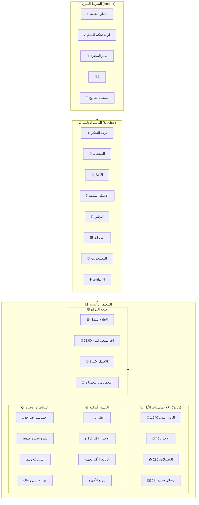

---

## 📄 `06_UI_UX/01_Public_Website/AdminDashboard/CMS-Dashboard.md`

```markdown
# لوحة تحكم مدير المحتوى (CMS Dashboard)

## 1. نظرة عامة
لوحة تحكم مدير المحتوى (CMS Dashboard) هي الواجهة الرئيسية التي تظهر لمسؤولي المحتوى بعد تسجيل الدخول إلى نظام إدارة المحتوى. تهدف إلى:
- **تقديم نظرة شاملة** عن أداء الموقع والمحتوى.
- **عرض مؤشرات الأداء الرئيسية** (KPIs) للمحتوى.
- **توفير وصول سريع** إلى جميع أدوات إدارة المحتوى.
- **عرض أحدث الأنشطة** والتحديثات في الموقع.

---

## 2. التخطيط العام (Layout - Mermaid)



---

## 3. Mockup الكامل (Full Layout)

```text
┌─────────────────────────────────────────────────────────────────────────────────────┐
│ 🏥 منصة الحجر الصحي القومي     لوحة تحكم المحتوى     👤 أحمد   🔔 3   🚪 خروج   │
├─────────────────────────────────────────────────────────────────────────────────────┤
│                                                                                     │
│ ┌─────────────┐  ┌───────────────────────────────────────────────────────────────┐ │
│ │ 📊 لوحة      │  │  📈 مؤشرات الأداء                                             │ │
│ │    التحكم    │  │  ┌──────────┐  ┌──────────┐  ┌──────────┐  ┌──────────┐    │ │
│ │              │  │  │ 👥 1,540 │  │ 📰 45   │  │ 📥 230  │  │ ✉️ 12   │    │ │
│ │ 📄 الصفحات  │  │  │ زوار اليوم│  │ أخبار   │  │ تحميلات │  │ رسائل   │    │ │
│ │              │  │  └──────────┘  └──────────┘  └──────────┘  └──────────┘    │ │
│ │ 📰 الأخبار  │  └───────────────────────────────────────────────────────────────┘ │
│ │              │  ┌───────────────────────────────────────────────────────────────┐ │
│ │ ❓ الأسئلة  │  │  📊 الرسوم البيانية                                            │ │
│ │    الشائعة   │  │  ┌──────────────────────┐  ┌──────────────────────┐         │ │
│ │              │  │  │  اتجاه الزوار        │  │  الأخبار الأكثر قراءة│         │ │
│ │ 📁 الوثائق  │  │  │  150 ┤    ╭──╮       │  │  │ خبر 1 ████████░ │         │ │
│ │              │  │  │  100 ┤  ╭──╯  ╰──╮  │  │  │ خبر 2 ██████░░░ │         │ │
│ │ 🖼️ البانرات│  │  │   50 ┤╭──╯       ╰──╮│  │  │ خبر 3 ████░░░░░ │         │ │
│ │              │  │  │    0 ┼╯            ╰│  │  │ خبر 4 ██░░░░░░░ │         │ │
│ │ 👥 المستخدمين│  │  └──────────────────────┘  └──────────────────────┘         │ │
│ │              │  │  ┌──────────────────────┐  ┌──────────────────────┐         │ │
│ │ ⚙️ الإعدادات│  │  │  الوثائق الأكثر      │  │  توزيع الأجهزة      │         │ │
│ │              │  │  │  تحميلاً             │  │  🖥️ حاسوب 45%      │         │ │
│ └─────────────┘  │  │  │ وثيقة 1 ████████░ │  │  📱 جوال 35%      │         │ │
│                  │  │  │ وثيقة 2 ██████░░░ │  │  📟 جهاز لوحي20%   │         │ │
│                  │  │  │ وثيقة 3 ████░░░░░ │  └──────────────────────┘         │ │
│                  │  │  └──────────────────────┘                                 │ │
│                  │  └───────────────────────────────────────────────────────────────┘ │
│                  │  ┌───────────────────────────────────────────────────────────────┐ │
│                  │  │  📋 النشاطات الأخيرة                                        │ │
│                  │  │  ┌───────────────────────────────────────────────────────┐  │ │
│                  │  │  │  👤 أحمد  نشر خبر جديد: "إعلان هام للمسافرين"     │  │ │
│                  │  │  │  👤 سارة  تحديث صفحة "متطلبات السفر"              │  │ │
│                  │  │  │  👤 علي   رفع وثيقة: "بروتوكول الحجر الصحي 2025"   │  │ │
│                  │  │  │  👤 مها   الرد على رسالة: استفسار عن QR Code       │  │ │
│                  │  │  └───────────────────────────────────────────────────────┘  │ │
│                  │  └───────────────────────────────────────────────────────────────┘ │
│                  │  ┌───────────────────────────────────────────────────────────────┐ │
│                  │  │  🟢 صحة الموقع                                              │ │
│                  │  │  🟢 الخادم متصل    📅 آخر نسخة: اليوم 02:00   📌 الإصدار 2.1.0 │ │
│                  │  │  [🔄 التحقق من التحديثات]                                  │ │
│                  │  └───────────────────────────────────────────────────────────────┘ │
└─────────────────────────────────────────────────────────────────────────────────────┘
```

---

## 4. القائمة الجانبية (Sidebar)

### 4.1. Mockup القائمة الجانبية

```text
┌─────────────────────────────────────────────────────────────────────────────────────┐
│  📊 لوحة التحكم                                                                   │
│  📄 الصفحات                                                                       │
│  📰 الأخبار                                                                       │
│  ❓ الأسئلة الشائعة                                                               │
│  📁 الوثائق                                                                       │
│  🖼️ البانرات                                                                      │
│  👥 المستخدمين                                                                    │
│  ⚙️ الإعدادات                                                                     │
│                                                                                     │
│  ─────────────────────────────────────────────────────────────────────────────────  │
│                                                                                     │
│  🔔 الإشعارات (3)                                                                 │
│  📋 سجل النشاطات                                                                  │
│  🚪 تسجيل الخروج                                                                  │
└─────────────────────────────────────────────────────────────────────────────────────┘
```

### 4.2. عناصر القائمة

| العنصر | الأيقونة | الوصف | الرابط |
| :--- | :--- | :--- | :--- |
| **لوحة التحكم** | 📊 | الصفحة الرئيسية | `/admin/dashboard` |
| **الصفحات** | 📄 | إدارة الصفحات الثابتة | `/admin/pages` |
| **الأخبار** | 📰 | إدارة الأخبار والإعلانات | `/admin/news` |
| **الأسئلة الشائعة** | ❓ | إدارة الأسئلة والأجوبة | `/admin/faq` |
| **الوثائق** | 📁 | إدارة الوثائق والملفات | `/admin/documents` |
| **البانرات** | 🖼️ | إدارة الشرائح الدوارة | `/admin/sliders` |
| **المستخدمين** | 👥 | إدارة مستخدمي CMS | `/admin/users` |
| **الإعدادات** | ⚙️ | إعدادات الموقع العامة | `/admin/settings` |

---

## 5. مؤشرات الأداء (KPI Cards)

### 5.1. Mockup KPI Cards

```text
┌─────────────────────────────────────────────────────────────────────────────────────┐
│  📈 مؤشرات الأداء                                                                  │
│                                                                                     │
│  ┌──────────────────┐  ┌──────────────────┐  ┌──────────────────┐  ┌─────────────┐ │
│  │  👥 1,540        │  │  📰 45           │  │  📥 230          │  │  ✉️ 12      │ │
│  │  زوار اليوم      │  │  أخبار منشورة   │  │  تحميلات اليوم   │  │  رسائل جديدة│ │
│  │  📈 +5% عن الأمس │  │  📊 +3 هذا الشهر│  │  📈 +12% عن الأمس│  │  ⚠️ 8 غير   │ │
│  │                  │  │                  │  │                  │  │    مقروءة   │ │
│  └──────────────────┘  └──────────────────┘  └──────────────────┘  └─────────────┘ │
│                                                                                     │
└─────────────────────────────────────────────────────────────────────────────────────┘
```

### 5.2. تفاصيل KPI Cards

| البطاقة | الأيقونة | القيمة | الوصف | الاتجاه | اللون |
| :--- | :--- | :--- | :--- | :--- | :--- |
| **الزوار** | 👥 | 1,540 | زوار اليوم | 📈 +5% | أزرق |
| **الأخبار** | 📰 | 45 | إجمالي الأخبار المنشورة | 📊 +3 | أخضر |
| **التحميلات** | 📥 | 230 | تحميلات اليوم | 📈 +12% | برتقالي |
| **الرسائل** | ✉️ | 12 | رسائل جديدة غير مقروءة | ⚠️ 8 | أحمر |

---

## 6. الرسوم البيانية (Charts)

### 6.1. Mockup الرسوم البيانية

```text
┌─────────────────────────────────────────────────────────────────────────────────────┐
│  📊 الرسوم البيانية                                                                │
│                                                                                     │
│  ┌──────────────────────────────┐  ┌──────────────────────────────┐               │
│  │  📈 اتجاه الزوار             │  │  📰 الأخبار الأكثر قراءة     │               │
│  │                              │  │                              │               │
│  │  150 ┤    ╭──╮              │  │  خبر 1 ██████████ 1,200     │               │
│  │  120 ┤  ╭──╯  ╰──╮         │  │  خبر 2 ████████░░ 980       │               │
│  │   90 ┤╭──╯       ╰──╮      │  │  خبر 3 ██████░░░░ 750       │               │
│  │   60 ┤╭╯            ╰──╮   │  │  خبر 4 ████░░░░░░ 520       │               │
│  │   30 ┤╯                ╰──  │  │  خبر 5 ██░░░░░░░░ 310       │               │
│  │    0 ┼─────────────────    │  │                              │               │
│  │      يوم1 يوم2 ... يوم30  │  └──────────────────────────────┘               │
│  └──────────────────────────────┘                                               │
│                                                                                     │
│  ┌──────────────────────────────┐  ┌──────────────────────────────┐               │
│  │  📁 الوثائق الأكثر تحميلاً  │  │  📱 توزيع الأجهزة            │               │
│  │                              │  │                              │               │
│  │  وثيقة 1 ████████░░ 450     │  │  🖥️ حاسوب      45%          │               │
│  │  وثيقة 2 ██████░░░░ 320     │  │  📱 جوال       35%          │               │
│  │  وثيقة 3 ████░░░░░░ 210     │  │  📟 جهاز لوحي  20%          │               │
│  │  وثيقة 4 ██░░░░░░░░ 150     │  │                              │               │
│  │  وثيقة 5 █░░░░░░░░░ 90      │  │                              │               │
│  └──────────────────────────────┘  └──────────────────────────────┘               │
│                                                                                     │
└─────────────────────────────────────────────────────────────────────────────────────┘
```

### 6.2. تفاصيل الرسوم البيانية

| الرسم البياني | النوع | الوصف | البيانات |
| :--- | :--- | :--- | :--- |
| **اتجاه الزوار** | Line Chart | عدد الزوار اليومي خلال 30 يوماً | يومي |
| **الأخبار الأكثر قراءة** | Bar Chart | أكثر 5 أخبار قراءة | إجمالي المشاهدات |
| **الوثائق الأكثر تحميلاً** | Bar Chart | أكثر 5 وثائق تحميلاً | إجمالي التحميلات |
| **توزيع الأجهزة** | Pie Chart | توزيع زوار الموقع حسب الجهاز | النسبة المئوية |

---

## 7. النشاطات الأخيرة (Recent Activity)

### 7.1. Mockup النشاطات الأخيرة

```text
┌─────────────────────────────────────────────────────────────────────────────────────┐
│  📋 النشاطات الأخيرة                                                              │
│                                                                                     │
│  ┌─────────────────────────────────────────────────────────────────────────────┐    │
│  │  🟢 الآن    👤 أحمد  نشر خبر جديد: "إعلان هام للمسافرين"                 │    │
│  │  🟡 10:30   👤 سارة  تحديث صفحة "متطلبات السفر"                          │    │
│  │  🔵 09:45   👤 علي   رفع وثيقة: "بروتوكول الحجر الصحي 2025"              │    │
│  │  🟣 08:20   👤 مها   الرد على رسالة: استفسار عن QR Code                 │    │
│  │  🟢 07:50   👤 خالد  تعديل الأسئلة الشائعة: "كيف أحصل على QR؟"          │    │
│  └─────────────────────────────────────────────────────────────────────────────┘    │
│                                                                                     │
│  [عرض جميع النشاطات →]                                                            │
└─────────────────────────────────────────────────────────────────────────────────────┘
```

### 7.2. أنواع النشاطات

| النوع | الأيقونة | اللون | الوصف |
| :--- | :--- | :--- | :--- |
| **نشر خبر** | 📰 | 🟢 أخضر | نشر خبر جديد |
| **تحديث صفحة** | 📄 | 🟡 أصفر | تعديل محتوى صفحة |
| **رفع وثيقة** | 📁 | 🔵 أزرق | رفع ملف جديد |
| **الرد على رسالة** | ✉️ | 🟣 بنفسجي | رد على استفسار |
| **تعديل FAQ** | ❓ | 🟢 أخضر | تعديل الأسئلة الشائعة |

---

## 8. صحة الموقع (Site Health)

### 8.1. Mockup صحة الموقع

```text
┌─────────────────────────────────────────────────────────────────────────────────────┐
│  🟢 صحة الموقع                                                                     │
│                                                                                     │
│  ┌─────────────────────────────────────────────────────────────────────────────┐    │
│  │                                                                              │    │
│  │  🟢 الخادم متصل          📅 آخر نسخة: اليوم 02:00      📌 الإصدار 2.1.0    │    │
│  │                                                                              │    │
│  │  [🔄 التحقق من التحديثات]                                                    │    │
│  │                                                                              │    │
│  └─────────────────────────────────────────────────────────────────────────────┘    │
│                                                                                     │
└─────────────────────────────────────────────────────────────────────────────────────┘
```

### 8.2. مؤشرات صحة الموقع

| المؤشر | الأيقونة | الحالة | الوصف |
| :--- | :--- | :--- | :--- |
| **اتصال الخادم** | 🟢 | متصل | الخادم يعمل بشكل طبيعي |
| **آخر نسخة احتياطية** | 📅 | اليوم 02:00 | تم عمل نسخة احتياطية اليوم |
| **إصدار النظام** | 📌 | 2.1.0 | أحدث إصدار مثبت |
| **التحديثات** | 🔄 | - | زر للتحقق من التحديثات |

---

## 9. حالات واجهة المستخدم (UI States)

### 9.1. حالة التحميل (Loading)

```text
┌─────────────────────────────────────────────────────────────────────────────────────┐
│  ⏳ جاري تحميل البيانات...                                                         │
│                                                                                     │
│  ┌──────────┐  ┌──────────┐  ┌──────────┐  ┌──────────┐                          │
│  │ ⏳ 1,540 │  │ ⏳ 45   │  │ ⏳ 230  │  │ ⏳ 12   │                          │
│  └──────────┘  └──────────┘  └──────────┘  └──────────┘                          │
│                                                                                     │
│  ┌──────────────────────────────┐  ┌──────────────────────────────┐               │
│  │  ⏳ جاري تحميل الرسم البياني │  │  ⏳ جاري تحميل الرسم البياني │               │
│  └──────────────────────────────┘  └──────────────────────────────┘               │
│                                                                                     │
└─────────────────────────────────────────────────────────────────────────────────────┘
```

### 9.2. حالة الخطأ (Error)

```text
┌─────────────────────────────────────────────────────────────────────────────────────┐
│  ❌ عذراً، حدث خطأ في تحميل البيانات                                               │
│                                                                                     │
│  يرجى التحقق من اتصالك بالإنترنت والمحاولة مرة أخرى.                              │
│                                                                                     │
│  [🔄 إعادة المحاولة]                                                               │
│                                                                                     │
└─────────────────────────────────────────────────────────────────────────────────────┘
```

### 9.3. حالة عدم وجود بيانات (Empty)

```text
┌─────────────────────────────────────────────────────────────────────────────────────┐
│  📭 لا توجد بيانات لعرضها حالياً                                                    │
│                                                                                     │
│  لم يتم تسجيل أي نشاط حتى الآن.                                                   │
│                                                                                     │
└─────────────────────────────────────────────────────────────────────────────────────┘
```

---

## 10. التصميم المتجاوب (Responsive Design)

### Desktop (≥ 1024px)
- عرض القائمة الجانبية + المحتوى الرئيسي.
- 4 أعمدة لبطاقات KPI.
- 2x2 شبكة للرسوم البيانية.

### Tablet (768px - 1023px)
- القائمة الجانبية قابلة للطي (Collapsible).
- 2 أعمدة لبطاقات KPI.
- 1x4 شبكة للرسوم البيانية (عمودية).

### Mobile (< 768px)
- القائمة الجانبية مخفية (Hamburger Menu).
- 1 عمود لبطاقات KPI.
- 1x4 شبكة للرسوم البيانية (عمودية).
- تكبير الأزرار والعناصر التفاعلية.

---

## 11. التفاعلات (Interactions)

| العنصر | التفاعل | التأثير |
| :--- | :--- | :--- |
| **عناصر القائمة الجانبية** | Hover | تغيير الخلفية إلى أزرق فاتح |
| **بطاقات KPI** | Hover | ارتفاع بسيط (Elevation) |
| **الرسوم البيانية** | Hover | عرض تفاصيل النقطة |
| **زر "التحقق من التحديثات"** | Click | فتح نافذة منبثقة بالنتائج |
| **النشاطات** | Hover | تمييز الصف |
| **زر "عرض جميع النشاطات"** | Click | الانتقال إلى صفحة سجل النشاطات |

---

## 12. نقاط النهاية الخلفية (API Endpoints)

| الطريقة | المسار | الوصف |
| :--- | :--- | :--- |
| `GET` | `/api/v1/admin/cms/dashboard/stats/` | جلب إحصائيات KPI |
| `GET` | `/api/v1/admin/cms/dashboard/charts/` | جلب بيانات الرسوم البيانية |
| `GET` | `/api/v1/admin/cms/dashboard/activity/` | جلب النشاطات الأخيرة |
| `GET` | `/api/v1/admin/cms/dashboard/health/` | جلب حالة صحة الموقع |

---

## 13. ملفات مرجعية

| الملف | الوصف |
| :--- | :--- |
| `06_UI_UX/00-UX-UI-Screens.md` | دليل التصميم الموحد |
| `06_UI_UX/01_Public_Website/AdminDashboard/Overview.md` | نظرة عامة على لوحة التحكم |
| `06_UI_UX/01_Public_Website/AdminDashboard/PagesManager.md` | إدارة الصفحات |
| `06_UI_UX/01_Public_Website/AdminDashboard/NewsManager.md` | إدارة الأخبار |
| `06_UI_UX/01_Public_Website/AdminDashboard/FAQManager.md` | إدارة الأسئلة الشائعة |
| `06_UI_UX/01_Public_Website/AdminDashboard/DocumentManager.md` | إدارة الوثائق |

---
