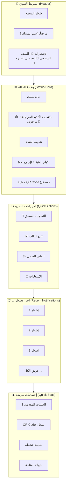

بالتأكيد! سأقوم بتصميم لوحة التحكم (Dashboard) الخاصة بالمسافر في بوابة المسافرين (Traveler Portal)، والتي تظهر بعد تسجيل الدخول مباشرة.

---

## 📄 `06_UI_UX/02_Traveler_Portal/Dashboard.md`

```markdown
# لوحة تحكم المسافر (Traveler Dashboard)

## 1. نظرة عامة
لوحة التحكم هي الصفحة الرئيسية التي تظهر للمسافر بعد تسجيل الدخول إلى بوابة المسافرين. تهدف إلى تقديم:
- **ملخص سريع** عن حالة المسافر (طلب، QR Code، متابعة).
- **وصول سريع** إلى جميع الخدمات (تسجيل جديد، تتبع الطلب، الملف الصحي، الإشعارات).
- **عرض الإشعارات** والتحديثات الأخيرة.
- **عرض حالة QR Code** (إذا كان مفعلاً).

---

## 2. التخطيط العام (Layout - Mermaid)



---

## 3. Mockup الكامل (Full Layout)

```text
┌─────────────────────────────────────────────────────────────────────────────────────┐
│ 🏥 منصة الحجر الصحي القومي                          مرحباً، أحمد محمد 🔔 3  👤  🚪 │
├─────────────────────────────────────────────────────────────────────────────────────┤
│                                                                                     │
│  ┌──────────────────────────────────────────────────────────────────────────────┐  │
│  │  🟦 حالة طلبك                                                              │  │
│  │                                                                              │  │
│  │  ┌─────────────────────────────────────────────────────────────────────────┐ │  │
│  │  │  ✅ طلبك معتمد                                                         │ │  │
│  │  │  رقم الطلب: REG-20260709-0001                                           │ │  │
│  │  │  تاريخ الإصدار: 2024-07-09                                              │ │  │
│  │  │                                                                         │ │  │
│  │  │  [████████████████████████████████████████████████████] 100%            │ │  │
│  │  │  تم إكمال جميع الخطوات                                                  │ │  │
│  │  │                                                                         │ │  │
│  │  │  ┌─────────────────┐                                                     │ │  │
│  │  │  │ ████████████████ │  رمز QR الخاص بك                                  │ │  │
│  │  │  │ ██  QR Code  ██ │  صالح حتى: 2024-07-10                             │ │  │
│  │  │  │ ████████████████ │                                                     │ │  │
│  │  │  └─────────────────┘                                                     │ │  │
│  │  │                                                                         │ │  │
│  │  │  [📥 تنزيل QR]  [🖨️ طباعة]  [📤 مشاركة]                              │ │  │
│  │  └─────────────────────────────────────────────────────────────────────────┘ │  │
│  │                                                                              │  │
│  │  🔔 لديك 3 إشعارات غير مقروءة                                              │  │
│  └──────────────────────────────────────────────────────────────────────────────┘  │
│                                                                                     │
│  ┌──────────────────────────────────────────────────────────────────────────────┐  │
│  │  🚀 الإجراءات السريعة                                                        │  │
│  │                                                                              │  │
│  │  ┌─────────────┐  ┌─────────────┐  ┌─────────────┐  ┌─────────────┐       │  │
│  │  │  📝 تسجيل   │  │  📊 تتبع   │  │  🩺 ملفي   │  │  🔔 إشعارات │       │  │
│  │  │  جديد       │  │  الطلب     │  │  الصحي     │  │            │       │  │
│  │  │             │  │             │  │             │  │     3 غير  │       │  │
│  │  │  [ابدأ]    │  │  [عرض]     │  │  [عرض]     │  │  مقروءة   │       │  │
│  │  └─────────────┘  └─────────────┘  └─────────────┘  └─────────────┘       │  │
│  │                                                                              │  │
│  └──────────────────────────────────────────────────────────────────────────────┘  │
│                                                                                     │
│  ┌──────────────────────────────────────────────────────────────────────────────┐  │
│  │  📋 آخر الإشعارات                                                            │  │
│  │                                                                              │  │
│  │  ┌─────────────────────────────────────────────────────────────────────────┐ │  │
│  │  │  🔵 2024-07-09 10:30  ✅ تم إصدار رمز QR الخاص بك                     │ │  │
│  │  └─────────────────────────────────────────────────────────────────────────┘ │  │
│  │  ┌─────────────────────────────────────────────────────────────────────────┐ │  │
│  │  │  🟡 2024-07-08 14:20  ⏳ تم استلام طلبك، قيد المراجعة                 │ │  │
│  │  └─────────────────────────────────────────────────────────────────────────┘ │  │
│  │  ┌─────────────────────────────────────────────────────────────────────────┐ │  │
│  │  │  🟢 2024-07-07 08:00  📝 تم إنشاء حسابك بنجاح                         │ │  │
│  │  └─────────────────────────────────────────────────────────────────────────┘ │  │
│  │                                                                              │  │
│  │  [عرض جميع الإشعارات →]                                                      │  │
│  └──────────────────────────────────────────────────────────────────────────────┘  │
│                                                                                     │
│  ┌──────────────────────────────────────────────────────────────────────────────┐  │
│  │  📊 إحصائيات سريعة                                                          │  │
│  │                                                                              │  │
│  │  ┌───────────┐  ┌───────────┐  ┌───────────┐  ┌───────────┐               │  │
│  │  │  📝 3     │  │  ✅ مفعل  │  │  🟢 نشطة  │  │  📄 متاحة │               │  │
│  │  │ طلبات     │  │ QR Code   │  │ متابعة    │  │ شهادة     │               │  │
│  │  │ مقدمة     │  │           │  │           │  │           │               │  │
│  │  └───────────┘  └───────────┘  └───────────┘  └───────────┘               │  │
│  │                                                                              │  │
│  └──────────────────────────────────────────────────────────────────────────────┘  │
│                                                                                     │
└─────────────────────────────────────────────────────────────────────────────────────┘
```

---

## 4. تفاصيل كل قسم

---

### 🔷 4.1. الشريط العلوي (Header)

#### Mockup
```text
┌─────────────────────────────────────────────────────────────────────────────────────┐
│ 🏥 منصة الحجر الصحي القومي                          مرحباً، أحمد محمد 🔔 3  👤  🚪 │
└─────────────────────────────────────────────────────────────────────────────────────┘
```

#### المكونات

| العنصر | الوصف | الإجراء |
| :--- | :--- | :--- |
| **الشعار** | شعار المنصة + الاسم | العودة إلى الصفحة الرئيسية |
| **الترحيب** | "مرحباً، [اسم المسافر]" | عرض اسم المسافر المسجل |
| **الإشعارات (🔔)** | أيقونة مع عداد الإشعارات غير المقروءة | الانتقال إلى صفحة الإشعارات |
| **الملف الشخصي (👤)** | أيقونة الملف الشخصي | الانتقال إلى صفحة الملف الشخصي |
| **تسجيل الخروج (🚪)** | أيقونة تسجيل الخروج | تسجيل الخروج من النظام |

---

### 🟦 4.2. بطاقة الحالة (Status Card)

#### Mockup - حالة مكتملة (مع QR)
```text
┌─────────────────────────────────────────────────────────────────────────────────────┐
│  🟦 حالة طلبك                                                                      │
│                                                                                     │
│  ┌─────────────────────────────────────────────────────────────────────────────┐    │
│  │  ✅ طلبك معتمد                                                              │    │
│  │  رقم الطلب: REG-20260709-0001                                                │    │
│  │  تاريخ الإصدار: 2024-07-09                                                   │    │
│  │                                                                              │    │
│  │  [████████████████████████████████████████████████████] 100%                 │    │
│  │  تم إكمال جميع الخطوات                                                       │    │
│  │                                                                              │    │
│  │  ┌─────────────────┐                                                          │    │
│  │  │ ████████████████ │  رمز QR الخاص بك                                       │    │
│  │  │ ██  QR Code  ██ │  صالح حتى: 2024-07-10                                  │    │
│  │  │ ████████████████ │                                                         │    │
│  │  └─────────────────┘                                                         │    │
│  │                                                                              │    │
│  │  [📥 تنزيل QR]  [🖨️ طباعة]  [📤 مشاركة]                                   │    │
│  └─────────────────────────────────────────────────────────────────────────────┘    │
│                                                                                     │
│  🔔 لديك 3 إشعارات غير مقروءة                                                      │
└─────────────────────────────────────────────────────────────────────────────────────┘
```

#### Mockup - حالة قيد المراجعة
```text
┌─────────────────────────────────────────────────────────────────────────────────────┐
│  🟦 حالة طلبك                                                                      │
│                                                                                     │
│  ┌─────────────────────────────────────────────────────────────────────────────┐    │
│  │  ⏳ طلبك قيد المراجعة                                                       │    │
│  │  رقم الطلب: REG-20260709-0001                                                │    │
│  │  تاريخ التقديم: 2024-07-09                                                   │    │
│  │                                                                              │    │
│  │  [████████████████████████████░░░░░░░░░░░░░░░░░░░░░░] 60%                    │    │
│  │  تم إكمال الخطوات: 3 من 5                                                    │    │
│  │                                                                              │    │
│  │  ⚠️ يرجى إكمال الإقرار الصحي                                                 │    │
│  │                                                                              │    │
│  │  [📝 متابعة التسجيل]                                                         │    │
│  └─────────────────────────────────────────────────────────────────────────────┘    │
└─────────────────────────────────────────────────────────────────────────────────────┘
```

#### Mockup - حالة مرفوضة
```text
┌─────────────────────────────────────────────────────────────────────────────────────┐
│  🟦 حالة طلبك                                                                      │
│                                                                                     │
│  ┌─────────────────────────────────────────────────────────────────────────────┐    │
│  │  ❌ طلبك مرفوض                                                              │    │
│  │  رقم الطلب: REG-20260709-0001                                                │    │
│  │  تاريخ التقديم: 2024-07-09                                                   │    │
│  │                                                                              │    │
│  │  سبب الرفض: المستندات غير واضحة                                              │    │
│  │                                                                              │    │
│  │  [📝 إعادة التقديم]  [📞 التواصل مع الدعم]                                  │    │
│  └─────────────────────────────────────────────────────────────────────────────┘    │
└─────────────────────────────────────────────────────────────────────────────────────┘
```

#### المكونات التفصيلية

| العنصر | الوصف | الحالات |
| :--- | :--- | :--- |
| **حالة الطلب** | عرض حالة الطلب الحالية | ✅ معتمد / ⏳ قيد المراجعة / ❌ مرفوض |
| **رقم الطلب** | رقم الطلب الفريد | REG-YYYYMMDD-XXXX |
| **شريط التقدم** | عرض التقدم في إكمال الطلب | 0% → 100% |
| **معاينة QR** | عرض مصغر لرمز QR | يظهر فقط عند اعتماد الطلب |
| **أزرار الإجراءات** | تنزيل، طباعة، مشاركة QR | تظهر فقط عند اعتماد الطلب |
| **تنبيه الإشعارات** | عدد الإشعارات غير المقروءة | يظهر دائماً |

---

### 🚀 4.3. الإجراءات السريعة (Quick Actions)

#### Mockup
```text
┌─────────────────────────────────────────────────────────────────────────────────────┐
│  🚀 الإجراءات السريعة                                                              │
│                                                                                     │
│  ┌─────────────┐  ┌─────────────┐  ┌─────────────┐  ┌─────────────┐              │
│  │  📝 تسجيل   │  │  📊 تتبع   │  │  🩺 ملفي   │  │  🔔 إشعارات │              │
│  │  جديد       │  │  الطلب     │  │  الصحي     │  │            │              │
│  │             │  │             │  │             │  │     3 غير  │              │
│  │  [ابدأ]    │  │  [عرض]     │  │  [عرض]     │  │  مقروءة   │              │
│  └─────────────┘  └─────────────┘  └─────────────┘  └─────────────┘              │
│                                                                                     │
└─────────────────────────────────────────────────────────────────────────────────────┘
```

#### المكونات التفصيلية

| البطاقة | الأيقونة | الوصف | الزر | الوجهة |
| :--- | :--- | :--- | :--- | :--- |
| **تسجيل جديد** | 📝 | بدء طلب تسجيل جديد | "ابدأ" | `/traveler/register` |
| **تتبع الطلب** | 📊 | متابعة حالة الطلب الحالي | "عرض" | `/traveler/tracking` |
| **ملفي الصحي** | 🩺 | عرض وتحديث الملف الصحي | "عرض" | `/traveler/profile` |
| **الإشعارات** | 🔔 | عرض جميع الإشعارات | "عرض" | `/traveler/notifications` |

#### حالة عدم وجود طلب
```text
┌─────────────────────────────────────────────────────────────────────────────────────┐
│  🚀 الإجراءات السريعة                                                              │
│                                                                                     │
│  ┌─────────────┐  ┌─────────────┐  ┌─────────────┐  ┌─────────────┐              │
│  │  📝 تسجيل   │  │  📊 تتبع   │  │  🩺 ملفي   │  │  🔔 إشعارات │              │
│  │  جديد       │  │  الطلب     │  │  الصحي     │  │            │              │
│  │             │  │  (لا يوجد) │  │             │  │     0      │              │
│  │  [ابدأ]    │  │  [غير متاح]│  │  [عرض]     │  │  [عرض]     │              │
│  └─────────────┘  └─────────────┘  └─────────────┘  └─────────────┘              │
│                                                                                     │
└─────────────────────────────────────────────────────────────────────────────────────┘
```

---

### 📋 4.4. آخر الإشعارات (Recent Notifications)

#### Mockup
```text
┌─────────────────────────────────────────────────────────────────────────────────────┐
│  📋 آخر الإشعارات                                                                  │
│                                                                                     │
│  ┌─────────────────────────────────────────────────────────────────────────────┐    │
│  │  🔵 2024-07-09 10:30  ✅ تم إصدار رمز QR الخاص بك                         │    │
│  └─────────────────────────────────────────────────────────────────────────────┘    │
│  ┌─────────────────────────────────────────────────────────────────────────────┐    │
│  │  🟡 2024-07-08 14:20  ⏳ تم استلام طلبك، قيد المراجعة                     │    │
│  └─────────────────────────────────────────────────────────────────────────────┘    │
│  ┌─────────────────────────────────────────────────────────────────────────────┐    │
│  │  🟢 2024-07-07 08:00  📝 تم إنشاء حسابك بنجاح                             │    │
│  └─────────────────────────────────────────────────────────────────────────────┘    │
│                                                                                     │
│  [عرض جميع الإشعارات →]                                                            │
└─────────────────────────────────────────────────────────────────────────────────────┘
```

#### المكونات التفصيلية

| العنصر | الوصف | الألوان |
| :--- | :--- | :--- |
| **أيقونة الحالة** | تعكس نوع الإشعار | 🔵 معلومات / 🟡 تحذير / 🟢 نجاح / 🔴 خطر |
| **التاريخ والوقت** | وقت حدوث الإشعار | `2024-07-09 10:30` |
| **نص الإشعار** | وصف مختصر للإشعار | "تم إصدار رمز QR الخاص بك" |
| **حالة القراءة** | تمييز الإشعارات غير المقروءة | خلفية زرقاء فاتحة (لغير المقروء) |

#### حالة عدم وجود إشعارات
```text
┌─────────────────────────────────────────────────────────────────────────────────────┐
│  📋 آخر الإشعارات                                                                  │
│                                                                                     │
│  ┌─────────────────────────────────────────────────────────────────────────────┐    │
│  │                         🔔                                                  │    │
│  │                                                                              │    │
│  │   لا توجد إشعارات جديدة                                                     │    │
│  │                                                                              │    │
│  └─────────────────────────────────────────────────────────────────────────────┘    │
│                                                                                     │
└─────────────────────────────────────────────────────────────────────────────────────┘
```

---

### 📊 4.5. إحصائيات سريعة (Quick Stats)

#### Mockup
```text
┌─────────────────────────────────────────────────────────────────────────────────────┐
│  📊 إحصائيات سريعة                                                                  │
│                                                                                     │
│  ┌───────────┐  ┌───────────┐  ┌───────────┐  ┌───────────┐                      │
│  │  📝 3     │  │  ✅ مفعل  │  │  🟢 نشطة  │  │  📄 متاحة │                      │
│  │ طلبات     │  │ QR Code   │  │ متابعة    │  │ شهادة     │                      │
│  │ مقدمة     │  │           │  │           │  │           │                      │
│  └───────────┘  └───────────┘  └───────────┘  └───────────┘                      │
│                                                                                     │
└─────────────────────────────────────────────────────────────────────────────────────┘
```

#### المكونات التفصيلية

| البطاقة | الأيقونة | القيمة | الوصف | لون الخلفية |
| :--- | :--- | :--- | :--- | :--- |
| **الطلبات المقدمة** | 📝 | 3 | عدد الطلبات المقدمة | أزرق فاتح |
| **QR Code** | ✅ | مفعل | حالة QR Code | أخضر فاتح |
| **المتابعة** | 🟢 | نشطة | حالة المتابعة الصحية | أخضر فاتح |
| **الشهادة** | 📄 | متاحة | حالة شهادة التعافي | أزرق فاتح |

---

## 5. حالات واجهة المستخدم (UI States)

### 5.1. حالة التحميل (Loading)
```text
┌─────────────────────────────────────────────────────────────────────────────────────┐
│  🌀 جاري تحميل بياناتك...                                                          │
│                                                                                     │
│  ┌─────────────────────────────────────────────────────────────────────────────┐    │
│  │  ⏳ جاري تحميل حالة الطلب...                                                │    │
│  └─────────────────────────────────────────────────────────────────────────────┘    │
│                                                                                     │
│  ┌─────────────┐  ┌─────────────┐  ┌─────────────┐  ┌─────────────┐              │
│  │  ⏳ Loading │  │  ⏳ Loading │  │  ⏳ Loading │  │  ⏳ Loading │              │
│  └─────────────┘  └─────────────┘  └─────────────┘  └─────────────┘              │
│                                                                                     │
└─────────────────────────────────────────────────────────────────────────────────────┘
```

### 5.2. حالة الخطأ (Error)
```text
┌─────────────────────────────────────────────────────────────────────────────────────┐
│  ❌ عذراً، حدث خطأ في تحميل البيانات                                               │
│                                                                                     │
│  يرجى التحقق من اتصالك بالإنترنت والمحاولة مرة أخرى.                              │
│                                                                                     │
│  [🔄 إعادة المحاولة]                                                               │
│                                                                                     │
└─────────────────────────────────────────────────────────────────────────────────────┘
```

### 5.3. حالة عدم وجود طلب (No Request)
```text
┌─────────────────────────────────────────────────────────────────────────────────────┐
│  🟦 حالة طلبك                                                                      │
│                                                                                     │
│  ┌─────────────────────────────────────────────────────────────────────────────┐    │
│  │  📭 ليس لديك طلبات سابقة                                                    │    │
│  │                                                                              │    │
│  │  يمكنك بدء طلب جديد بالضغط على الزر أدناه.                                  │    │
│  │                                                                              │    │
│  │  [📝 بدء طلب جديد]                                                           │    │
│  └─────────────────────────────────────────────────────────────────────────────┘    │
└─────────────────────────────────────────────────────────────────────────────────────┘
```

---

## 6. اعتبارات التصميم (Design Considerations)

| الجانب | الاعتبار |
| :--- | :--- |
| **الألوان** | استخدام الألوان الأساسية (الأزرق، الأخضر، الأصفر، الأحمر) |
| **الخطوط** | Tajawal (عربي) و Inter (إنجليزي) |
| **التجاوب** | تصميم متجاوب لجميع الأجهزة (Desktop، Tablet، Mobile) |
| **السرعة** | تحسين الصور، استخدام Lazy Loading |
| **إمكانية الوصول** | تباين ألوان عالٍ، دعم التنقل بالكيبورد |
| **التفاعل** | تأثيرات hover و transition سلسة |

---

## 7. التجاوب (Responsive Design)

### Desktop (≥ 1024px)
```text
┌─────────────────────────────────────────────────────────────────────────────────────┐
│ 🏥 منصة الحجر الصحي القومي                          مرحباً، أحمد محمد 🔔 3  👤  🚪 │
├─────────────────────────────────────────────────────────────────────────────────────┤
│ ┌─────────────────────────────────────────────────────────────────────────────────┐ │
│ │  🟦 حالة طلبك (كامل)                                                           │ │
│ │  ┌───────────────────────────────────────────────────────────────────────────┐ │ │
│ │  │  ✅ طلبك معتمد + QR Code + أزرار                                         │ │ │
│ │  └───────────────────────────────────────────────────────────────────────────┘ │ │
│ └─────────────────────────────────────────────────────────────────────────────────┘ │
│ ┌───────┐ ┌───────┐ ┌───────┐ ┌───────┐                                        │
│ │ تسجيل │ │ تتبع  │ │ ملفي  │ │إشعارات│                                        │
│ └───────┘ └───────┘ └───────┘ └───────┘                                        │
│ ┌─────────────────────────────────────────────────────────────────────────────────┐ │
│ │  📋 آخر الإشعارات (3 إشعارات)                                                  │ │
│ └─────────────────────────────────────────────────────────────────────────────────┘ │
│ ┌───────┐ ┌───────┐ ┌───────┐ ┌───────┐                                        │
│ │ طلبات │ │ QR    │ │متابعة │ │شهادة │                                        │
│ └───────┘ └───────┘ └───────┘ └───────┘                                        │
└─────────────────────────────────────────────────────────────────────────────────────┘
```

### Tablet (768px - 1023px)
```text
┌─────────────────────────────────────────────────────────────────────────┐
│ 🏥 NQP                مرحباً، أحمد محمد 🔔 3  👤  🚪                  │
├─────────────────────────────────────────────────────────────────────────┤
│ ┌─────────────────────────────────────────────────────────────────────┐ │
│ │  🟦 حالة طلبك (مختصر)                                             │ │
│ │  ✅ معتمد + QR Code مصغر                                           │ │
│ └─────────────────────────────────────────────────────────────────────┘ │
│ ┌─────────────┐ ┌─────────────┐                                      │
│ │  تسجيل جديد │ │  تتبع الطلب │                                      │
│ └─────────────┘ └─────────────┘                                      │
│ ┌─────────────┐ ┌─────────────┐                                      │
│ │  ملفي الصحي │ │  الإشعارات  │                                      │
│ └─────────────┘ └─────────────┘                                      │
│ ┌─────────────────────────────────────────────────────────────────────┐ │
│ │  📋 آخر الإشعارات (3 إشعارات)                                    │ │
│ └─────────────────────────────────────────────────────────────────────┘ │
│ ┌───────────┐ ┌───────────┐ ┌───────────┐ ┌───────────┐            │
│ │ طلبات: 3  │ │ QR: مفعل │ │متابعة:نشطة│ │شهادة:متاحة│            │
│ └───────────┘ └───────────┘ └───────────┘ └───────────┘            │
└─────────────────────────────────────────────────────────────────────────┘
```

### Mobile (< 768px)
```text
┌─────────────────────────────────────────┐
│ 🏥 NQP    مرحباً، أحمد 🔔3  👤  🚪   │
├─────────────────────────────────────────┤
│ ┌─────────────────────────────────────┐ │
│ │  🟦 حالة طلبك                       │ │
│ │  ✅ معتمد                           │ │
│ │  [QR Code مصغر]                     │ │
│ │  [📥 تنزيل]                         │ │
│ └─────────────────────────────────────┘ │
│ ┌─────────────────────────────────────┐ │
│ │  📝 تسجيل جديد    [ابدأ]           │ │
│ ├─────────────────────────────────────┤ │
│ │  📊 تتبع الطلب     [عرض]           │ │
│ ├─────────────────────────────────────┤ │
│ │  🩺 ملفي الصحي     [عرض]           │ │
│ ├─────────────────────────────────────┤ │
│ │  🔔 الإشعارات      [عرض] 3 غير مقروءة│ │
│ └─────────────────────────────────────┘ │
│ ┌─────────────────────────────────────┐ │
│ │  📋 آخر الإشعارات                   │ │
│ │  ✅ تم إصدار QR...                  │ │
│ │  ⏳ قيد المراجعة...                 │ │
│ │  📝 تم إنشاء الحساب...              │ │
│ │  [عرض الكل →]                      │ │
│ └─────────────────────────────────────┘ │
│ ┌───────┐ ┌───────┐ ┌───────┐ ┌───────┐│
│ │ طلبات:3│ │ QR:مفعل│ │متابعة │ │شهادة ││
│ └───────┘ └───────┘ └───────┘ └───────┘│
└─────────────────────────────────────────┘
```

---

## 8. التفاعلات (Interactions)

| العنصر | التفاعل | التأثير |
| :--- | :--- | :--- |
| **أزرار الإجراءات** | Hover | تغيير اللون، ظل خفيف |
| **بطاقات الخدمات** | Hover | ارتفاع بسيط (Elevation) |
| **الإشعارات** | Click | الانتقال إلى صفحة الإشعارات |
| **رمز QR** | Click | فتح QR بحجم أكبر (Modal) |
| **زر "تنزيل QR"** | Click | تنزيل صورة QR |
| **زر "طباعة"** | Click | فتح نافذة الطباعة |
| **زر "مشاركة"** | Click | فتح خيارات المشاركة |

---

## 9. نقاط النهاية الخلفية (API Endpoints)

| الطريقة | المسار | الوصف |
| :--- | :--- | :--- |
| `GET` | `/api/v1/travelers/dashboard/` | جلب بيانات لوحة التحكم |
| `GET` | `/api/v1/travelers/{id}/status/` | جلب حالة الطلب الحالي |
| `GET` | `/api/v1/travelers/{id}/qr-code/` | جلب رمز QR (إن وجد) |
| `GET` | `/api/v1/travelers/{id}/notifications/` | جلب الإشعارات |
| `GET` | `/api/v1/travelers/{id}/stats/` | جلب الإحصائيات السريعة |

---

## 10. ملفات مرجعية

| الملف | الوصف |
| :--- | :--- |
| `06_UI_UX/00-UX-UI-Screens.md` | دليل التصميم الموحد |
| `06_UI_UX/02_Traveler_Portal/PreRegistration.md` | شاشة التسجيل المسبق |
| `06_UI_UX/02_Traveler_Portal/HealthDeclaration.md` | شاشة الإقرار الصحي |
| `06_UI_UX/02_Traveler_Portal/QRCode.md` | شاشة رمز QR |
| `05_API/Traveler_API.md` | واجهات API الخاصة بالمسافرين |

---

## ✅ ملخص ما تم إنجازه

| العنصر | الحالة | الوصف |
| :--- | :--- | :--- |
| **Mockup لوحة التحكم** | ✅ (جديد) | تخطيط كامل للوحة التحكم |
| **الشريط العلوي (Header)** | ✅ | ترحيب، إشعارات، ملف شخصي، خروج |
| **بطاقة الحالة (Status Card)** | ✅ | 3 حالات (مكتمل، مراجعة، مرفوض) |
| **الإجراءات السريعة (Quick Actions)** | ✅ | 4 بطاقات خدمات |
| **آخر الإشعارات (Notifications)** | ✅ | 3 إشعارات + زر عرض الكل |
| **الإحصائيات السريعة (Quick Stats)** | ✅ | 4 بطاقات إحصائية |
| **حالات واجهة المستخدم** | ✅ | تحميل، خطأ، فارغ |
| **التجاوب (Responsive)** | ✅ | Desktop، Tablet، Mobile |

---
