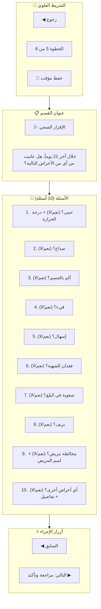

بالتأكيد! سأقوم بتصميم وتوثيق شاشة الإقرار الصحي (Health Declaration) الخاصة بالمسافر في بوابة المسافرين، وهي الخطوة الخامسة في عملية التسجيل المسبق.

---

## 📄 `06_UI_UX/02_Traveler_Portal/HealthDeclaration.md`

```markdown
# شاشة الإقرار الصحي (Health Declaration)

## 1. نظرة عامة
شاشة الإقرار الصحي هي الخطوة الخامسة من عملية التسجيل المسبق للمسافر، حيث يقوم المسافر بالإجابة على 10 أسئلة حول حالته الصحية خلال الـ 21 يوماً الماضية. تهدف هذه الشاشة إلى:
- **جمع البيانات الصحية** الدقيقة عن المسافر.
- **تقييم المخاطر الصحية** بشكل مبدئي.
- **تحديد ما إذا كان المسافر بحاجة إلى فحص إضافي** عند الوصول.
- **تغذية نظام تقييم المخاطر (Risk Engine)** بالبيانات اللازمة.

---

## 2. التخطيط العام (Layout - Mermaid)



---

## 3. Mockup الكامل (Full Layout)

```text
┌─────────────────────────────────────────────────────────────────────────────────────┐
│  ◀ رجوع      الخطوة 5 من 6      💾 حفظ مؤقت                                     │
├─────────────────────────────────────────────────────────────────────────────────────┤
│                                                                                     │
│  🩺 الإقرار الصحي                                                                  │
│  ─────────────────────────────────────────────────────────────────────────────────  │
│  خلال آخر 21 يوماً، هل عانيت من أي من الأعراض التالية؟                            │
│                                                                                     │
│  ┌──────────────────────────────────────────────────────────────────────────────┐  │
│  │  1. حمى؟                    (●) نعم  ( ) لا                                 │  │
│  │     🌡️ درجة الحرارة: [ 38.5 °C ]                                           │  │
│  ├──────────────────────────────────────────────────────────────────────────────┤  │
│  │  2. صداع؟                   ( ) نعم  (●) لا                                 │  │
│  ├──────────────────────────────────────────────────────────────────────────────┤  │
│  │  3. ألم بالجسم؟             ( ) نعم  (●) لا                                 │  │
│  ├──────────────────────────────────────────────────────────────────────────────┤  │
│  │  4. قيء؟                    ( ) نعم  (●) لا                                 │  │
│  ├──────────────────────────────────────────────────────────────────────────────┤  │
│  │  5. إسهال؟                  ( ) نعم  (●) لا                                 │  │
│  ├──────────────────────────────────────────────────────────────────────────────┤  │
│  │  6. فقدان الشهية؟           ( ) نعم  (●) لا                                 │  │
│  ├──────────────────────────────────────────────────────────────────────────────┤  │
│  │  7. صعوبة في البلع؟         ( ) نعم  (●) لا                                 │  │
│  ├──────────────────────────────────────────────────────────────────────────────┤  │
│  │  8. نزيف؟                   ( ) نعم  (●) لا                                 │  │
│  ├──────────────────────────────────────────────────────────────────────────────┤  │
│  │  9. مخالطة مريض؟            (●) نعم  ( ) لا                                 │  │
│  │     👤 اسم المريض: [ أحمد محمد ]                                            │  │
│  ├──────────────────────────────────────────────────────────────────────────────┤  │
│  │ 10. أي أعراض أخرى؟          ( ) نعم  (●) لا                                 │  │
│  │     📝 التفاصيل: [ ................................................ ]      │  │
│  └──────────────────────────────────────────────────────────────────────────────┘  │
│                                                                                     │
│  ┌──────────────────────────────────────────────────────────────────────────────┐  │
│  │  ⚠️ تذكير: جميع البيانات سرية وتستخدم لأغراض صحية فقط.                     │  │
│  └──────────────────────────────────────────────────────────────────────────────┘  │
│                                                                                     │
│  [◀ السابق]                                                      [التالي: مراجعة وتأكيد ▶]│
│                                                                                     │
└─────────────────────────────────────────────────────────────────────────────────────┘
```

---

## 4. الأسئلة التفصيلية (10 Questions)

### 4.1. السؤال 1: الحمى (Fever)

| العنصر | الوصف |
| :--- | :--- |
| **السؤال** | هل عانيت من ارتفاع في درجة الحرارة (حمى) خلال الـ 21 يوماً الماضية؟ |
| **الخيارات** | (●) نعم / ( ) لا |
| **الحقل الإضافي** | درجة الحرارة (يظهر عند اختيار "نعم") |
| **التحقق** | 35°C - 42°C |

**Mockup:**
```text
┌─────────────────────────────────────────────────────────────────────────────────────┐
│  1. حمى؟                    (●) نعم  ( ) لا                                     │
│     🌡️ درجة الحرارة: [ 38.5 °C ]                                               │
└─────────────────────────────────────────────────────────────────────────────────────┘
```

---

### 4.2. السؤال 2: الصداع (Headache)

| العنصر | الوصف |
| :--- | :--- |
| **السؤال** | هل عانيت من صداع خلال الـ 21 يوماً الماضية؟ |
| **الخيارات** | ( ) نعم / (●) لا |
| **الحقل الإضافي** | لا يوجد |

**Mockup:**
```text
┌─────────────────────────────────────────────────────────────────────────────────────┐
│  2. صداع؟                   ( ) نعم  (●) لا                                     │
└─────────────────────────────────────────────────────────────────────────────────────┘
```

---

### 4.3. السؤال 3: ألم بالجسم (Body Pain)

| العنصر | الوصف |
| :--- | :--- |
| **السؤال** | هل عانيت من ألم في الجسم خلال الـ 21 يوماً الماضية؟ |
| **الخيارات** | ( ) نعم / (●) لا |
| **الحقل الإضافي** | لا يوجد |

**Mockup:**
```text
┌─────────────────────────────────────────────────────────────────────────────────────┐
│  3. ألم بالجسم؟             ( ) نعم  (●) لا                                     │
└─────────────────────────────────────────────────────────────────────────────────────┘
```

---

### 4.4. السؤال 4: القيء (Vomiting)

| العنصر | الوصف |
| :--- | :--- |
| **السؤال** | هل عانيت من قيء خلال الـ 21 يوماً الماضية؟ |
| **الخيارات** | ( ) نعم / (●) لا |
| **الحقل الإضافي** | لا يوجد |

**Mockup:**
```text
┌─────────────────────────────────────────────────────────────────────────────────────┐
│  4. قيء؟                    ( ) نعم  (●) لا                                     │
└─────────────────────────────────────────────────────────────────────────────────────┘
```

---

### 4.5. السؤال 5: الإسهال (Diarrhea)

| العنصر | الوصف |
| :--- | :--- |
| **السؤال** | هل عانيت من إسهال خلال الـ 21 يوماً الماضية؟ |
| **الخيارات** | ( ) نعم / (●) لا |
| **الحقل الإضافي** | لا يوجد |

**Mockup:**
```text
┌─────────────────────────────────────────────────────────────────────────────────────┐
│  5. إسهال؟                  ( ) نعم  (●) لا                                     │
└─────────────────────────────────────────────────────────────────────────────────────┘
```

---

### 4.6. السؤال 6: فقدان الشهية (Loss of Appetite)

| العنصر | الوصف |
| :--- | :--- |
| **السؤال** | هل عانيت من فقدان الشهية خلال الـ 21 يوماً الماضية؟ |
| **الخيارات** | ( ) نعم / (●) لا |
| **الحقل الإضافي** | لا يوجد |

**Mockup:**
```text
┌─────────────────────────────────────────────────────────────────────────────────────┐
│  6. فقدان الشهية؟           ( ) نعم  (●) لا                                     │
└─────────────────────────────────────────────────────────────────────────────────────┘
```

---

### 4.7. السؤال 7: صعوبة في البلع (Difficulty Swallowing)

| العنصر | الوصف |
| :--- | :--- |
| **السؤال** | هل عانيت من صعوبة في البلع خلال الـ 21 يوماً الماضية؟ |
| **الخيارات** | ( ) نعم / (●) لا |
| **الحقل الإضافي** | لا يوجد |

**Mockup:**
```text
┌─────────────────────────────────────────────────────────────────────────────────────┐
│  7. صعوبة في البلع؟         ( ) نعم  (●) لا                                     │
└─────────────────────────────────────────────────────────────────────────────────────┘
```

---

### 4.8. السؤال 8: النزيف (Bleeding)

| العنصر | الوصف |
| :--- | :--- |
| **السؤال** | هل عانيت من نزيف غير طبيعي خلال الـ 21 يوماً الماضية؟ |
| **الخيارات** | ( ) نعم / (●) لا |
| **الحقل الإضافي** | لا يوجد |

**Mockup:**
```text
┌─────────────────────────────────────────────────────────────────────────────────────┐
│  8. نزيف؟                   ( ) نعم  (●) لا                                     │
└─────────────────────────────────────────────────────────────────────────────────────┘
```

---

### 4.9. السؤال 9: مخالطة مريض (Contact with Patient)

| العنصر | الوصف |
| :--- | :--- |
| **السؤال** | هل خالطت أي شخص مصاب بمرض معدي خلال الـ 21 يوماً الماضية؟ |
| **الخيارات** | (●) نعم / ( ) لا |
| **الحقل الإضافي** | اسم المريض (يظهر عند اختيار "نعم") |
| **التحقق** | 2-50 حرفاً |

**Mockup:**
```text
┌─────────────────────────────────────────────────────────────────────────────────────┐
│  9. مخالطة مريض؟            (●) نعم  ( ) لا                                     │
│     👤 اسم المريض: [ أحمد محمد ]                                                │
└─────────────────────────────────────────────────────────────────────────────────────┘
```

---

### 4.10. السؤال 10: أعراض أخرى (Other Symptoms)

| العنصر | الوصف |
| :--- | :--- |
| **السؤال** | هل عانيت من أي أعراض أخرى غير المذكورة؟ |
| **الخيارات** | ( ) نعم / (●) لا |
| **الحقل الإضافي** | تفاصيل الأعراض (يظهر عند اختيار "نعم") |
| **التحقق** | 5-500 حرفاً (اختياري) |

**Mockup:**
```text
┌─────────────────────────────────────────────────────────────────────────────────────┐
│ 10. أي أعراض أخرى؟          ( ) نعم  (●) لا                                     │
│     📝 التفاصيل: [ ................................................ ]           │
└─────────────────────────────────────────────────────────────────────────────────────┘
```

---

## 5. حالات الأسئلة (Question States)

### 5.1. الحالة الافتراضية (لا)
```text
┌─────────────────────────────────────────────────────────────────────────────────────┐
│  1. حمى؟                    ( ) نعم  (●) لا                                     │
└─────────────────────────────────────────────────────────────────────────────────────┘
```

### 5.2. حالة نعم (مع حقل إضافي)
```text
┌─────────────────────────────────────────────────────────────────────────────────────┐
│  1. حمى؟                    (●) نعم  ( ) لا                                     │
│     🌡️ درجة الحرارة: [ 38.5 °C ]                                               │
└─────────────────────────────────────────────────────────────────────────────────────┘
```

### 5.3. حالة خطأ (Validation Error)
```text
┌─────────────────────────────────────────────────────────────────────────────────────┐
│  1. حمى؟                    (●) نعم  ( ) لا                                     │
│     🌡️ درجة الحرارة: [ 45 °C ] ❌                                               │
│     ⚠️ درجة الحرارة غير صحيحة (يجب أن تكون بين 30 و 45)                        │
└─────────────────────────────────────────────────────────────────────────────────────┘
```

### 5.4. حالة تحميل (Saving)
```text
┌─────────────────────────────────────────────────────────────────────────────────────┐
│  1. حمى؟                    (●) نعم  ( ) لا                                     │
│     🌡️ درجة الحرارة: [ 38.5 °C ] ⏳                                           │
└─────────────────────────────────────────────────────────────────────────────────────┘
```

---

## 6. التقييم الأولي للمخاطر (Risk Assessment)

بناءً على إجابات المسافر، يقوم النظام بحساب **درجة المخاطر الأولية**:

| المعيار | النقاط |
| :--- | :--- |
| **حمى (نعم)** | +10 نقاط |
| **صداع (نعم)** | +5 نقاط |
| **ألم بالجسم (نعم)** | +5 نقاط |
| **قيء (نعم)** | +5 نقاط |
| **إسهال (نعم)** | +5 نقاط |
| **فقدان الشهية (نعم)** | +5 نقاط |
| **صعوبة في البلع (نعم)** | +10 نقاط |
| **نزيف (نعم)** | +15 نقاط |
| **مخالطة مريض (نعم)** | +10 نقاط |
| **أعراض أخرى (نعم)** | +5 نقاط |
| **درجة الحرارة > 38°C** | +10 نقاط إضافية |

| المجموع | التصنيف | اللون |
| :--- | :--- | :--- |
| **0-10** | منخفض | 🟢 أخضر |
| **11-30** | متوسط | 🟡 أصفر |
| **31+** | مرتفع | 🔴 أحمر |

---

## 7. التحقق من صحة البيانات (Validation Rules)

| الحقل | القاعدة | رسالة الخطأ |
| :--- | :--- | :--- |
| **جميع الأسئلة** | يجب الإجابة على جميع الأسئلة | "يرجى الإجابة على جميع الأسئلة." |
| **درجة الحرارة** | 35°C - 42°C | "درجة الحرارة غير صحيحة (يجب أن تكون بين 35 و 42)." |
| **اسم المريض** | 2-50 حرفاً (عربي/إنجليزي) | "يرجى إدخال اسم صحيح." |
| **تفاصيل الأعراض** | 5-500 حرفاً (اختياري) | "التفاصيل طويلة جداً (الحد الأقصى 500 حرف)." |

---

## 8. التخزين المؤقت (Auto-Save)

يتم حفظ إجابات المسافر تلقائياً في الخلفية (LocalStorage/IndexedDB) لتجنب فقدان البيانات في حال:
- انقطاع الاتصال بالإنترنت.
- إغلاق المتصفح.
- انتهاء الجلسة.

**آلية العمل:**
1. يتم حفظ البيانات بعد كل إجابة (تغيير في الحقل).
2. يتم إرسال البيانات إلى الخادم كل 30 ثانية (في الخلفية).
3. عند العودة، يتم استعادة البيانات المحفوظة.

---

## 9. التصميم المتجاوب (Responsive Design)

### Desktop (≥ 1024px)
- عرض جميع الأسئلة في عمود واحد.
- أزرار نعم/لا جنباً إلى جنب.

### Tablet (768px - 1023px)
- نفس التصميم مع تقليل الهوامش.
- تكبير حجم الخطوط قليلاً.

### Mobile (< 768px)
- تكبير حجم الأزرار (مناسب للإبهام).
- عرض الحقول الإضافية أسفل السؤال.
- تقليل الهوامش الداخلية.

---

## 10. الإشعارات والتنبيهات (Alerts)

### 10.1. تذكير
```text
┌─────────────────────────────────────────────────────────────────────────────────────┐
│  ⚠️ تذكير: جميع البيانات سرية وتستخدم لأغراض صحية فقط.                         │
└─────────────────────────────────────────────────────────────────────────────────────┘
```

### 10.2. حالة مرتفعة الخطورة
```text
┌─────────────────────────────────────────────────────────────────────────────────────┐
│  🚨 بناءً على إجاباتك، تم تصنيفك ضمن (عالي الخطورة).                           │
│  يرجى التوجه إلى الفحص الطبي فور وصولك.                                        │
└─────────────────────────────────────────────────────────────────────────────────────┘
```

### 10.3. حالة متوسطة الخطورة
```text
┌─────────────────────────────────────────────────────────────────────────────────────┐
│  ⚠️ بناءً على إجاباتك، تم تصنيفك ضمن (متوسط الخطورة).                         │
│  قد تحتاج إلى فحص إضافي عند الوصول.                                            │
└─────────────────────────────────────────────────────────────────────────────────────┘
```

---

## 11. التفاعلات (Interactions)

| العنصر | التفاعل | التأثير |
| :--- | :--- | :--- |
| **زر "نعم"** | Click | إظهار الحقل الإضافي (إن وجد) |
| **زر "لا"** | Click | إخفاء الحقل الإضافي (إن وجد) |
| **حقل درجة الحرارة** | Input | تحديث التقييم الأولي للمخاطر |
| **زر "حفظ مؤقت"** | Click | حفظ البيانات في LocalStorage |
| **زر "التالي"** | Click | التحقق من صحة البيانات والانتقال إلى الخطوة 6 |

---

## 12. نقاط النهاية الخلفية (API Endpoints)

| الطريقة | المسار | الوصف |
| :--- | :--- | :--- |
| `POST` | `/api/v1/travelers/{id}/health-declaration/` | حفظ الإقرار الصحي |
| `GET` | `/api/v1/travelers/{id}/health-declaration/` | استرجاع الإقرار الصحي (للتعديل) |
| `POST` | `/api/v1/travelers/{id}/health-declaration/risk/` | تقييم المخاطر الأولي |

---

## 13. نموذج البيانات (Data Model)

```json
{
  "traveler_id": "uuid",
  "symptoms": {
    "fever": {
      "has": true,
      "temperature": 38.5
    },
    "headache": false,
    "body_pain": false,
    "vomiting": false,
    "diarrhea": false,
    "loss_of_appetite": false,
    "difficulty_swallowing": false,
    "bleeding": false,
    "contact_with_patient": {
      "has": true,
      "patient_name": "أحمد محمد"
    },
    "other_symptoms": {
      "has": false,
      "details": ""
    }
  },
  "risk_level": "MEDIUM",
  "risk_score": 25,
  "submitted_at": "2024-07-09T10:30:00Z"
}
```

---

## 14. ملفات مرجعية

| الملف | الوصف |
| :--- | :--- |
| `06_UI_UX/00-UX-UI-Screens.md` | دليل التصميم الموحد |
| `06_UI_UX/02_Traveler_Portal/PreRegistration.md` | شاشة التسجيل المسبق (الخطوات الكاملة) |
| `06_UI_UX/02_Traveler_Portal/Dashboard.md` | لوحة تحكم المسافر |
| `05_API/Traveler_API.md` | واجهات API الخاصة بالمسافرين |
| `04_Modules/02_Traveler_Portal/Health-Declaration.md` | المتطلبات الوظيفية للإقرار الصحي |

---