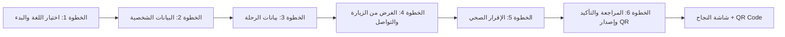

---

## 📄 `06_UI_UX/02_Traveler_Portal/PreRegistration.md`

```markdown
# شاشة التسجيل المسبق للمسافر (Traveler Pre-Registration)

## 1. نظرة عامة
شاشة متعددة الخطوات (Wizard) لتعبئة الاستمارة الإلكترونية قبل السفر، تهدف إلى تسريع إجراءات المسافرين عند الوصول إلى المنافذ وتقليل وقت الانتظار. تعمل الشاشة على كل من (الويب والجوال) مع تصميم متجاوب (Responsive).

## 2. تدفق الشاشة (Wizard - 6 خطوات)



---

## 3. تفاصيل كل خطوة

---

### 📌 الخطوة 1: اختيار اللغة والبدء (Language Selection & Start)

#### الهدف
تمكين المسافر من اختيار اللغة المناسبة (عربية/إنجليزية) والبدء في عملية التسجيل.

#### المكونات

| العنصر | الوصف | التصميم |
| :---   | :--- | :--- |
| **العنوان** | "بوابة التسجيل الصحي للسفر" | خط كبير، في الأعلى |
| **اختيار اللغة** | زر تبديل اللغة (عربي / English) | أزرار اختيار أو قائمة منسدلة |
| **النص الترحيبي** | "لتسريع إجراءاتك عند الوصول، يرجى تعبئة الاستمارة الصحية قبل السفر." | خط متوسط، شرح للفائدة |
| **زر البدء** | "بدء التسجيل" | زر أزرق كبير، بارز |

#### Mockup
```text
┌─────────────────────────────────────────┐
│         🏥 بوابة التسجيل الصحي للسفر    │
│         Choose Language | العربية        │
├─────────────────────────────────────────┤
│                                         │
│   لتسريع إجراءاتك عند الوصول،           │
│   يرجى تعبئة الاستمارة الصحية قبل       │
│   السفر.                                │
│                                         │
│   [  🚀 بدء التسجيل  ]                 │
│                                         │
│   🔒 جميع البيانات مشفرة وآمنة          │
└─────────────────────────────────────────┘
```

#### التفاعلات
- **النقر على "بدء التسجيل"**: الانتقال إلى الخطوة 2.
- **تغيير اللغة**: تحديث جميع النصوص في الصفحة.

#### حالات الاستخدام
| الحالة | الإجراء |
| :--- | :--- |
| **زيارة أولى** | عرض شاشة الترحيب. |
| **عودة لتكملة التسجيل** | توجيه إلى آخر خطوة تم حفظها (إذا كان هناك حفظ مؤقت). |

---

### 📌 الخطوة 2: البيانات الشخصية (Personal Information)

#### الهدف
جمع البيانات الأساسية للمسافر (الاسم، الجواز، تاريخ الميلاد، الجنسية، الجنس).

#### المكونات

| العنصر | النوع | إلزامي | التحقق |
| :--- | :--- | :--- | :--- |
| **الاسم الكامل** | Text | ✅ نعم | أحرف عربية/إنجليزية، 2-100 حرف |
| **رقم الجواز** | Text | ✅ نعم | 6-20 حرفاً وأرقاماً، بحروف كبيرة |
| **مسح الجواز** | Button | ❌ لا | فتح الكاميرا (OCR) لقراءة MRZ |
| **تاريخ الميلاد** | Date Picker | ✅ نعم | تاريخ صحيح، العمر >= 18 سنة |
| **الجنسية** | Dropdown | ✅ نعم | قائمة الدول (من قاعدة البيانات) |
| **الجنس** | Radio | ✅ نعم | (ذكر / أنثى) |

#### Mockup
```text
┌──────────────────────────────────────────────┐
│  ◀ رجوع      الخطوة 2 من 6      💾 حفظ مؤقت │
├──────────────────────────────────────────────┤
│  👤 الاسم الكامل*: [........................] │
│                                              │
│  🛂 رقم الجواز*:   [.........]  [📷 مسح]    │
│                                              │
│  📅 تاريخ الميلاد*: [DD/MM/YYYY]            │
│                                              │
│  🌍 الجنسية*:      [اختر من القائمة ▼]      │
│                                              │
│  ⚤ الجنس:         (●) ذكر  ( ) أنثى         │
│                                              │
│  ────────────────────────────────────────── │
│                                              │
│  [ ▶ التالي: العنوان داخل السودان ]        │
└──────────────────────────────────────────────┘
```

#### التفاعلات
- **زر "مسح الجواز"**: فتح الكاميرا، قراءة MRZ، تعبئة الحقول تلقائياً.
- **زر "حفظ مؤقت"**: حفظ البيانات في LocalStorage/IndexedDB (للعودة لاحقاً).
- **زر "التالي"**: التحقق من صحة الحقول، الانتقال إلى الخطوة 3.

#### التحقق من صحة البيانات (Validation)

| الحقل | القاعدة | رسالة الخطأ |
| :--- | :--- | :--- |
| الاسم الكامل | لا يقل عن 2 أحرف | "يرجى إدخال الاسم الكامل." |
| رقم الجواز | 6-20 حرفاً، أحرف وأرقام | "رقم الجواز غير صحيح." |
| تاريخ الميلاد | عمر >= 18 سنة | "يجب أن يكون العمر 18 سنة على الأقل." |
| الجنسية | اختيار من القائمة | "يرجى اختيار الجنسية." |
| الجنس | اختيار أحد الخيارين | "يرجى اختيار الجنس." |

---

### 📌 الخطوة 3: بيانات الرحلة (Flight Information)

#### الهدف
جمع معلومات الرحلة (دولة القدوم، منفذ الدخول، وسيلة النقل، رقم الرحلة، تاريخ الوصول، دول العبور).

#### المكونات

| العنصر | النوع | إلزامي | ملاحظات |
| :--- | :--- | :--- | :--- |
| **دولة القدوم** | Dropdown | ✅ نعم | قائمة الدول |
| **منفذ الدخول** | Dropdown | ✅ نعم | يتغير بناءً على دولة القدوم (المنافذ المتاحة) |
| **وسيلة النقل** | Radio | ✅ نعم | (طائرة، سفينة، بر) |
| **رقم الرحلة** | Text | ✅ نعم (إذا كانت وسيلة النقل طائرة) | يظهر فقط عند اختيار "طائرة" |
| **رقم المقعد** | Text | ❌ لا | اختياري |
| **تاريخ الوصول** | Date Picker | ✅ نعم | تاريخ وصول متوقع |
| **دول العبور** | Multi-select | ❌ لا | يمكن إضافة دول عبور متعددة |

#### Mockup
```text
┌──────────────────────────────────────────────┐
│  ◀ رجوع      الخطوة 3 من 6                  │
├──────────────────────────────────────────────┤
│  🌍 دولة القدوم*:     [اختر الدولة ▼]       │
│                                              │
│  🛬 منفذ الدخول*:     [اختر المنفذ ▼]       │
│                                              │
│  🚢 وسيلة النقل*:     (●) طائرة ( ) سفينة ( ) بر│
│                                              │
│  ✈️ رقم الرحلة*:      [.........]            │
│  💺 رقم المقعد:       [.........]            │
│                                              │
│  📅 تاريخ الوصول*:    [DD/MM/2026]          │
│                                              │
│  🌐 دول العبور:       [اختر دولة...] [+ إضافة]│
│                      - مصر                   │
│                      - السعودية             │
│                                              │
│  [ ▶ التالي: الغرض من الزيارة ]             │
└──────────────────────────────────────────────┘
```

#### التفاعلات
- **تغيير دولة القدوم**: تحديث قائمة منافذ الدخول المتاحة.
- **تغيير وسيلة النقل**: إظهار/إخفاء حقل "رقم الرحلة".
- **زر "+ إضافة"**: إضافة دولة عبور جديدة إلى القائمة.

#### التحقق من صحة البيانات

| الحقل | القاعدة | رسالة الخطأ |
| :--- | :--- | :--- |
| دولة القدوم | اختيار من القائمة | "يرجى اختيار دولة القدوم." |
| منفذ الدخول | اختيار من القائمة | "يرجى اختيار منفذ الدخول." |
| وسيلة النقل | اختيار أحد الخيارين | "يرجى اختيار وسيلة النقل." |
| رقم الرحلة | (إذا كانت طائرة) 2-10 أحرف وأرقام | "رقم الرحلة غير صحيح." |
| تاريخ الوصول | تاريخ مستقبلي | "يرجى إدخال تاريخ وصول صحيح." |

---

### 📌 الخطوة 4: الغرض من الزيارة والتواصل (Purpose & Contact)

#### الهدف
جمع الغرض من الزيارة ومعلومات الاتصال (الهاتف، البريد الإلكتروني، رقم الطوارئ).

#### المكونات

| العنصر | النوع | إلزامي | ملاحظات |
| :--- | :--- | :--- | :--- |
| **الغرض من الزيارة** | Radio / Checkbox | ✅ نعم | سياحة، عمل، زيارة، دراسة، عبور، دبلوماسي، منظمة دولية، آخر |
| **رقم الهاتف** | Text (Phone) | ✅ نعم | مع رمز الدولة |
| **واتساب** | Text (Phone) | ❌ لا | اختياري |
| **البريد الإلكتروني** | Email | ❌ لا | اختياري |
| **رقم أقرب شخص (للطوارئ)** | Text (Phone) | ✅ نعم | مع رمز الدولة |

#### Mockup
```text
┌──────────────────────────────────────────────┐
│  ◀ رجوع      الخطوة 4 من 6                  │
├──────────────────────────────────────────────┤
│  🎯 الغرض من الزيارة*:                      │
│  ( ) سياحة  (●) عمل  ( ) زيارة              │
│  ( ) دراسة  ( ) عبور  ( ) دبلوماسي          │
│  ( ) منظمة دولية  ( ) آخر...                │
│                                              │
│  📞 رقم الهاتف*:     [+249] [.........]     │
│  💬 واتساب:          [+249] [.........]     │
│  ✉️ البريد الإلكتروني: [.........]          │
│                                              │
│  🆘 رقم الطوارئ*:    [+249] [.........]     │
│  (أقرب شخص يمكن الاتصال به)                  │
│                                              │
│  [ ▶ التالي: الإقرار الصحي ]                │
└──────────────────────────────────────────────┘
```

#### التفاعلات
- **اختيار "آخر"**: ظهور حقل نصي لتوضيح الغرض.
- **إضافة رمز الدولة**: اختيار من قائمة الدول.

#### التحقق من صحة البيانات

| الحقل | القاعدة | رسالة الخطأ |
| :--- | :--- | :--- |
| الغرض من الزيارة | اختيار أحد الخيارات | "يرجى اختيار الغرض من الزيارة." |
| رقم الهاتف | رقم صحيح (10-15 رقم) | "رقم الهاتف غير صحيح." |
| رقم الطوارئ | رقم صحيح (10-15 رقم) | "رقم الطوارئ غير صحيح." |
| البريد الإلكتروني | صيغة بريد إلكتروني صحيحة (اختياري) | "يرجى إدخال بريد إلكتروني صحيح." |

---

### 📌 الخطوة 5: الإقرار الصحي (Health Declaration)

#### الهدف
جمع البيانات الصحية للمسافر (الأعراض، المخالطة، الحالة الصحية العامة) عبر 10 أسئلة.

#### المكونات

| الرقم | السؤال | النوع | ملاحظات |
| :--- | :--- | :--- | :--- |
| 1 | حمى؟ | Yes/No | إذا نعم → حقل درجة الحرارة |
| 2 | صداع؟ | Yes/No | - |
| 3 | ألم بالجسم؟ | Yes/No | - |
| 4 | قيء؟ | Yes/No | - |
| 5 | إسهال؟ | Yes/No | - |
| 6 | فقدان الشهية؟ | Yes/No | - |
| 7 | صعوبة في البلع؟ | Yes/No | - |
| 8 | نزيف؟ | Yes/No | - |
| 9 | مخالطة مريض؟ | Yes/No | إذا نعم → حقل توضيحي |
| 10 | أي أعراض أخرى؟ | Yes/No | إذا نعم → حقل نصي للتفاصيل |

#### Mockup
```text
┌──────────────────────────────────────────────┐
│  ◀ رجوع      الخطوة 5 من 6                  │
├──────────────────────────────────────────────┤
│  🩺 خلال آخر 21 يوماً، هل عانيت من أي من:   │
│                                              │
│  1. حمى؟                 (●) نعم  ( ) لا    │
│     🌡️ درجة الحرارة: [38.5°C]             │
│                                              │
│  2. صداع؟                ( ) نعم  (●) لا    │
│  3. ألم بالجسم؟          ( ) نعم  (●) لا    │
│  4. قيء؟                 ( ) نعم  (●) لا    │
│  5. إسهال؟               ( ) نعم  (●) لا    │
│  6. فقدان الشهية؟        ( ) نعم  (●) لا    │
│  7. صعوبة في البلع؟      ( ) نعم  (●) لا    │
│  8. نزيف؟                ( ) نعم  (●) لا    │
│  9. مخالطة مريض؟         (●) نعم  ( ) لا    │
│     👤 اسم المريض: [.........]              │
│ 10. أي أعراض أخرى؟       ( ) نعم  (●) لا    │
│     📝 التفاصيل: [........................] │
│                                              │
│  [ ▶ التالي: مراجعة وتأكيد ]                │
└──────────────────────────────────────────────┘
```

#### التفاعلات
- **اختيار "نعم"**: ظهور الحقل الإضافي (درجة الحرارة، اسم المريض، التفاصيل).
- **اختيار "لا"**: إخفاء الحقل الإضافي.

#### التحقق من صحة البيانات

| الحقل | القاعدة | رسالة الخطأ |
| :--- | :--- | :--- |
| جميع الأسئلة | يجب الإجابة على جميع الأسئلة | "يرجى الإجابة على جميع الأسئلة." |
| درجة الحرارة | (إذا ظهر) بين 30 و 45 | "درجة الحرارة غير صحيحة." |
| اسم المريض | (إذا ظهر) 2-50 حرفاً | "يرجى إدخال اسم المريض." |

---

### 📌 الخطوة 6: المراجعة والتأكيد وإصدار QR (Review & Submit)

#### الهدف
عرض ملخص لجميع البيانات المدخلة، تأكيد صحتها، وإصدار رمز QR.

#### المكونات

| العنصر | الوصف |
| :--- | :--- |
| **ملخص البيانات** | عرض جميع البيانات في شكل منظم (الاسم، الجواز، الرحلة، الأعراض، إلخ) |
| **خانة الموافقة** | "أقر بصحة البيانات المقدمة" (Checkbox إلزامي) |
| **زر الإرسال** | "حفظ وإصدار رمز المرور الصحي" (يُفعّل بعد الموافقة) |

#### Mockup
```text
┌──────────────────────────────────────────────────┐
│  ◀ رجوع      مراجعة البيانات      تأكيد وحفظ    │
├──────────────────────────────────────────────────┤
│  📋 ملخص البيانات:                               │
│  ┌────────────────────────────────────────────┐  │
│  │  👤 الاسم: أحمد محمد                      │  │
│  │  🛂 الجواز: X123456                       │  │
│  │  ✈️ الرحلة: SV123، تاريخ 09/07/2026      │  │
│  │  🎯 الغرض: عمل                            │  │
│  │  📞 الهاتف: +249123456789                 │  │
│  │  🩺 الأعراض: لا توجد أعراض               │  │
│  └────────────────────────────────────────────┘  │
│                                                  │
│  ▢  أقر بصحة البيانات المقدمة *                 │
│                                                  │
│  [  💾 حفظ وإصدار رمز المرور الصحي  ]          │
└──────────────────────────────────────────────────┘
```

#### التفاعلات
- **النقر على "تأكيد وحفظ"**: التحقق من الموافقة، إرسال البيانات، الانتقال إلى شاشة النجاح.

#### التحقق من صحة البيانات

| الحقل | القاعدة | رسالة الخطأ |
| :--- | :--- | :--- |
| الموافقة | يجب تفعيل خانة الاختيار | "يرجى الموافقة على صحة البيانات." |

---

## 4. شاشة النجاح + QR Code

#### الهدف
تأكيد نجاح التسجيل وعرض رمز QR للمسافر.

#### المكونات

| العنصر | الوصف |
| :--- | :--- |
| **رسالة النجاح** | "✅ تم التسجيل بنجاح" |
| **رقم التسجيل** | "REG-20260709-0001" |
| **رمز QR** | صورة QR Code تحتوي على بيانات المسافر المشفرة |
| **أزرار الإجراءات** | تحميل PDF، مشاركة عبر واتساب، إضافة إلى المحفظة |

#### Mockup
```text
┌──────────────────────────────────────────────────┐
│  ✅ تم التسجيل بنجاح                             │
│  رقم التسجيل: REG-20260709-0001                  │
│                                                  │
│  ┌───────────────────────┐                       │
│  │ ██████████████████████│                       │
│  │ ██  QR Code هنا    ██│                       │
│  │ ██████████████████████│                       │
│  └───────────────────────┘                       │
│                                                  │
│  [📥 تحميل PDF] [💬 مشاركة عبر واتساب]           │
│  [📱 إضافة إلى المحفظة]                          │
│                                                  │
│  🔔 تم إرسال نسخة إلى بريدك الإلكتروني          │
└──────────────────────────────────────────────────┘
```

#### التفاعلات
- **زر "تحميل PDF"**: تنزيل ملف PDF يحتوي على بيانات التسجيل ورمز QR.
- **زر "مشاركة عبر واتساب"**: فتح واتساب مع صورة QR مرفقة.
- **زر "إضافة إلى المحفظة"**: حفظ رمز QR في تطبيق المحفظة (Apple Wallet / Google Wallet).

---

## 5. حالات الاستخدام (Use Cases)

| المعرف | حالة الاستخدام | الوصف |
| :--- | :--- | :--- |
| **UC-01** | تسجيل جديد | مسافر جديد يبدأ التسجيل من الخطوة 1. |
| **UC-02** | استكمال تسجيل | مسافر يعود لتكملة التسجيل (حفظ مؤقت). |
| **UC-03** | مسح جواز السفر | استخدام OCR لقراءة بيانات الجواز. |
| **UC-04** | التحقق من صحة البيانات | التحقق من جميع الحقول في كل خطوة. |
| **UC-05** | إصدار QR | إصدار رمز QR بعد تأكيد البيانات. |
| **UC-06** | مشاركة QR | مشاركة رمز QR عبر واتساب أو تحميل PDF. |

---

## 6. المتطلبات التقنية (Technical Requirements)

| الجانب | المتطلب |
| :--- | :--- |
| **الواجهة الأمامية** | React + TypeScript + Tailwind CSS |
| **إدارة النماذج** | React Hook Form + Zod (للتحقق من الصحة) |
| **الحفظ المؤقت** | LocalStorage / IndexedDB (للتسجيل غير المكتمل) |
| **OCR لقراءة الجواز** | Tesseract.js أو Google Vision API (لقراءة MRZ) |
| **توليد QR** | qrcode.react أو مكتبة QRCode |
| **تصدير PDF** | jsPDF أو react-pdf |
| **نقاط النهاية (API)** | `POST /api/v1/travelers/register/` (تسجيل جديد) <br> `GET /api/v1/travelers/{id}/status/` (استرجاع التسجيل) <br> `GET /api/v1/travelers/{id}/qr-code/` (استرجاع QR) |
| **التخزين المؤقت** | Redis (لتخزين بيانات التسجيل المؤقتة) |
| **الأمان** | تشفير البيانات الحساسة (AES-256)، HTTPS |

---

## 7. اعتبارات إمكانية الوصول (Accessibility)

| الجانب | الإجراء |
| :--- | :--- |
| **تباين الألوان** | نسبة تباين 4.5:1 على الأقل |
| **التنقل بالكيبورد** | دعم Tab و Enter لجميع العناصر التفاعلية |
| **التسميات** | استخدام `<label>` لجميع الحقول |
| **النصوص البديلة** | Alt Text للصور والأيقونات |
| **دعم RTL** | دعم كامل للغة العربية (RTL) |

---

## 8. أدوات وتقنيات التطوير

| الأداة | الاستخدام |
| :--- | :--- |
| **React Hook Form** | إدارة النماذج |
| **Zod** | التحقق من صحة البيانات |
| **Tesseract.js** | OCR لقراءة الجواز |
| **qrcode.react** | توليد رمز QR |
| **jsPDF** | تصدير PDF |
| **Tailwind CSS** | التصميم والتنسيق |
| **Framer Motion** | تأثيرات الانتقال بين الخطوات |
| **React Router** | التنقل بين الصفحات |

---

## 9. ملفات مرجعية

- `06_UI_UX/00-UX-UI-Screens.md` (دليل التصميم الموحد).
- `04_Modules/02_Traveler_Portal/02_Traveler_Portal.md` (نظرة عامة على بوابة المسافرين).
- `04_Modules/02_Traveler_Portal/Pre-registration.md` (المتطلبات الوظيفية).
- `05_API/Traveler_API.md` (واجهات API الخاصة بالمسافرين).
```

---
