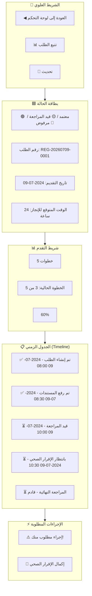

بالتأكيد! سأقوم بتصميم وتوثيق شاشة تتبع الطلب (Request Tracking) الخاصة بالمسافر في بوابة المسافرين، والتي تتيح للمسافر متابعة حالة طلبه في الوقت الفعلي.

---

## 📄 `06_UI_UX/02_Traveler_Portal/RequestTracking.md`

```markdown
# شاشة تتبع الطلب (Request Tracking)

## 1. نظرة عامة
شاشة تتبع الطلب هي الصفحة التي تتيح للمسافر متابعة حالة طلبه الصحي في الوقت الفعلي، ومعرفة المرحلة التي وصل إليها طلبه، وما هي الخطوات المتبقية، وأي إجراءات مطلوبة منه. تهدف هذه الشاشة إلى:
- **توفير الشفافية** للمسافر حول حالة طلبه.
- **توجيه المسافر** للإجراءات المطلوبة منه (إن وجدت).
- **عرض سجل زمني** لجميع التحديثات على الطلب.
- **تقدير الوقت المتبقي** لإنجاز الطلب.

---

## 2. التخطيط العام (Layout - Mermaid)



---

## 3. Mockup الكامل (Full Layout)

```text
┌─────────────────────────────────────────────────────────────────────────────────────┐
│  ◀ العودة إلى لوحة التحكم      📊 تتبع الطلب              🔄 تحديث              │
├─────────────────────────────────────────────────────────────────────────────────────┤
│                                                                                     │
│  ┌──────────────────────────────────────────────────────────────────────────────┐  │
│  │  🟡 طلبك قيد المراجعة                                                       │  │
│  │                                                                              │  │
│  │  رقم الطلب: REG-20260709-0001                                                │  │
│  │  تاريخ التقديم: 2024-07-09                                                   │  │
│  │  الوقت المتوقع للإنجاز: 24 ساعة                                             │  │
│  │                                                                              │  │
│  │  ┌─────────────────────────────────────────────────────────────────────────┐ │  │
│  │  │  [████████████████████████████████████████████████████] 60%             │ │  │
│  │  │  الخطوة 3 من 5: قيد المراجعة                                           │ │  │
│  │  └─────────────────────────────────────────────────────────────────────────┘ │  │
│  │                                                                              │  │
│  │  ⚠️ الإجراء المطلوب: يرجى إكمال الإقرار الصحي                              │  │
│  │                                                                              │  │
│  │  [📝 إكمال الإقرار الصحي]                                                    │  │
│  └──────────────────────────────────────────────────────────────────────────────┘  │
│                                                                                     │
│  ┌──────────────────────────────────────────────────────────────────────────────┐  │
│  │  📋 الجدول الزمني (Timeline)                                                │  │
│  │  ─────────────────────────────────────────────────────────────────────────── │  │
│  │                                                                              │  │
│  │  ✅ 2024-07-09 08:00   تم إنشاء الطلب                                      │  │
│  │  ─────────────────────────────────────────────────────────────────────────── │  │
│  │  ✅ 2024-07-09 08:30   تم رفع المستندات                                    │  │
│  │  ─────────────────────────────────────────────────────────────────────────── │  │
│  │  ⏳ 2024-07-09 10:00   قيد المراجعة (الخطوة الحالية)                      │  │
│  │  ─────────────────────────────────────────────────────────────────────────── │  │
│  │  ○ 2024-07-09 10:30   بانتظار الإقرار الصحي                               │  │
│  │  ─────────────────────────────────────────────────────────────────────────── │  │
│  │  ○ قادم                المراجعة النهائية                                   │  │
│  │                                                                              │  │
│  └──────────────────────────────────────────────────────────────────────────────┘  │
│                                                                                     │
│  ┌──────────────────────────────────────────────────────────────────────────────┐  │
│  │  📄 تفاصيل الطلب                                                             │  │
│  │  ─────────────────────────────────────────────────────────────────────────── │  │
│  │                                                                              │  │
│  │  👤 الاسم الكامل: أحمد محمد                                                 │  │
│  │  🛂 رقم الجواز: A1234567                                                     │  │
│  │  ✈️ الرحلة: SV123 (2024-07-10)                                              │  │
│  │  🎯 الغرض: عمل                                                              │  │
│  │  📞 الهاتف: +249123456789                                                    │  │
│  │                                                                              │  │
│  │  [📥 تحميل ملخص الطلب (PDF)]                                                │  │
│  └──────────────────────────────────────────────────────────────────────────────┘  │
│                                                                                     │
└─────────────────────────────────────────────────────────────────────────────────────┘
```

---

## 4. حالات الطلب (Request Statuses)

### 4.1. حالة: قيد المراجعة (Under Review)

```text
┌─────────────────────────────────────────────────────────────────────────────────────┐
│  🟡 طلبك قيد المراجعة                                                             │
│                                                                                     │
│  رقم الطلب: REG-20260709-0001                                                      │
│  تاريخ التقديم: 2024-07-09                                                         │
│  الوقت المتوقع للإنجاز: 24 ساعة                                                   │
│                                                                                     │
│  [████████████████████████████████████████████████████] 60%                        │
│  الخطوة 3 من 5: قيد المراجعة                                                      │
│                                                                                     │
│  ⚠️ الإجراء المطلوب: يرجى إكمال الإقرار الصحي                                    │
│                                                                                     │
│  [📝 إكمال الإقرار الصحي]                                                          │
└─────────────────────────────────────────────────────────────────────────────────────┘
```

### 4.2. حالة: مكتمل / معتمد (Approved)

```text
┌─────────────────────────────────────────────────────────────────────────────────────┐
│  🟢 تم اعتماد طلبك بنجاح!                                                         │
│                                                                                     │
│  رقم الطلب: REG-20260709-0001                                                      │
│  تاريخ الاعتماد: 2024-07-09                                                        │
│  QR Code صالح حتى: 2024-07-10                                                      │
│                                                                                     │
│  [████████████████████████████████████████████████████] 100%                       │
│  ✅ تم إكمال جميع الخطوات                                                          │
│                                                                                     │
│  🎉 يمكنك الآن تنزيل رمز QR الخاص بك.                                             │
│                                                                                     │
│  [📥 تنزيل QR]  [🖨️ طباعة]  [📤 مشاركة]                                         │
└─────────────────────────────────────────────────────────────────────────────────────┘
```

### 4.3. حالة: مرفوض (Rejected)

```text
┌─────────────────────────────────────────────────────────────────────────────────────┐
│  🔴 للأسف، تم رفض طلبك                                                            │
│                                                                                     │
│  رقم الطلب: REG-20260709-0001                                                      │
│  تاريخ التقديم: 2024-07-09                                                         │
│                                                                                     │
│  سبب الرفض: المستندات غير واضحة (صورة الجواز غير مقروءة)                         │
│                                                                                     │
│  [📝 إعادة التقديم]  [📞 التواصل مع الدعم]                                        │
└─────────────────────────────────────────────────────────────────────────────────────┘
```

### 4.4. حالة: بانتظار المستندات (Pending Documents)

```text
┌─────────────────────────────────────────────────────────────────────────────────────┐
│  🟡 بانتظار رفع المستندات                                                         │
│                                                                                     │
│  رقم الطلب: REG-20260709-0001                                                      │
│  تاريخ التقديم: 2024-07-09                                                         │
│                                                                                     │
│  [████████████████████████████████████████████████████] 20%                        │
│  الخطوة 2 من 5: رفع المستندات                                                     │
│                                                                                     │
│  ⚠️ الإجراء المطلوب: يرجى رفع المستندات المطلوبة                                 │
│                                                                                     │
│  [📤 رفع المستندات]                                                                │
└─────────────────────────────────────────────────────────────────────────────────────┘
```

---

## 5. شريط التقدم (Progress Bar)

### 5.1. الخطوات التفصيلية (5 Steps)

| الخطوة | الحالة | الأيقونة |
| :--- | :--- | :--- |
| **1. تقديم الطلب** | مكتمل | ✅ |
| **2. رفع المستندات** | مكتمل | ✅ |
| **3. الإقرار الصحي** | نشط (مطلوب) | ⏳ |
| **4. المراجعة** | قادم | ○ |
| **5. الإصدار** | قادم | ○ |

### 5.2. Mockup شريط التقدم

```text
┌─────────────────────────────────────────────────────────────────────────────────────┐
│                                                                                     │
│  [████████████████████████████████████████████████████] 60%                        │
│                                                                                     │
│  ① تقديم الطلب  ② رفع المستندات  ③ الإقرار الصحي  ④ المراجعة  ⑤ الإصدار        │
│       ✅              ✅              ⏳              ○              ○              │
│                                                                                     │
└─────────────────────────────────────────────────────────────────────────────────────┘
```

### 5.3. حالة مكتملة (100%)

```text
┌─────────────────────────────────────────────────────────────────────────────────────┐
│                                                                                     │
│  [████████████████████████████████████████████████████] 100%                       │
│                                                                                     │
│  ① تقديم الطلب  ② رفع المستندات  ③ الإقرار الصحي  ④ المراجعة  ⑤ الإصدار        │
│       ✅              ✅              ✅              ✅              ✅              │
│                                                                                     │
└─────────────────────────────────────────────────────────────────────────────────────┘
```

---

## 6. الجدول الزمني (Timeline)

### 6.1. Mockup الجدول الزمني

```text
┌─────────────────────────────────────────────────────────────────────────────────────┐
│  📋 الجدول الزمني (Timeline)                                                       │
│  ─────────────────────────────────────────────────────────────────────────────────  │
│                                                                                     │
│  ✅ 2024-07-09 08:00   تم إنشاء الطلب                                             │
│  ─────────────────────────────────────────────────────────────────────────────────  │
│  ✅ 2024-07-09 08:30   تم رفع المستندات                                           │
│  ─────────────────────────────────────────────────────────────────────────────────  │
│  ⏳ 2024-07-09 10:00   قيد المراجعة (الخطوة الحالية)                             │
│  ─────────────────────────────────────────────────────────────────────────────────  │
│  ○ 2024-07-09 10:30   بانتظار الإقرار الصحي                                      │
│  ─────────────────────────────────────────────────────────────────────────────────  │
│  ○ قادم                المراجعة النهائية                                          │
│                                                                                     │
└─────────────────────────────────────────────────────────────────────────────────────┘
```

### 6.2. حالات الجدول الزمني

| الحالة | الأيقونة | اللون | الوصف |
| :--- | :--- | :--- | :--- |
| **مكتمل** | ✅ | أخضر | تم إنجاز هذه الخطوة بنجاح |
| **نشط** | ⏳ | أصفر | الخطوة الحالية (قيد التنفيذ) |
| **قادم** | ○ | رمادي | لم تبدأ هذه الخطوة بعد |
| **ملغي** | ❌ | أحمر | تم إلغاء هذه الخطوة (نادر) |

---

## 7. الإجراءات المطلوبة (Action Required)

### 7.1. عندما يكون هناك إجراء مطلوب من المسافر

```text
┌─────────────────────────────────────────────────────────────────────────────────────┐
│  ⚠️ الإجراء المطلوب: يرجى إكمال الإقرار الصحي                                    │
│                                                                                     │
│  [📝 إكمال الإقرار الصحي]                                                          │
└─────────────────────────────────────────────────────────────────────────────────────┘
```

### 7.2. أنواع الإجراءات المطلوبة

| الإجراء | الوصف | الزر | الوجهة |
| :--- | :--- | :--- | :--- |
| **إكمال الإقرار الصحي** | لم يتم الإجابة على الأسئلة الصحية | "إكمال الإقرار الصحي" | `/traveler/health-declaration` |
| **رفع المستندات** | لم يتم رفع المستندات المطلوبة | "رفع المستندات" | `/traveler/upload-documents` |
| **تعديل البيانات** | بعض البيانات غير صحيحة | "تعديل البيانات" | `/traveler/edit-profile` |
| **الموافقة** | الموافقة على الشروط والأحكام | "الموافقة" | `/traveler/terms` |

### 7.3. حالة عدم وجود إجراء مطلوب

```text
┌─────────────────────────────────────────────────────────────────────────────────────┐
│  ✅ لا توجد إجراءات مطلوبة منك حالياً.                                            │
│  سيتم إشعارك عند الحاجة إلى أي إجراء.                                             │
└─────────────────────────────────────────────────────────────────────────────────────┘
```

---

## 8. تفاصيل الطلب (Request Details)

### 8.1. Mockup تفاصيل الطلب

```text
┌─────────────────────────────────────────────────────────────────────────────────────┐
│  📄 تفاصيل الطلب                                                                   │
│  ─────────────────────────────────────────────────────────────────────────────────  │
│                                                                                     │
│  👤 الاسم الكامل: أحمد محمد                                                        │
│  🛂 رقم الجواز: A1234567                                                           │
│  ✈️ الرحلة: SV123 (2024-07-10)                                                    │
│  🎯 الغرض: عمل                                                                    │
│  📞 الهاتف: +249123456789                                                          │
│  ✉️ البريد الإلكتروني: ahmed@example.com                                          │
│                                                                                     │
│  [📥 تحميل ملخص الطلب (PDF)]                                                       │
└─────────────────────────────────────────────────────────────────────────────────────┘
```

### 8.2. ملخص الطلب (PDF)

```text
┌─────────────────────────────────────────────────────────────────────────────────────┐
│  📄 ملخص طلب الحجر الصحي                                                           │
│  ─────────────────────────────────────────────────────────────────────────────────  │
│                                                                                     │
│  رقم الطلب: REG-20260709-0001                                                      │
│  تاريخ التقديم: 2024-07-09                                                         │
│  الحالة: قيد المراجعة                                                              │
│                                                                                     │
│  👤 الاسم الكامل: أحمد محمد                                                        │
│  🛂 رقم الجواز: A1234567                                                           │
│  ✈️ الرحلة: SV123 (2024-07-10)                                                    │
│  🎯 الغرض: عمل                                                                    │
│  📞 الهاتف: +249123456789                                                          │
│  ✉️ البريد الإلكتروني: ahmed@example.com                                          │
│                                                                                     │
│  🩺 الإقرار الصحي:                                                                 │
│  • حمى: لا                                                                        │
│  • صداع: لا                                                                       │
│  • ألم بالجسم: لا                                                                 │
│  • قيء: لا                                                                        │
│  • إسهال: لا                                                                      │
│  • مخالطة مريض: نعم (أحمد محمد)                                                   │
│                                                                                     │
│  📅 الجدول الزمني:                                                                 │
│  • 2024-07-09 08:00: تم إنشاء الطلب                                               │
│  • 2024-07-09 08:30: تم رفع المستندات                                             │
│  • 2024-07-09 10:00: قيد المراجعة                                                 │
│                                                                                     │
│  تم إنشاء هذا الملخص بواسطة منصة الحجر الصحي القومي (NQP)                         │
└─────────────────────────────────────────────────────────────────────────────────────┘
```

---

## 9. الإشعارات والتنبيهات (Alerts)

### 9.1. تحديث حالة الطلب

```text
┌─────────────────────────────────────────────────────────────────────────────────────┐
│  🟢 تم تحديث حالة طلبك!                                                            │
│                                                                                     │
│  ✅ تم اعتماد طلبك بنجاح. يمكنك الآن تنزيل رمز QR الخاص بك.                       │
│                                                                                     │
│  [📥 تنزيل QR]                                                                     │
└─────────────────────────────────────────────────────────────────────────────────────┘
```

### 9.2. طلب إجراء من المسافر

```text
┌─────────────────────────────────────────────────────────────────────────────────────┐
│  ⚠️ تنبيه: يرجى اتخاذ إجراء!                                                      │
│                                                                                     │
│  📝 يرجى إكمال الإقرار الصحي لاستكمال طلبك.                                       │
│                                                                                     │
│  [📝 إكمال الإقرار الصحي]                                                          │
└─────────────────────────────────────────────────────────────────────────────────────┘
```

### 9.3. تأخير في المعالجة

```text
┌─────────────────────────────────────────────────────────────────────────────────────┐
│  ⏳ عذراً، هناك تأخير في معالجة طلبك.                                              │
│                                                                                     │
│  نعتذر عن التأخير، جاري العمل على طلبك في أقرب وقت.                               │
│                                                                                     │
│  الوقت المتوقع: 48 ساعة                                                            │
└─────────────────────────────────────────────────────────────────────────────────────┘
```

---

## 10. التصميم المتجاوب (Responsive Design)

### Desktop (≥ 1024px)
- عرض جميع الأقسام بشكل كامل.
- الجدول الزمني في العمود الأيسر، التفاصيل في العمود الأيمن (اختياري).

### Tablet (768px - 1023px)
- عرض الجدول الزمني والتفاصيل في عمود واحد.
- تكبير حجم الخطوط.

### Mobile (< 768px)
- تكبير الأزرار.
- عرض الجدول الزمني بشكل مبسط.
- إخفاء بعض التفاصيل الثانوية.

---

## 11. التفاعلات (Interactions)

| العنصر | التفاعل | التأثير |
| :--- | :--- | :--- |
| **زر "تحديث"** | Click | جلب أحدث حالة للطلب |
| **زر "إكمال الإقرار الصحي"** | Click | الانتقال إلى صفحة الإقرار الصحي |
| **زر "رفع المستندات"** | Click | الانتقال إلى صفحة رفع المستندات |
| **زر "تحميل ملخص الطلب"** | Click | تنزيل ملف PDF |
| **زر "تنزيل QR"** | Click | تنزيل صورة QR (عند الاعتماد) |
| **زر "العودة إلى لوحة التحكم"** | Click | العودة إلى الصفحة الرئيسية |

---

## 12. نقاط النهاية الخلفية (API Endpoints)

| الطريقة | المسار | الوصف |
| :--- | :--- | :--- |
| `GET` | `/api/v1/travelers/{id}/request-status/` | جلب حالة الطلب الحالية |
| `GET` | `/api/v1/travelers/{id}/request-timeline/` | جلب الجدول الزمني للطلب |
| `GET` | `/api/v1/travelers/{id}/request-details/` | جلب تفاصيل الطلب |
| `POST` | `/api/v1/travelers/{id}/request-summary/` | إنشاء ملخص الطلب (PDF) |

---

## 13. ملفات مرجعية

| الملف | الوصف |
| :--- | :--- |
| `06_UI_UX/00-UX-UI-Screens.md` | دليل التصميم الموحد |
| `06_UI_UX/02_Traveler_Portal/Dashboard.md` | لوحة تحكم المسافر |
| `06_UI_UX/02_Traveler_Portal/PreRegistration.md` | شاشة التسجيل المسبق |
| `06_UI_UX/02_Traveler_Portal/HealthDeclaration.md` | شاشة الإقرار الصحي |
| `05_API/Traveler_API.md` | واجهات API الخاصة بالمسافرين |

---

