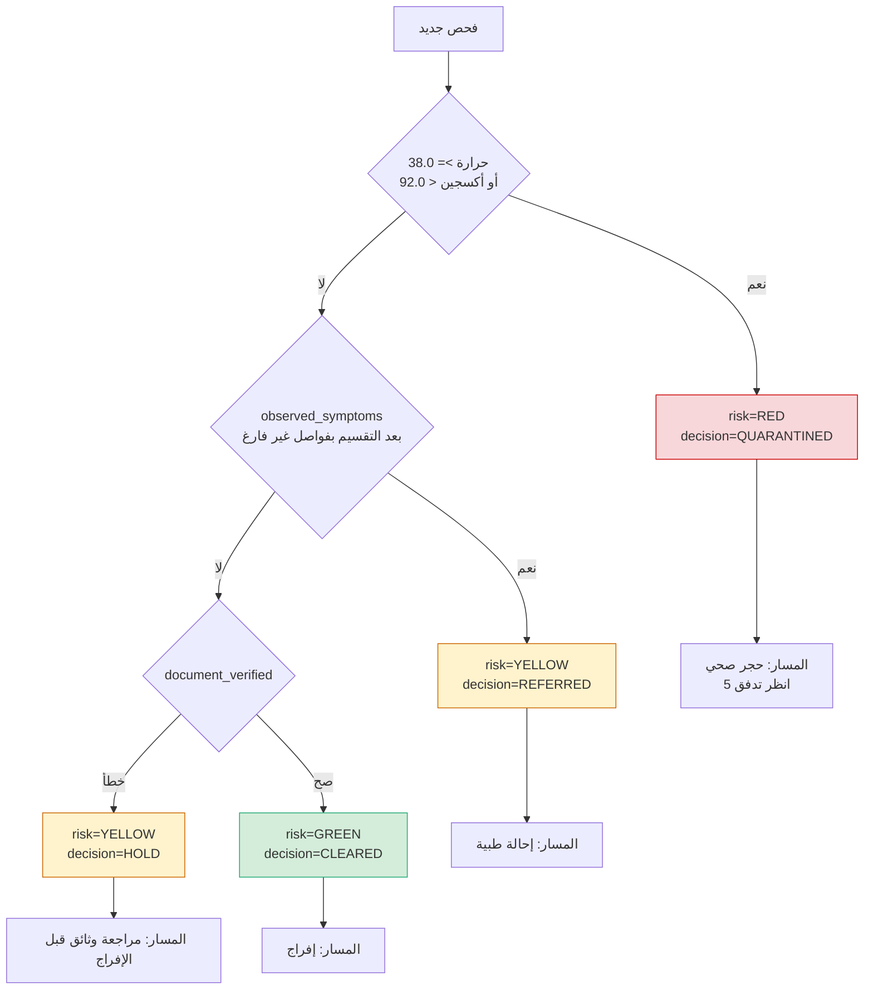
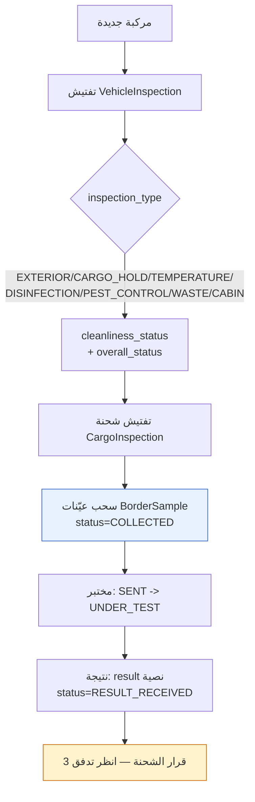
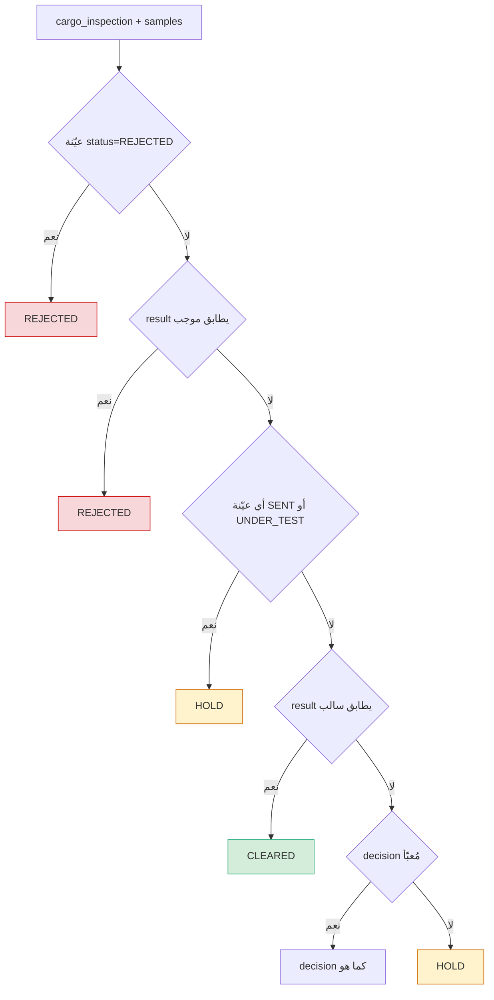
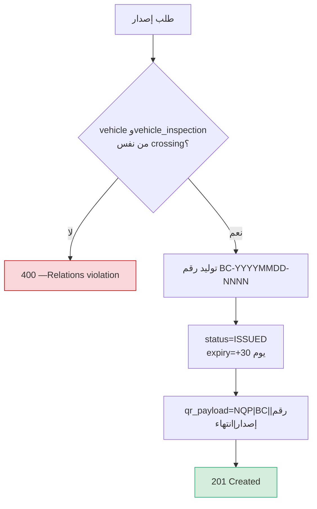
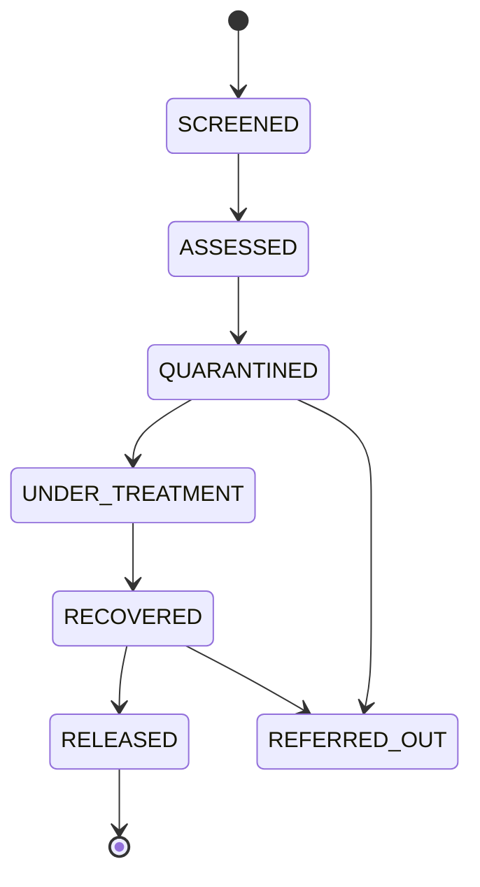
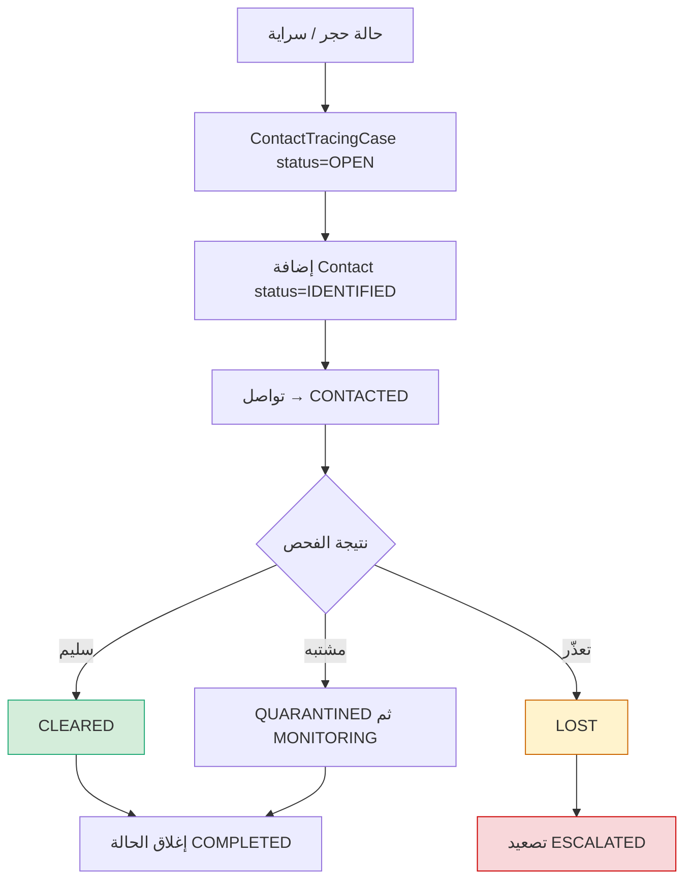
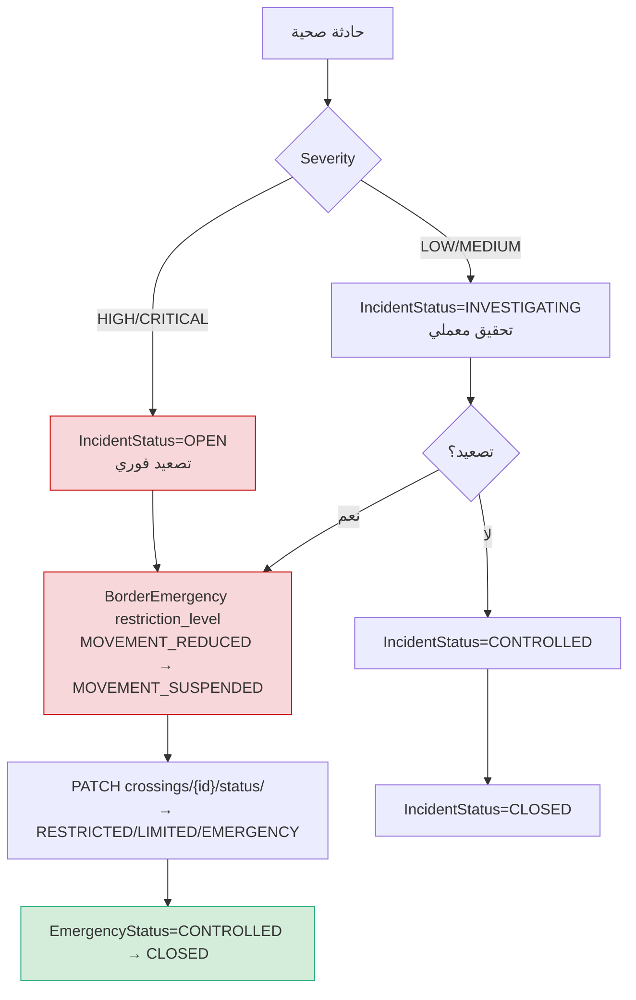
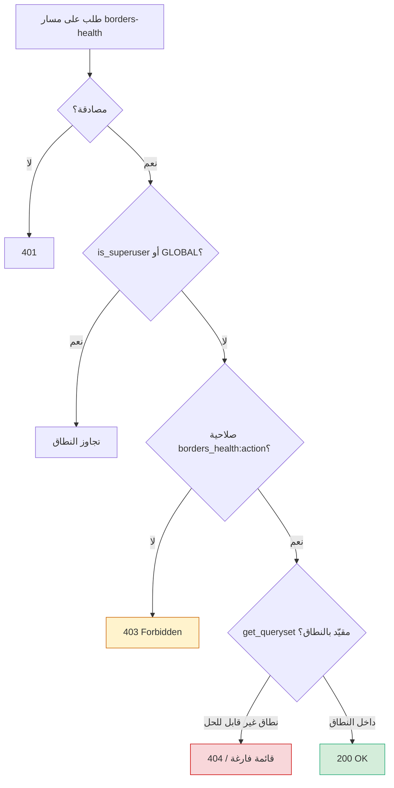

---

### 📄 `Border_Health_Workflow.md` (WF-10 — دورة الرقابة الصحية على المعابر البرية)

# WF-10: دورة الرقابة الصحية على المعابر البرية (Land Border Health Cycle)

> **نطاق الوثيقة:** وحدة `apps.borders_health` (21 نموذجاً، 22 مساراً مسجّلاً) وواجهتها
> `/app/borders-health`. كل قاعدة ورقم في هذا الملف مأخوذ من
> `backend/apps/borders_health/services.py` و`models.py` و`views.py` كما هي في الشيفرة،
> ولم يُفترض أي سلوك غير منفَّذ.
>
> **قاعدة عامة تطبَّق على كل التدفقات:** دوال `services.py` **بلا أي أثر جانبي على البريد
> أو الإشعارات** — ذلك مسؤولية مهام Celery. أي إشعار في هذا الملف يُنشئه المستخدم صراحةً
> عبر `BorderNotification`، ولا يُرسله النظام تلقائياً.

---

## 1. فهرس التدفقات

| # | التدفق | الفقرة | المسارات المحورية |
| :--- | :--- | :--- | :--- |
| 1 | وصول المسافر وإقراره وفحصه | [§3](#3-تدفق-1-الوصول-والفحص-والقرار) | `traveler-records/` `declarations/` `screenings/` |
| 2 | تفتيش المركبة والشحنة والعيّنات | [§4](#4-تدفق-2-المركبة-والشحنة-والعيّنات) | `vehicles/` `vehicle-inspections/` `cargo-inspections/` `samples/` |
| 3 | قرار الشحنة المشتق من العيّنات | [§5](#5-تدفق-3-قرار-الشحنة-المشتق-من-العيّنات) | `cargo-inspections/{id}/decide/` |
| 4 | إصدار الشهادة ومحتوى QR | [§6](#6-تدفق-4-إصدار-الشهادة-ورمز-qr) | `certificates/issue/` |
| 5 | دورة الحجر والعزل | [§7](#7-تدفق-5-دورة-الحجر-والعزل) | `quarantine-cases/` `isolation-cases/` |
| 6 | تتبع المخالطين | [§8](#8-تدفق-6-تتبع-المخالطين) | `contact-tracing-cases/` `contacts/` |
| 7 | الحادث والطوارئ وتقييد المعبر | [§9](#9-تدفق-7-الحادث-والطوارئ-وتقييد-المعبر) | `incidents/` `emergencies/` `crossings/{id}/status/` |
| 8 | حصيلة اليوم ولوحة القيادة | [§10](#10-تدفق-8-حصيلة-اليوم-ولوحة-القيادة) | `daily-statistics/refresh/` `dashboard/*` |
| 9 | البوابة: النطاق والصلاحيات | [§11](#11-تدفق-9-البوابة-النطاق-والصلاحيات) | كل المسارات |

---

## 2. الأدوار والممثلون

| الرمز | الدور (`Role.code`) | النطاق الافتراضي | ما يستطيع فعله في هذه التدفقات |
| :--- | :--- | :--- | :--- |
| `م` | `TRAVELER_REGISTRATION_OFFICER` | `PORT` | تسجيل المسافر وإقراره |
| `ض` | `BORDER_HEALTH_OFFICER` | `PORT` | الفحص، التفتيش، جمع العيّنات |
| `ط` | `QUARANTINE_DOCTOR` | `PORT` | الفتح والإدارة للحجر/العزل، التتبع |
| `ج` | `CUSTOMS_OFFICER` | `PORT` | تفتيش المركبة والشحنة |
| `مخ` | `LAB_TECHNICIAN` | `STATION` | إرسال العيّنات واستلام النتائج |
| `و` | `EPIDEMIOLOGY_OFFICER` | `SECTOR` | التتبع والإحصاءات والتقارير |
| `طو` | `EMERGENCY_OFFICER` | `SECTOR` | الطوارئ والحوادث |
| `م` | `BORDER_STATION_MANAGER` | `PORT` | تشغيل المعبر (فحص صحي، تعديل، حذف) |
| `م` | `BORDER_DIRECTOR` | `SECTOR` | إشراف قطاعي + إصدار الشهادات |
| `و` | `NATIONAL_QUARANTINE_DIRECTOR` | `GLOBAL` | صلاحية وطنية كاملة |
| `م` | `BORDER_SYSTEM_ADMIN` | `PORT` | إدارة النظام |

> **ثغرة موثّقة:** دور `QUARANTINE_INSPECTOR` (نطاق `STATION`) يحمل 12 صلاحية
> `borders_health` في `seed_rbac.py`، لكن **لا يمثّله مدخل في
> `roleLayouts/borders.tsx`** — فلا يستطيع فتح أي قسم في الواجهة رغم صلاحياته.

---

## 3. تدفق 1: الوصول والفحص والقرار

**الهدف:** تحويل حضور مسافر إلى قرار صحي موثَّق (`risk_level` + `decision`) قابل للتدقيق.

**الممثلون:** المسافر (خارج النظام) ← `م` ← `ض`.

**المسار:** `POST /api/v1/borders-health/traveler-records/` ثم
`POST /api/v1/borders-health/declarations/` ثم `POST /api/v1/borders-health/screenings/`.

### 3.1 الخطوات

1. **`م` يسجّل الحركة** — `POST /api/v1/borders-health/traveler-records/` ينشئ
   `TravelerHealthRecord` بـ `crossing` و`direction` (`INBOUND` / `OUTBOUND`) ووقت `entry_at`.
2. **المسافر يودع الإقرار** — `POST /api/v1/borders-health/declarations/` ينشئ
   `HealthDeclaration` بحالة البداية `RECEIVED` (قيم `Status`: `RECEIVED`, `REVIEWED`,
   `APPROVED`, `REJECTED`, `FLAGGED`).
3. **`ض` يسجّل القياسات** — `POST /api/v1/borders-health/screenings/` يحمل
   `body_temperature` و`oxygen_saturation` و`observed_symptoms` و`document_verified`
   و`vaccination_verified`.
4. **الحساب تلقائي عند الإنشاء** — `apply_screening_decision()` تستدعي `assess_screening()`
   وتكتب `risk_level` و`decision` على الكائن **قبل الحفظ**؛ لا يمكن للعميل تجاوزهما.
5. **`ض` يراجع** ويعدّل `decision` يدوياً إن شاء (تصعيد/تخفيض) مع تسجيل السبب في `notes`.
6. **`ض` يسجّل القرار الموثَّق** عبر `record_clearance_decision()` في `BorderDecision`
   (عبر `POST /api/v1/borders-health/decisions/`) إن لزم تدقيق لاحق.
7. **إعادة التقييم عند تغيّر البيانات** — `PATCH /api/v1/borders-health/screenings/{id}/`
   يعيد الحساب تلقائياً؛ و`POST .../reassess/` يعيد الحساب صراحةً دون تعديل الحقول.

### 3.2 مخطط القرار (القواعد الفعلية بترتيب التنفيذ)



### 3.3 التفاصيل الحاسمة

| البند | القيمة الفعلية |
| :--- | :--- |
| عتبة الحمّى | `FEVER_THRESHOLD_C = 38.0` — المقارنة `>=` |
| عتبة نقص الأكسجين | `HYPOXIA_THRESHOLD_PCT = 92.0` — المقارنة `<` |
| ترتيب القواعد | الحمّى/نقص الأكسجين **قبل** الأعراض؛ أي عيب في القياسات الحيوية يُطغى على كل شيء |
| `vaccination_verified` | **مستلَم ولا يُستخدم إطلاقاً** في `assess_screening()`؛ لا يخفض ولا يمنع الإفراج |
| تحليل الأعراض | `strip()` ثم `split(',')` ثم تجاهل الفارغ — أي سلسلة غير فارغة ⇒ `REFERRED` |
| إعادة الحساب | `apply_screening_decision()` تُستدعى في `Serializer.create` **و** `Serializer.update` |

### 3.4 المسارات البديلة

| الحالة | السلوك البديل |
| :--- | :--- |
| لا قياس حيوي (`None`) | تُتخطّى قاعدتا الحمّى والأكسجين؛ القرار من الأعراض ثم الوثائق |
| لا أعراض ولا وثائق | `YELLOW/HOLD` — لا يوجد مسار تلقائي للإفراج |
| الفاحص يخفض مستوى الخطر يدوياً | مسموح؛ `YELLOW` و`GREEN` تقديران لا محسوبان — لذا عتبات النظام إرشادية لا نهائية |
| إعادة الفحص | `reassess/` يعيد الحساب من القيم المخزَّنة فقط؛ لا يعيد أي قياس |

### 3.5 الفشل والتراجع

- **لا يوجد مسار فشل بـ `400`** في `assess_screening`: الدالة لا ترفع استثناءً، بل تعيد دائماً
  زوجاً صالحاً. الفشل الوحيد الممكن هو على مستوى إدخال الحقل (تحقّق `Serializer`).
- **`observed_symptoms` حقل `JSONField` بافتراضي قائمة، لكن الخدمة تعامله كنص.**
  في `services.py:56` الكود ينفّذ `(observed_symptoms or '').strip()`؛ وإذا أُرسلت قائمة
  (وهو الوضع الافتراضي `[]`)يرفع ‏`AttributeError` ⇒ **`500`** بدل قرار سليم.
  المسار الآمن: يُمرَّر حقل فارغ/نصّي، أو يُصحَّح النموذج/الخدمة لتوحيد النوع.
- **`vaccination_verified` زائد** ⇒ لا أثر.
- **التراجع:** `PATCH /api/v1/borders-health/screenings/{id}/` يعيد الحساب، فتُمحى أي
  تعديل يدوي للقرار عند تغيّر أي حقل مُدخل.

---

## 4. تدفق 2: المركبة والشحنة والعيّنات

**الهدف:** توثيق دورة تفتيش المركبة والشحنة وربط العيّنات بالمختبر قبل إصدار أي قرار.

**الممثلون:** `ج` (المركبة والشحنة) ← `ض`/`مخ` (العيّنات) ← مختبر الوحدة `laboratory`.

**المسارات:** `vehicles/` `vehicle-inspections/` `cargo-inspections/` `samples/`

### 4.1 الخطوات

1. **`ج` يسجّل المركبة** — `POST /api/v1/borders-health/vehicles/` بـ `plate_number` (فريد
   عالمياً) و`vehicle_type` (افتراضي `TRUCK` من 8 قيم) و`crossing`.
2. **`ج` ينفّذ التفتيش** — `POST /api/v1/borders-health/vehicle-inspections/`.
   `VehicleInspection` **لا تحمل `crossing`**؛ الربط عبر `vehicle__crossing` (انظر §11).
3. **`ج` يفتح تفتيش شحنة** — `POST /api/v1/borders-health/cargo-inspections/` بـ
   `scope` (`CARGO`, `FOOD`, `WAREHOUSE`, `WATER_SANITATION`) و`status`
   (`PENDING`, `INSPECTING`, `SAMPLES_SENT`, `AWAITING_DECISION`, `RELEASED`, `REJECTED`, `HOLD`).
4. **`ض` يسحب عيّنات** — `POST /api/v1/borders-health/samples/` لـ `crossing` و`vehicle`
   و/أو `cargo_inspection`؛ `status` يبدأ `COLLECTED` و`collected_at` بـ `auto_now_add`.
5. **`مخ` يربط المختبر** — يضبط `lab_sample`، ويحرّك `status` إلى `SENT` ثم `UNDER_TEST`.
6. **`مخ` يسجّل النتيجة** — يكتب `result` (نص حر) ويحرّك `status` إلى `RESULT_RECEIVED`.
7. **قرار الشحنة** — `POST .../decide/` (انظر التدفق 3).

### 4.2 مخطط المسار



### 4.3 المسارات البديلة

| الحالة | السلوك |
| :--- | :--- |
| شحنة بلا عيّنات | `assess_cargo_inspection` تعيد `HOLD` (تحفّظ افتراضي) ما لم يكن `decision` مُعبّأ |
| مركبة بحالة `UNDER_QUARANTINE` | لا منع تلقائي — التفتيش يبقى ممكناً؛ الإيقاف مسؤولية المستخدم |
| نتيجة عيّنة في نص عربي | `result__iregex` يدعم `سالبة` و`موجبة` إضافةً للإنجليزية |

### 4.4 الفشل والتراجع

- `plate_number` فريد عالمياً ⇒ تكرار ⇒ `400` من قيد قاعدة البيانات (لا يوجد تحقق مُسبق).
- `result` نص حر بلا `choices` ⇒ **أي كتابة** تُعامل كما هي؛ لا يوجد تحقق من كونها نتيجة
  فيروولوجية صالحة، والقرار يعتمد على مطابقة نمط نصّي (`positive|موجبة|إيجابية`).
- **تراجع الحالة:** تغيير `status` يدوياً إلى `SENT` يكفي لجعل القرار `HOLD` ما لم توجد
  نتيجة سالبة، لأن `SENT`/`UNDER_TEST` في القوائم تُقيَّم قبل النتيجة السالبة.

---

## 5. تدفق 3: قرار الشحنة المشتق من العيّنات

**الهدف:** اشتقاق قرار شحنة متسق من دورة حياة عيّناتها.

**الممثل:** `ض` أو `ج` (من يملك `cargo_inspect` أو `view`).

**المسار:** `POST /api/v1/borders-health/cargo-inspections/{id}/decide/`

### 5.1 القواعد الفعلية (أول شرط يتحقّق ينهي)

| # | الشرط | القرار |
| :--- | :--- | :--- |
| 1 | أي عيّنة `status = REJECTED` | `REJECTED` |
| 2 | أي عيّنة `result` يطابق `positive\|موجبة\|إيجابية` (غير فارغ) | `REJECTED` |
| 3 | أي عيّنة `status ∈ {SENT, UNDER_TEST}` | `HOLD` |
| 4 | أي عيّنة `result` يطابق `negative\|سالبة` (غير فارغ) | `CLEARED` |
| 5 | `inspection.decision` مُعبّأ مسبقاً | يُعاد كما هو |
| 6 | لا عيّنات إطلاقاً | `HOLD` |



### 5.2 تحويل `status` المرافق

| `decision` | `status` المكتوب |
| :--- | :--- |
| `REJECTED` | `REJECTED` |
| `CLEARED` | `RELEASED` |
| `HOLD` | `AWAITING_DECISION` |
| `CONDITIONAL` | **لا تغيير** |

ويُكتب أيضاً `decided_by` (المستخدم الحالي) و`decided_at` (`timezone.now()`).

### 5.3 المسارات البديلة والفشل

- **قرار صريح يتجاوز الاشتقاق:** الحقل `decision` في جسم الطلب **لا يُلغِ الاشتقاق**؛
  هو **الشرط رقم 5** فقط، بعد كل فحوص العيّنات؛ فمحاولة فرض قرار تُتجاهل ما دام
  هناك أي عيّنة تطابق القواعد 1–4.
- **`CONDITIONAL` لا يغيّر `status`**، فتبقى الشحنة في `PENDING`/`INSPECTING` رغم وجود قرار.
- **التراجع:** لا يوجد. القرار مشتق، فلا يمكن التراجع إلا بإعادة استدعاء `decide` بعد
  تعديل العيّنات.
- **الخلط بين `status` و`result`:** `status` دورة حياة، و`result` نتيجة. القرار يُشتق من
  `result` لا من `status` (إلا في `REJECTED`/`SENT`/`UNDER_TEST` التي هي `status`).

---

## 6. تدفق 4: إصدار الشهادة ورمز QR

**الهدف:** إصدار شهادة معبرية برقم متسلسل ومحتوى QR قابل للتدقيق.

**الممثل:** `BORDER_DIRECTOR` / `NATIONAL_QUARANTINE_DIRECTOR` (صلاحية `certificate_issue`)،
أو أي دور يحمل `view` فعلياً (§11).

**المسار:** `POST /api/v1/borders-health/certificates/issue/`

### 6.1 الخطوات والقواعد

1. `issue_certificate()` تعمل داخل `@transaction.atomic`.
2. **توليد الرقم** — `_next_sequence('BC', BorderCertificate, 'certificate_number')`:
   ```
   BC-<YYYYMMDD>-<####>
   ```
   حيث `####` = (عدد صفوف اليوم لنفس البادئة) + 1، بعرض 4 خانات، والتاريخ
   `timezone.localdate()` (توقيت `Africa/Khartoum`).
3. **التواريخ** — `issue_date = localdate()`، و`expiry_date = issue_date + expiry_days`
   (افتراضي `30`).
4. **الحالة** — `status = ISSUED` دائماً.
5. **محتوى QR** — نصّي، مقروء، غير سرّي:
   ```
   NQP|BC|<certificate_number>|<issue_date>|<expiry_date>
   ```
6. **الربط الإلزامي** — إن مُرِّرت `vehicle` و`vehicle_inspection` معاً يجب أن ينتميا
   كلاهما إلى `crossing` المطلوب.

### 6.2 مخطط التدفق



### 6.3 الفشل والتراجع

- **تعارض المعبر** ⇒ `400` برسالة صريحة (انظر مخطط §6.2 أعلاه).
- **سباق الترقيم:** العدّاد مشتق من `count()` لا من عدّاد تسلسلي. توازٍ عالٍ (آلاف
  الإصدارات/ثانية) قد يُنتج رقمين متطابقين ⇒ `IntegrityError` على القيد الفريد
  `certificate_number` ⇒ `500`. ملاحظة الشيفرة نفسها تؤكّد أن التضارب "نادر عملياً".
- **التراجع:** الشهادة `status` قابل للتعديل إلى `EXPIRED`/`REVOKED`/`CANCELLED` عبر
  `PATCH`، لكن **الرقم و`qr_payload` لا يُعاد توليدهما**.

---

## 7. تدفق 5: دورة الحجر والعزل

**الهدف:** فتح حالة حجر بموعد انتهاء محسوب، ثم إدارتها حتى الإفراج أو الإحالة.

**الممثلون:** `ط` (طبيب الحجر) ← `م` (مدير المحطة) ← إشعار للجهات (`طو`).

**المسارات:** `quarantine-cases/` `isolation-cases/`

### 7.1 دورة الحالة

| المرحلة (`Phase`) | المعنى | الحالة (`QuarantineStatus`) |
| :--- | :--- | :--- |
| `SCREENED` | مفحوص | `ADMITTED` |
| `ASSESSED` | مُقيَّم | `UNDER_QUARANTINE` |
| `QUARANTINED` | محجور (افتراضي `open_quarantine_case`) | `UNDER_QUARANTINE` |
| `UNDER_TREATMENT` | تحت العلاج | `UNDER_QUARANTINE` |
| `RECOVERED` | تعافى | `REFERRED` / `RELEASED` |
| `RELEASED` | مُفرج عنه | `RELEASED` |
| `REFERRED_OUT` | مُحال خارج المعبر | `ESCALATED` |

حالات الحالة (`QuarantineStatus`): `ADMITTED`, `UNDER_QUARANTINE`, `REFERRED`, `RELEASED`,
`ESCALATED`. حالات العزل (`IsolationStatus`): `ACTIVE`, `RELEASED`, `REMOVED`.

### 7.2 فتح الحالة

`open_quarantine_case()` (داخل معاملة):

- `required_days` افتراضي **14** ⇒ `expected_end_date = localdate(entry_at) + 14 يوم`.
- `status = UNDER_QUARANTINE`، `phase = QUARANTINED`.
- `person_name` يُشتق من `traveler.full_name` إن لم يُمرَّر.
- يرتبط بـ `crossing` و/أو `traveler` و/أو `facility` و/أو `clinic`.

### 7.3 مخطط دورة الحالة



### 7.4 المسارات البديلة

| الحالة | البديل |
| :--- | :--- |
| مسافر بلا `Traveler` | يُملأ `person_name` نصياً (حالة حجر لشخص غير مسجَّل) |
| بلا مرفق في المعبر | `facility` اختياري؛ الحالة تظل صالحة |
| استئناس الحاجة إلى عزل | `IsolationCase` بـ `status=ACTIVE` ومرتبط بـ `quarantine_case` |

### 7.5 الفشل والتراجع

- **`case_number` فريد لكن `null=True`:** يُسمح بعدة صفوف `NULL`؛ `save()` يولّد الرقم قبل
  أول `INSERT`. عملياً الرقم يُملأ عند الإنشاء فلا تصادم على `''`.
- **لا احتساب تلقائي للتأخير:** `expected_end_date` تاريخ ثابت. تجاوزه **لا** يغيّر
  `status` تلقائياً — يحتاج تدخّلاً يدوياً.
- **لا مسار `release` خدمة:** الإفراج يتم بـ `PATCH` على `status`/`phase` فقط.

---

## 8. تدفق 6: تتبع المخالطين

**الهدف:** فتح حالة تتبع من حالة حجر/سراية، ثم إدارة دورة حياة المخالطين.

**الممثلون:** `ط` و`و` (صلاحية `contact_trace`).

**المسارات:** `contact-tracing-cases/` `contacts/`

### 8.1 الخطوات

1. **`ط`/`و` يفتح حالة تتبع** — `POST /api/v1/borders-health/contact-tracing-cases/`
   بـ `crossing` (و/أو `case` = حالة حجر و/أو `disease`).
   `TracingStatus`: `OPEN`, `MONITORING`, `COMPLETED`, `ESCALATED`.
2. **`ط` يضيف مخالطاً** — `POST /api/v1/borders-health/contacts/`.
   `ContactStatus`: `IDENTIFIED`, `CONTACTED`, `QUARANTINED`, `MONITORING`, `CLEARED`, `LOST`.
3. **`ط` يحدّث الحالة** عبر `PATCH` على `contacts/{id}/` (مثلاً `IDENTIFIED → CLEARED`).
4. **إنهاء** — `PATCH` على `contact-tracing-cases/{id}/` إلى `COMPLETED` أو `ESCALATED`.

### 8.2 مخطط المسار



### 8.3 الفشل والتراجع

- **نطاق عميق:** `Contact` لا يحمل `crossing` إطلاقاً؛ النطاق عبر
  `tracing_case__crossing__entry_point` (انظر §11).
- **`Contact` يرتبط بـ `tracing_case` إجبارياً** ⇒ لا مخالط بلا حالة تتبع.
- **لا احتساب تلقائي للمتابعة:** لا تذكير ولا ترقية حالة للمخالط غير المستجيب؛
  `MONITORING` تبقى يدوية.

---

## 9. تدفق 7: الحادث والطوارئ وتقييد المعبر

**الهدف:** تصعيد حادثة صحية إلى حالة طوارئ مع تقييد حركة المعبر.

**الممثلون:** `طو` (EMERGENCY_OFFICER) ← `م` (BORDER_STATION_MANAGER).

**المسارات:** `incidents/` `emergencies/` `crossings/{id}/status/`

### 9.1 الخطوات

1. **`طو` يسجّل الحادث** — `POST /api/v1/borders-health/incidents/`.
   `IncidentStatus`: `OPEN`, `INVESTIGATING`, `CONTROLLED`, `CLOSED`.
   `Severity`: `LOW`, `MEDIUM`, `HIGH`, `CRITICAL`. يرتبط بـ `crossing` (و/أو `quarantine_case`).
2. **`طو` يصعّد** — `POST /api/v1/borders-health/emergencies/`.
   `EmergencyStatus`: `OPEN`, `ACTIVE`, `CONTROLLED`, `CLOSED`.
   `RestrictionLevel`: `ADVISORY`, `INCREASED_SURVEILLANCE`, `MOVEMENT_REDUCED`,
   `MOVEMENT_SUSPENDED`, `CLOSED` (افتراضي `ADVISORY`). اختياري: ربط `shared_event`
   (حدث طوارئ مشترك) و`disease`.
3. **`م` يقيّد المعبر** — `PATCH /api/v1/borders-health/crossings/{id}/status/`.
   `BorderStatus`: `OPEN`, `RESTRICTED`, `LIMITED`, `EMERGENCY`, `CLOSED`.
4. **`طو` ينهي** — `PATCH` الحادث إلى `CLOSED` والطوارئ إلى `CLOSED`، ثم يفتح المعبر.

### 9.2 مخطط التصعيد



### 9.3 الفشل والتراجع

- **لا ربط تلقائي:** فتح `BorderEmergency` **لا** يغيّر `BorderCrossing.operating_status`
  تلقائياً؛ يجب `PATCH` منفصل. و`PATCH crossings/{id}/status/` **لا** يسجّل قراراً
  ولا ينشئ طوارئ.
- **`restriction_level` لا يُترجم إلى `BorderStatus`:** الربط بينهما يدوي بالكامل.
- **الإغلاق:** `PATCH crossings/{id}/status/` يقبل `OPEN` فقط عند إرسال `closure_reason` فارغ
  (السبب يُستبدل إن أُرسل). التراجع بإعادة `status=OPEN` مع سبب.

---

## 10. تدفق 8: حصيلة اليوم ولوحة القيادة

**الهدف:** تجميع عدّادات يومية لكل معبر تغذّي اتجاه الحركة في لوحة القيادة.

**الممثل:** `و` (EPIDEMIOLOGY_OFFICER) أو `م` (BORDER_SYSTEM_ADMIN) — أي دور يملك
`view` على `daily-statistics`.

**المسارات:** `POST /api/v1/borders-health/daily-statistics/refresh/` ثم
`GET .../dashboard/traffic-trend/`

### 10.1 العدّادات التسعة

`refresh_daily_statistics(crossing, stat_date=None)` — نافذة `[start, end)` بتوقيت
`Africa/Khartoum`، و`update_or_create(crossing, stat_date)`:

| الحقل | المصدر | نافذة التصفية |
| :--- | :--- | :--- |
| `travelers_inbound` | `TravelerHealthRecord` (`direction=INBOUND`) | `entry_at` في النافذة |
| `travelers_outbound` | `TravelerHealthRecord` (`direction=OUTBOUND`) | `entry_at` في النافذة |
| `vehicles_inspected` | `VehicleInspection` | `inspection_date` + `vehicle__crossing` |
| `cargo_inspections` | `CargoInspection` | `created_at` |
| `quarantine_cases` | `QuarantineCase` | `entry_at` |
| `isolation_cases` | `IsolationCase` | `start_date == stat_date` (**مطابقة تامة**) |
| `suspected_cases` | `TravelerHealthRecord` (`risk_level=RED`) | `entry_at` |
| `certificates_issued` | `BorderCertificate` | `issue_date == stat_date` (**مطابقة تامة**) |
| `samples_collected` | `BorderSample` | `collected_at` |

### 10.2 مخطط التحديث

```mermaid
flowchart TD
    A["POST refresh/"] --> B{"stat_date=YYYY-MM-DD؟"}
    B -->|لا| E1["400 — تاريخ غير صحيح"]
    B -->|نعم| C["نافذة [start,end) بتوقيت Africa/Khartoum"]
    C --> D["عدّ 9 مؤشرات من مصادرها"]
    D --> F["update_or_create(crossing, stat_date)<br/>idempotent"]
    F --> G["200 OK"]
    G --> H["GET dashboard/traffic-trend<br/>يقرأ هذه الصفوف"]

    style E1 fill:#f8d7da,stroke:#c00
    style F fill:#e7f1fd,stroke:#36c
```



### 10.3 المسارات البديلة والفشل

- **متعدد المعابر:** `crossing` اختياري ⇒ يحدّث كل معابر نطاق المستخدم دفعةً واحدة.
- **crossing خارج النطاق** ⇒ `400` `{"crossing": "معبر غير موجود في نطاقك"}` (تحقّق صريح).
- **`average_processing_minutes`** **لا يُحسب** إطلاقاً — يبقى `0` (افتراضي `PositiveIntegerField`).
  لا يوجد قياس زمن معالجة في الوحدة.
- **تعارض التوقيت:** `refresh_daily_statistics` يستخدم نافذة واعية بالتوقيت
  (`[start, end)`)، بينما `dashboard/overview` يستخدم `entry_at__date=today` (استخراج
  تاريخ من قاعدة البيانات). مع `TIME_ZONE=Africa/Khartoum` واختلاف توقيت خادم قاعدة
  البيانات، قد يُظهر "اليوم" أرقاماً مختلفة بين اللوحة والحصيلة.
- **لا تحديث تلقائي:** لا مهمة Celery مجدولة في الوحدة — التحديث **يدوي** عبر `refresh/`.
- **التراجع/المحو:** لا حذف؛ إعادة `refresh/` بنفس التاريخ تعيد الحساب وتُحدّث الصف نفسه.

---

## 11. تدفق 9: البوابة — النطاق والصلاحيات

**الهدف:** شرح طبقة التفويض التي تحكم كل المسارات أعلاه.

### 11.1 طبقتا التفويض

1. **`PermissionAction`** (من `core.permissions`) — يتحقق من امتلاك
   `borders_health:<action>`.
2. **`MultiHopScopeFilter`** — يتحقق أن العنصر داخل نطاق المستخدم عبر مسارات علائقية
   متعددة المستويات.

### 11.2 المسارات العميقة الثلاثة

`core.permissions.ScopeFilter` يقرأ النطاق بمسار **مستوى واحد** فقط. مسارات هذه الوحدة
عميقة، لذلك `borders_health/permissions.py` يضيف `MultiHopScopeFilter`:

| النموذج | مسار النطاق | عدد القفزات |
| :--- | :--- | :--- |
| `HealthDeclaration` | `crossing__entry_point` | 2 |
| `VehicleInspection` | `vehicle__crossing__entry_point` | 3 |
| `Contact` | `tracing_case__crossing__entry_point` | 3 |

> `MultiHopScopeFilter` لا يخدم هذين المسارين العميقين فقط — بل **كل** نموذج يحمل مسار
> عمودي. توزيع الـ 21 نموذجاً على `scope_field`: `entry_point` (قفزة واحدة) لنموذج واحد،
> و`crossing__entry_point` (قفزتان) لثمانية عشر نموذجاً، والمساران العميقان أعلاه
> لنموذجين. مجموعها 21. طُبِّق المساران العميقان لأن `ScopeFilter` الأساسي يفشل عليهما.

### 11.3 سياسة الفشل الآمن

| الحالة | النتيجة |
| :--- | :--- |
| `is_superuser` | يتجاوز كل فحص |
| نطاق `GLOBAL` نشط | يتجاوز كل فحص |
| نطاق قابل للحل | `entry_point_id in scope_ids` |
| **نطاق غير قابل للحل** | **منع** + `logger.warning` (`DENYING`) |
| `get_queryset()` بنطاق غير قابل للحل | `qs.none()` ⇒ **قائمة فارغة**، وعنصر خارج النطاق ⇒ `404` |

### 11.4 مخطط التفويض



### 11.5 خلل الموثّق: الإجراءات الخمسة لا تُحقَّق بصلاحياتها المخصّصة

`views.py` يربط الإجراءات المخصّصة الخمسة **غير** المدرجة في `ACTION_TO_PERMISSION`:

| الإجراء | الصلاحية المطلوبة في التصميم | الصلاحية الفعلية المُنفَّذة |
| :--- | :--- | :--- |
| `crossings/{id}/status/` | `edit` | `view` (افتراضي) |
| `screenings/{id}/reassess/` | `health_screen` | `view` (افتراضي) |
| `certificates/issue/` | `certificate_issue` | `view` (افتراضي) |
| `cargo-inspections/{id}/decide/` | `cargo_inspect` | `view` (افتراضي) |
| `daily-statistics/refresh/` | `dashboard_view` | `view` (افتراضي) |

**الأثر:** أي دور يحمل `borders_health:view` (16 دوراً) يستطيع **إصدار شهادة** أو
**تغيير حالة معبر** أو **تحديث الإحصاءات**، ما يتجاوز استحقاقات
`certificate_issue`/`edit`/`dashboard_view`. الإصلاح: إضافة مفاتيح الإجراءات الخمسة
إلى `ACTION_TO_PERMISSION`.

---

## 12. فجوات الموثّقة (تُلخّص)

| # | الفجوة | الموقع | الأثر |
| :--- | :--- | :--- | :--- |
| 1 | `observed_symptoms` (JSON) يُعامل كنص | `services.py:56` | `500` على القائمة الافتراضية |
| 2 | الإجراءات الخمسة ترث `view` | `views.py` `ACTION_TO_PERMISSION` | تجاوز صلاحيات |
| 3 | `average_processing_minutes` لا يُحسب | `services.refresh_daily_statistics` | المؤشر يبقى `0` |
| 4 | تعارض نافذة التوقيت | `refresh_daily_statistics` (tz-aware) مقابل `dashboard/overview` (`__date`) | اختلاف أرقام "اليوم" |
| 5 | `national_overview` لا تُستخدم + تنقص `open_emergencies` | `services.py:296` | شيفرة ميتة |
| 6 | `vaccination_verified` بلا أثر | `services.assess_screening` | لا تأثير على القرار |
| 7 | `QUARANTINE_INSPECTOR` بلا تنقّل واجهة | `roleLayouts/borders.tsx` | دور محجوب عن الواجهة |
| 8 | ترقيم الشهادة بـ `count()` | `services._next_sequence` | تصادم محتمل تحت التوازي |
| 9 | `open_quarantine_case` لا يولّد `case_number` رغم وصفه في توثيق الدالة | `services.py:202` | فجوة توثيق |
| 10 | لا مسار `release` خدمة | `services.py` | الإفراج يدوي بالكامل |
