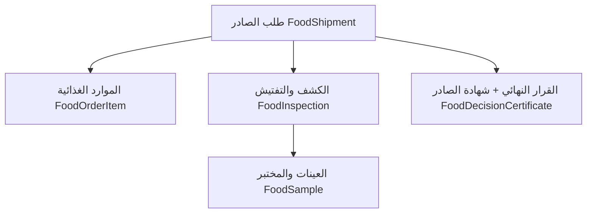

---

### 📄 8. `Food_Inspection.md` (التفتيش والإفراج الغذائي)

```markdown
# WF-08: التفتيش والإفراج الغذائي (Food Quarantine Inspection)

## 1. الهدف
توثيق عملية الحجر الصحي الغذائي من لحظة وصول الشحنة إلى المنفذ، مروراً بالتفتيش وأخذ العينات، وانتهاءً بإصدار شهادة الإفراج للجمارك (عبر التكامل الخارجي).

## 2. تدفق العملية

```mermaid
flowchart TD
    Start([بداية: وصول شحنة غذائية]) --> Step1[1. تسجيل الشحنة في النظام<br/>(بوابة 7 - React) عن طريق الجمارك أو المورد]
    Step1 --> Step2[2. تظهر الشحنة في قائمة<br/>"بانتظار التفتيش" للمفتش - Django ORM]
    Step2 --> Step3[3. المفتش يقوم بالتفتيش الظاهري<br/>(العبوات، التواريخ، درجة الحرارة) - React Form]
    Step3 --> Decision1{هل التفتيش الظاهري مطابق؟}
    Decision1 -- لا --> Step4[4. رفض الشحنة<br/>وإشعار المورد والجمارك - Django Service]
    Step4 --> End1([النهاية: رفض])
    
    Decision1 -- نعم --> Step5[5. أخذ عينات عشوائية<br/>من الشحنة - React Form]
    Step5 --> Step6[6. تسجيل العينات في المختبر<br/>(مع باركود) - Django API]
    Step6 --> Step7[7. المختبر يحلل العينات<br/>(ميكروبيولوجي/كيميائي) - بوابة 6]
    Step7 --> Step8[8. ظهور النتيجة في النظام - Django Signal]
    
    Step8 --> Decision2{النتيجة مطابقة للمواصفات؟}
    Decision2 -- لا --> Step9[9. إشعار المفتش بعدم المطابقة - WebSocket]
    Step9 --> Step10[10. اتخاذ قرار: إعادة التصدير أو الإتلاف]
    Step10 --> End2([النهاية: رفض])
    
    Decision2 -- نعم --> Step11[11. إصدار شهادة الإفراج الصحي<br/>رقمياً - Django Report (PDF)]
    Step11 --> Step12[12. إرسال الشهادة إلى الجمارك<br/>(تكامل آلي عبر REST API)]
    Step12 --> Step13[13. الجمارك تُنهي إجراءات الإفراج الجمركي]
    Step13 --> End3([النهاية: إفراج])

3. التكامل الخارجي

    الجمارك: تُرسل الشهادة تلقائياً عبر Django Service (apps/integration/services.py) إلى نظام الجمارك عبر REST API أو SFTP.

    هيئة المواصفات: يتم استدعاء قائمة المواصفات القياسية من نظام هيئة المواصفات آلياً عبر REST API لمقارنة النتائج (يتم تخزينها مؤقتاً في Redis).
```

---

## دورة الطلب التشغيلية (Operational Flow — تم البناء)

مسار العمل التنفيذي القصير المطبق في النظام (الكاتب → المحاسب → مدير القسم → المفتش) فوق
`FoodShipment`, مع **حساب تلقائي** لعدد العينات والرسوم والمتابعة عبر **حالات الشحنة**:

```mermaid
flowchart TD
    A[الكاتب: POST /shipments/ (مع items + message_type)] --> B[apply_sampling + fee_preview تلقائي]
    B --> C[الكاتب: POST /shipments/{id}/submit → FEES_DUE]
    C --> D[المحاسب: GET fee-preview / POST invoice]
    D --> E[المحاسب: POST pay → fees_paid=true + إيصال RCPT]
    E --> F[مدير القسم: POST review APPROVE → AWAITING_INSPECTION]
    F --> G[المفتش: POST inspection<br/>COMPLIANT → RELEASED | NEEDS_ANALYSIS → UNDER_INSPECTION | NON_COMPLIANT → AWAITING_DECISION]
    G --> H[المفتش: POST samples (sampling_reason)]
    H --> I[مدير القسم: POST to-decision → AWAITING_DECISION]
    I --> J[مدير القسم: POST decide → شهادة FCER + حالة نهائية]
```

### نقاط الحسم (قواعد العمل)
- **الرسوم الإلزامية**: `decide`/`to-decision` تتطلب `fees_paid=true`.
- **القرار النهائي** (`FinalDecision`) وربطه بحالة الشحنة (خريطة `status_map`):
  `COMPLIANT→RELEASED`, `CONDITIONAL_RELEASE→CONDITIONAL_RELEASE`, `PARTIAL_RELEASE→CONDITIONAL_RELEASE`,
  `TEMPORARY_RELEASE→HOLD`, `REJECTED→REJECTED`, `HOLD→HOLD`, `RE_EXPORT→RE_EXPORT`, `TRANSFER→HOLD`,
  `DESTROY→DESTROYED`.
- **المحرك المالي**: بِنى `compute_fee_breakdown` (بنود ثابتة)، مع إعفاء كلي لـ `RELIEF` وإعفاء
  رسوم الشهادة لـ `EXEMPT`. التعريفة الشرائحية الرسمية حسب الكمية/للفحص في `docs/Data`
  **مرجعية غير مطبقة بعد** (راجع قسمي «حالة التنفيذ» في تلك الملفات).
- **قرار التفتيش** (`FoodInspection.decision`): `NEEDS_ANALYSIS` يفوّض للمعمل ثم `to-decision`؛
  `COMPLIANT` يفرج مباشرة؛ `NON_COMPLIANT` يمر للقرار. لا يُسمح بتكرار التفتيش.

---

## استمارة كشف الموارد الغذائية الصادرة (Export Food Inspection Form)

سجل إلكتروني موحّد لشحنات الصادر يُجمَّع عبر
`GET /api/v1/food/shipments/{id}/export-form` بلا إدخال مكرر:



- **الأقسام السبعة**: بيانات الطلب ← بيانات المصدّر ← الموارد الغذائية ← الكشف والتفتيش ←
  العينات والفحص المخبري ← القرار ← الشهادة، مع رأس الاعتماد (المفتش ← رئيس القسم ← مدير
  إدارة رقابة الأغذية).
- **العرض**: تبويب «استمارة الكشف الصادر» في `/app/food-ops` + زر «طباعة / PDF» يفتح وثيقة
  HTML مستقلة عبر `window.print()` (راجع `04_Modules/07_Food_Quarantine/ExportInspectionForm.md`).