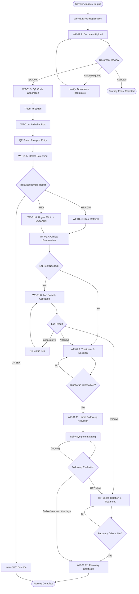
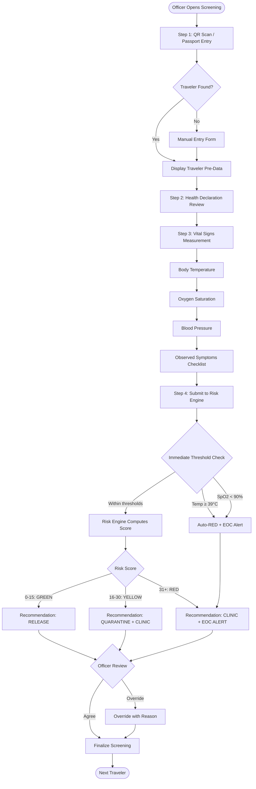
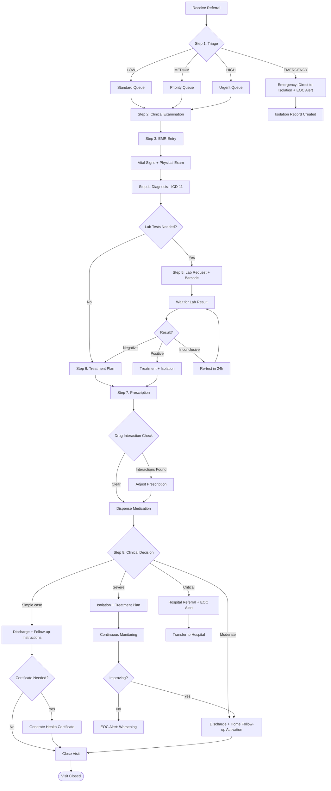
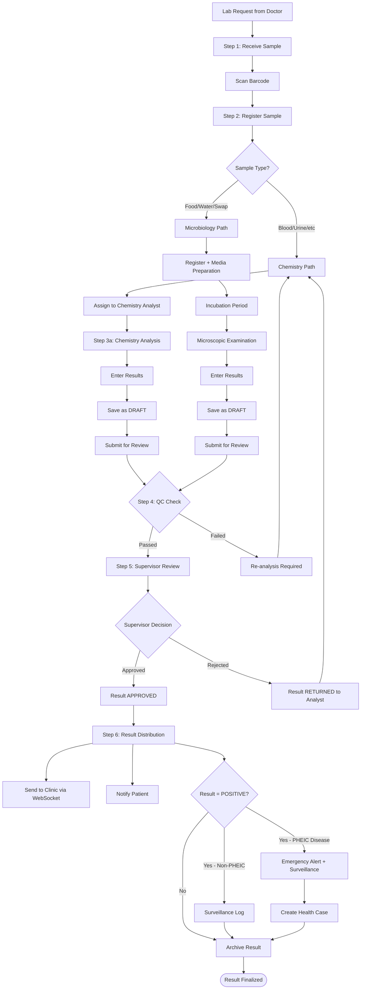
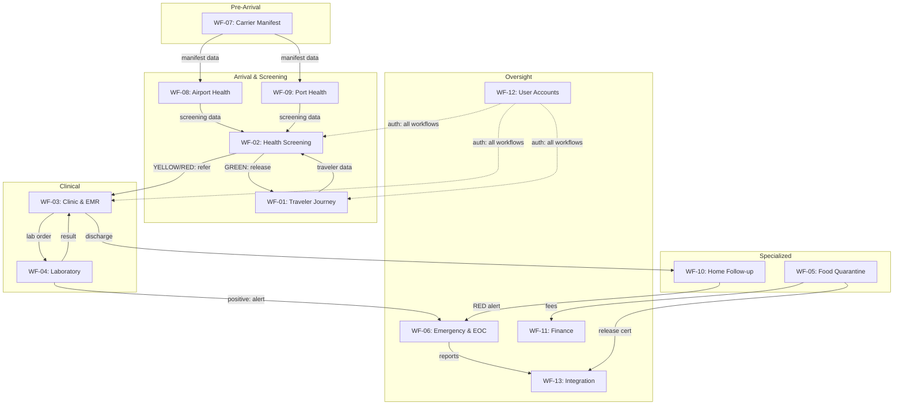

```mermaid
flowchart TD
    DETECT[Alert Detection] --> SOURCE{Alert Source}
    
    SOURCE -->|RED Screening| SCREENING_ALERT[RED Alert from WF-02]
    SOURCE -->|Positive Lab| LAB_ALERT[LAB Alert from WF-04]
    SOURCE -->|EWARS Threshold| EWARS_ALERT[EWARS Auto-Alert]
    SOURCE -->|Public Report| PUBLIC_ALERT[Public Report]
    
    SCREENING_ALERT --> NEW[Alert Status: NEW]
    LAB_ALERT --> NEW
    EWARS_ALERT --> NEW
    PUBLIC_ALERT --> NEW
    
    NEW --> EOC_RECEIVE[EOC Receives Alert]
    EOC_RECEIVE --> ASSESS[Step 1: Assess Alert]
    ASSESS --> CLASSIFY{Classification}
    
    CLASSIFY -->|Individual Case| DISPATCH_RRT[Step 2a: Dispatch RRT]
    CLASSIFY -->|Potential Outbreak| INVESTIGATE[Step 2b: Investigation]
    CLASSIFY -->|Confirmed Outbreak| ESCALATE[Step 2c: Escalate to Director]
    
    DISPATCH_RRT --> RRT_DEPLOY[Deploy Rapid Response Team]
    RRT_DEPLOY --> RRT_ASSESS[Field Assessment]
    RRT_ASSESS --> RRT_RESULT{Field Result}
    RRT_RESULT -->|Contained| RESOLVED_IND[Resolve Individual Alert]
    RRT_RESULT -->|Spreading| ESCALATE
    
    INVESTIGATE --> CASE_TRACING[Contact Tracing]
    CASE_TRACING --> THRESHOLD{5+ Cases at Same Port in 1h?}
    THRESHOLD -->|Yes| ESCALATE
    THRESHOLD -->|No| MANAGE_OUTBREAK[Manage Outbreak]
    
    ESCALATE --> DIRECTOR_REVIEW[Emergency Director Review]
    DIRECTOR_REVIEW --> KILL_SWITCH_DECISION{Activate Kill Switch?}
    KILL_SWITCH_DECISION -->|Yes| DUAL_AUTH[Dual Authorization Required]
    KILL_SWITCH_DECISION -->|No| MANAGE_OUTBREAK
    
    DUAL_AUTH --> DIRECTOR_PASS[Director Password]
    DIRECTOR_PASS --> SECURITY_PASS[Security Officer Password]
    SECURITY_PASS --> KILL_SWITCH_ACTIVE[KILL SWITCH ACTIVATED]
    
    KILL_SWITCH_ACTIVE --> STOP_PORTS[Stop All Port Operations]
    STOP_PORTS --> MASS_NOTIFY[Mass Notification to All Staff]
    MASS_NOTIFY --> CRISIS_TEAM[Crisis Team Activation]
    CRISIS_TEAM --> MONITOR[Monitor Situation]
    
    MANAGE_OUTBREAK --> MONITOR
    MONITOR --> SITUATION{Situation Under Control?}
    SITUATION -->|Yes| DEACTIVATE[Deactivate Kill Switch]
    SITUATION -->|No| MONITOR
    
    DEACTIVATE --> DUAL_AUTH_DEACT[Dual Auth to Deactivate]
    DUAL_AUTH_DEACT --> RESTART[Gradual Port Restart]
    RESTART --> RESOLVED[Close Event]
    
    RESOLVED_IND --> REPORT[Step 3: Generate Reports]
    RESOLVED --> REPORT
    REPORT --> MOH_REPORT[Report to Ministry of Health]
    MOH_REPORT --> END([Emergency Cycle Complete])
```

# NQP Master Workflow — سير العمل الرئيسي لمنصة الحجر الصحي القومي

> **Version:** 2.0  
> **Date:** 2026-09-10  
> **Scope:** Complete workflow design covering all actors, steps, decision points, statuses, notifications, and exceptions across the entire NQP platform.

---

## Table of Contents

1. [Actors & Roles Matrix](#1-actors--roles-matrix)
2. [Master Status Taxonomy](#2-master-status-taxonomy)
3. [Workflow 01 — Traveler End-to-End Journey](#wf-01)
4. [Workflow 02 — Health Screening & Risk Assessment](#wf-02)
5. [Workflow 03 — Clinic & Medical Records (EMR)](#wf-03)
6. [Workflow 04 — Laboratory Sample Lifecycle](#wf-04)
7. [Workflow 05 — Food Quarantine & Inspection](#wf-05)
8. [Workflow 06 — Emergency Response & EOC](#wf-06)
9. [Workflow 07 — Carrier Manifest Processing](#wf-07)
10. [Workflow 08 — Airport Health Operations](#wf-08)
11. [Workflow 09 — Port Health & Vessel Operations](#wf-09)
12. [Workflow 10 — Home Follow-up & Recovery](#wf-10)
13. [Workflow 11 — Financial Lifecycle (Invoicing & Payment)](#wf-11)
14. [Workflow 12 — User Account Lifecycle & RBAC](#wf-12)
15. [Workflow 13 — External Integration & Sync](#wf-13)
16. [Notification Matrix](#notification-matrix)
17. [Exception Catalog](#exception-catalog)
18. [Workflow Dependency Map](#workflow-dependency-map)

---

## 1. Actors & Roles Matrix

### 1.1 Primary Actors

| Actor ID | Role Code | Display Name (AR) | Display Name (EN) | Portal | Scope |
|:---:|:---|:---|:---|:---|:---|
| A01 | `SUPER_ADMIN` | مدير النظام العام | System Admin | Admin | Global |
| A02 | `FEDERAL_DIRECTOR` | المدير العام | Director General | National Command | National |
| A03 | `SECTOR_MANAGER` | مدير القطاع | Sector Manager | Sector Dashboard | Sector |
| A04 | `STATION_HEAD` | رئيس المحطة | Station Head | Station Dashboard | Station |
| A05 | `PORT_OFFICER` | موظفي الحجر الصحي | Port Health Officer | Screening Portal (4) | Port/Point |
| A06 | `AIRPORT_INSPECTOR` | مفتشف المطار | Airport Inspector | Airport Portal (17) | Airport |
| A07 | `CLINIC_DOCTOR` | الطبيب | Doctor | Clinic Portal (5) | Clinic |
| A08 | `LAB_TECHNICIAN` | التقني المختبري | Lab Technician | Lab Portal (6) | Laboratory |
| A09 | `LAB_SUPERVISOR` | مشرف المختبر | Lab Supervisor | Lab Portal (6) | Laboratory |
| A10 | `FOOD_INSPECTOR` | مفتشف الأغذية | Food Inspector | Food Portal (7) | Port |
| A11 | `FOOD_CLERK` | كاتب الحجر الغذائي | Food Clerk | Food Portal (7) | Port |
| A12 | `ACCOUNTANT` | المحاسب | Accountant | Finance | Port |
| A13 | `EOC_OPERATOR` | مشغل غرفة الطوارئ | EOC Operator | EOC Portal (9) | National/Regional |
| A14 | `EMERGENCY_DIRECTOR` | مدير الطوارئ | Emergency Director | EOC Portal (9) | National |
| A15 | `QUARANTINE_INSPECTOR` | مفتشف الحجر | Quarantine Inspector | Field | Port/Point |
| A16 | `CARRIER` | شركة النقل | Carrier/Airline | Carrier Portal (3) | Airline |
| A17 | `TRAVELER` | المسافر | Traveler | Traveler Portal (2) | Self |
| A18 | `RISK_ANALYST` | محلل المخاطر | Risk Analyst | Analytics | National |
| A19 | `SURVEILLANCE_OFFICER` | مسؤول الترصد | Surveillance Officer | EOC/Surveillance | Sector |
| A20 | `CHEM_ANALYST` | محلل كيميائي | Chemistry Analyst | Chemistry Lab | Lab |
| A21 | `MICRO_ANALYST` | محلل ميكروبيولوجي | Microbiology Analyst | Microbiology Lab | Lab |
| A22 | `QUALITY_ASSURANCE` | ضمان الجودة | Quality Assurance | Lab | Lab |
| A23 | `IT_ADMIN` | مدير تقنية المعلومات | IT Admin | IT Management | Sector |
| A24 | `NATIONAL_IT_DIRECTOR` | مدير تقنية المعلومات الوطني | National IT Director | National IT | National |
| A25 | `CMS_EDITOR` | محرر المحتوى | CMS Editor | CMS | Sector |

### 1.2 System Actors (Automated)

| System ID | Name | Trigger | Action |
|:---:|:---|:---|:---|
| S01 | **Risk Engine** | Screening submission | Computes risk score → GREEN/YELLOW/RED |
| S02 | **QR Generator** | Document approval | Generates HMAC-signed QR token |
| S03 | **EWARS Engine** | Case threshold breach | Creates SurveillanceAlert → bridges to EmergencyEvent |
| S04 | **Celery Beat** | Cron schedule | Daily reports, IHR sync, overdue checks, follow-up reminders |
| S05 | **Notification Dispatcher** | Event trigger | Sends SMS/Email/Push/In-App notifications |
| S06 | **Financial Calculator** | Shipment registration | Computes fees based on type, weight, samples |
| S07 | **Microbiology Engine** | Sample registration | Assigns test battery based on food matrix + origin |
| S08 | **Integration Gateway** | Scheduled/triggered | Syncs with MoH, WHO IHR, Customs |

---

## 2. Master Status Taxonomy

### 2.1 Universal Status Classes

| Status Class | Values | Used By |
|:---|:---|:---|
| **Lifecycle** | `DRAFT` → `ACTIVE` → `COMPLETED` / `CANCELLED` | Shipments, Events, Investigations |
| **Review** | `PENDING` → `UNDER_REVIEW` → `APPROVED` / `REJECTED` / `RETURNED` | Documents, Inspections, Lab Results |
| **Medical** | `OPEN` → `IN_PROGRESS` → `RESOLVED` / `CLOSED` | Clinic Visits, Cases, Alerts |
| **Financial** | `DRAFT` → `ISSUED` → `PENDING_PAYMENT` → `PAID` → `RECONCILED` | Invoices |
| **Risk** | `GREEN` → `YELLOW` → `RED` | Screening, Surveillance |
| **Health** | `FIT` / `UNFIT` / `UNDER_OBSERVATION` | Crew, Passengers |
| **Operational** | `PENDING` → `IN_PROGRESS` → `COMPLETED` | Tasks, Tests, Analyses |

### 2.2 Complete Status Map by Domain

#### Traveler Domain
```
PENDING_DOCUMENTS → UNDER_REVIEW → ACTION_REQUIRED → COMPLETED
                                                    → REJECTED
```

#### Screening Domain (Risk Output)
```
GREEN  → Release immediately
YELLOW → Clinic referral → possible lab → release with follow-up
RED    → Immediate clinic + EOC alert → isolation/treatment
```

#### Clinic Domain (Visit Phases)
```
REGISTERED → TRIAGED → EXAMINED → LABORATORY → DECISION → CERTIFICATE → CLOSED
                                    ↓                        ↓
                               (skip to DECISION)      (skip to CLOSED)
```

#### Laboratory Domain (Sample)
```
REGISTERED → RECEIVED → ACCEPTED → PROCESSING → UNDER_TESTING → READY_FOR_APPROVAL → APPROVED → COMPLETED
                        ↓                                              ↓
                   CONDITIONALLY_ACCEPTED                            REJECTED → re-analysis
                        ↓
                    REJECTED
```

#### Food Quarantine Domain (Shipment)
```
DRAFT → RECEIVED → FEES_DUE → AWAITING_INSPECTION → UNDER_INSPECTION → AWAITING_LAB_RESULTS → AWAITING_DECISION
                                                                              ↓                         ↓
                                                                    NEEDS_ANALYSIS              DECISION
                                                                                                    ↓
                                                                    ┌──────────────────────────────────────────┐
                                                                    │  COMPLIANT → RELEASED                     │
                                                                    │  CONDITIONAL → CONDITIONAL_RELEASE         │
                                                                    │  REJECTED → REJECTED                       │
                                                                    │  HOLD → HOLD                               │
                                                                    │  RE_EXPORT → RE_EXPORT                     │
                                                                    │  DESTROY → DESTROYED                       │
                                                                    └──────────────────────────────────────────┘
```

#### Emergency Domain (Alert)
```
NEW → PROCESSING → RESOLVED
```

#### Emergency Domain (Event)
```
IDENTIFIED → VERIFIED → RESPONDING → CONTROLLED → CLOSED
                                               → REJECTED
```

#### Financial Domain (Invoice)
```
DRAFT → ISSUED → PENDING_PAYMENT → PAID → RECONCILED
                                  → PARTIAL → PAID
                                  → OVERDUE → PAID / CANCELLED / REFUNDED
                   → CANCELLED
```

#### Surveillance Domain (Health Case)
```
SUSPECTED → PROBABLE → CONFIRMED → UNDER_TREATMENT → RECOVERED
                                         ↓                ↓
                                      ISOLATED         CLOSED
                                         ↓
                                    DEAD / LOST_FOLLOWUP
```

---

## WF-01: Traveler End-to-End Journey

### Overview
The complete lifecycle from pre-registration to recovery certificate, covering all touchpoints between the traveler and the NQP system.

### Actors
| Actor | Role |
|:---|:---|
| A17 — Traveler | Self-service portal user |
| A05 — Port Officer | Screening at arrival |
| A07 — Doctor | Clinical examination |
| A08 — Lab Technician | Sample analysis |
| A01 — System Admin | Account management |
| S01 — Risk Engine | Automated risk scoring |
| S02 — QR Generator | Token generation |

### Workflow Steps



### Decision Points

| Step | Decision | Condition | Outcomes |
|:---|:---|:---|:---|
| WF-01.2 | Document completeness | All required docs uploaded + valid | Approved → QR / Action Required → re-upload / Rejected → end |
| WF-01.5 | Risk score | Risk Engine output (0-100) | GREEN (0-15) / YELLOW (16-30) / RED (31+) |
| WF-01.7 | Lab necessity | Doctor's clinical judgment + risk level | Yes → lab / No → treatment |
| WF-01.8 | Lab result | POSITIVE / NEGATIVE / INCONCLUSIVE | Negative → release / Positive → isolate / Inconclusive → re-test |
| WF-01.9 | Discharge criteria | Duration complete + 3 stable days + negative PCR | Yes → follow-up / No → continue treatment |
| WF-01.10 | Recovery | 14 days + 3 consecutive stable + negative PCR | Yes → certificate / No → extend isolation |
| WF-01.11 | Follow-up daily eval | Symptom score + temperature + SpO2 | GREEN → reassurance / YELLOW → doctor notified / RED → re-isolate |

### Status Transitions

| Entity | From | To | Trigger |
|:---|:---|:---|:---|
| Traveler | `PENDING_DOCUMENTS` | `UNDER_REVIEW` | Documents submitted |
| Traveler | `UNDER_REVIEW` | `COMPLETED` | Documents approved |
| Traveler | `UNDER_REVIEW` | `ACTION_REQUIRED` | Docs incomplete |
| Traveler | `UNDER_REVIEW` | `REJECTED` | Docs invalid |
| QR Token | — | `ACTIVE` | Generated after approval |
| QR Token | `ACTIVE` | `EXPIRED` | TTL exceeded (24h) |
| QR Token | `ACTIVE` | `REVOKED` | Admin revocation |
| Risk Level | — | `GREEN/YELLOW/RED` | Risk Engine computation |
| Clinic Visit | — | `REGISTERED` | Referral received |
| Clinic Visit | `REGISTERED` | `CLOSED` | Doctor closes case |

### Notifications

| Trigger | Recipient | Channel | Content |
|:---|:---|:---|:---|
| Documents approved | Traveler | Email + Push | "Documents approved. QR code ready." |
| Documents incomplete | Traveler | Email + In-App | "Please upload: [missing doc list]" |
| Documents rejected | Traveler | Email | "Document rejected. Reason: [reason]" |
| Risk = RED | EOC + Port Officer | Push + WebSocket | "RED alert: Traveler [name] at [port]" |
| Risk = YELLOW | Port Officer | In-App | "YELLOW: Traveler [name] referred to clinic" |
| Clinic referral | Doctor | Push + WebSocket | "New referral: [traveler] from screening" |
| Lab result ready | Doctor | WebSocket + Push | "Lab result for [traveler]: [result]" |
| Positive result | EOC + Surveillance | Push + WebSocket + Email | "PHEIC positive: [disease] at [port]" |
| Follow-up RED alert | EOC + Doctor | Push + WebSocket | "Follow-up RED: [patient] worsening" |
| Recovery certificate | Traveler | Email + Push | "Recovery certificate ready for download" |

### Exceptions

| Exception | Handling | Recovery |
|:---|:---|:---|
| QR scan failure | Manual passport entry fallback | Officer enters passport → system looks up traveler |
| QR expired during travel | Auto-extend 6 hours | System extends; if still expired, manual entry |
| Traveler refuses screening | Document refusal + security alert | Security team介入; traveler cannot enter |
| Risk Engine timeout (>500ms) | Default to YELLOW + log error | Manual screening by doctor |
| Lab system offline | Manual result recording on paper | Tech enters results when system recovers; audit log notes manual entry |
| Traveler leaves before discharge | Alert to port officer + flag in system | If found: re-admit. If not: flag in national database |
| Inconclusive lab result | Re-test in 24 hours | Second result is final; if still inconclusive → YELLOW classification |
| Critical case (SpO2 < 90%) | Immediate RED + hospital transfer | EOC activates ambulance; hospital admission logged |

---

## WF-02: Health Screening & Risk Assessment

### Overview
The real-time screening process at port of entry, from QR scan to risk classification. Target: complete screening in < 3 minutes.

### Actors
| Actor | Role |
|:---|:---|
| A05 — Port Officer | Conducts screening |
| A06 — Airport Inspector | Airport-specific screening |
| A17 — Traveler | Provides health data |
| S01 — Risk Engine | Automated scoring |

### Workflow Steps



### Decision Points

| Step | Decision | Condition | Outcomes |
|:---|:---|:---|:---|
| Step 1 | Traveler identification | QR decode / passport lookup | Found → pre-fill / Not found → manual form |
| Threshold | Auto-RED triggers | Temp ≥ 39°C OR SpO2 < 90% OR country = RED | Immediate RED regardless of score |
| Step 4 | Risk classification | Weighted score from 6 factors | GREEN / YELLOW / RED |
| Officer Review | Override capability | Officer judgment + justification | Accept computed / Override (logged) |

### Risk Score Formula
```
Risk_Score = (0.5 × Temperature_Factor) 
           + (0.7 × SpO2_Factor) 
           + (0.3 × Symptoms_Factor) 
           + (0.6 × Origin_Country_Factor) 
           + (0.4 × Chronic_Disease_Factor) 
           - (0.4 × Vaccination_Factor)

Where:
  Temperature_Factor = 0 (36-37.5) | 10 (37.6-38) | 20 (38.1-38.9) | 30 (≥39)
  SpO2_Factor        = 0 (≥97) | 10 (94-96) | 25 (90-93) | 40 (<90)
  Symptoms_Factor    = 0 (none) | 5 (1-2 mild) | 15 (3+ or severe)
  Origin_Factor      = 0 (GREEN country) | 10 (YELLOW) | 20 (RED country)
  Chronic_Factor     = 0 (none) | 10 (present)
  Vaccine_Factor     = 15 (fully vaccinated) | 5 (partial) | 0 (none)

Classification: 0-15 = GREEN | 16-30 = YELLOW | 31+ = RED
```

### Status Transitions

| Entity | From | To | Trigger |
|:---|:---|:---|:---|
| Screening Record | — | `COMPLETED` | Officer submits |
| Risk Assessment | — | `GREEN/YELLOW/RED` | Engine computes |
| Traveler (at port) | `ARRIVED` | `SCREENED` | Screening complete |
| Traveler (at port) | `SCREENED` | `RELEASED` | GREEN risk |
| Traveler (at port) | `SCREENED` | `REFERRED` | YELLOW/RED risk |

### Notifications

| Trigger | Recipient | Channel | Content |
|:---|:---|:---|:---|
| Auto-RED threshold | EOC Operator | WebSocket + Audio alarm | "CRITICAL: SpO2 < 90% at [port]" |
| Auto-RED threshold | Port Officer | In-App alert | "IMMEDIATE: Refer to clinic" |
| Screening complete (GREEN) | Traveler | SMS | " Screening clear. Welcome to Sudan." |
| Screening complete (YELLOW) | Clinic Doctor | WebSocket | "New referral from screening" |
| Screening complete (RED) | Clinic + EOC + Sector Mgr | WebSocket + Push | "RED screening: [traveler] at [port]" |
| Officer override | Sector Manager | In-App (audit) | "Override logged: [officer] changed [from] to [to]" |

### Exceptions

| Exception | Handling | Recovery |
|:---|:---|:---|
| Risk Engine unavailable | Default YELLOW + manual doctor review | System alerts IT; officer marks "manual_pending" |
| QR scanner hardware failure | Passport manual entry | Officer types passport; system fetches traveler |
| Traveler vital signs unreliable | Flag "unreliable_reading" + re-measure | Officer re-measures or escalates to doctor |
| Officer disagrees with engine | Override with mandatory reason | Override logged; analytics track override rate |
| Duplicate screening (same traveler) | Block + show previous screening | Officer reviews; can re-screen with supervisor approval |

---

## WF-03: Clinic & Medical Records (EMR)

### Overview
Clinical workflow from receiving a screening referral through examination, diagnosis, treatment, and discharge or isolation.

### Actors
| Actor | Role |
|:---|:---|
| A07 — Doctor | Clinical examination, diagnosis, treatment |
| A05 — Port Officer | Initial screening (referral source) |
| A08 — Lab Technician | Lab sample processing |
| A13 — EOC Operator | Emergency escalation recipient |
| S01 — Risk Engine | Risk context |

### Workflow Steps



### Decision Points

| Step | Decision | Condition | Outcomes |
|:---|:---|:---|:---|
| Triage | Severity level | Vital signs + symptoms + risk level | LOW / MEDIUM / HIGH / EMERGENCY |
| Lab necessity | Order tests? | Clinical judgment + ICD-11 protocol | Yes → lab order / No → treat directly |
| Result interpretation | Action on result | NEGATIVE / POSITIVE / INCONCLUSIVE | Negative → discharge / Positive → isolate / Inconclusive → re-test |
| Drug interaction | Prescription safe? | Interaction database check | Clear → dispense / Interaction → adjust |
| Clinical decision | Disposition | Patient condition + response to treatment | Discharge / Home follow-up / Isolation / Hospital |
| Certificate | Issue certificate? | Patient request + eligibility | Yes → generate / No → close |

### Visit Phase State Machine
```python
# Enforced transitions (from clinic/models.py)
ALLOWED_TRANSITIONS = {
    REGISTERED:  {TRIAGED},
    TRIAGED:      {EXAMINED},
    EXAMINED:     {LABORATORY, DECISION},
    LABORATORY:   {DECISION},
    DECISION:     {CERTIFICATE, CLOSED},
    CERTIFICATE:  {CLOSED},
}
```

### Status Transitions

| Entity | From | To | Trigger |
|:---|:---|:---|:---|
| Clinic Referral | `PENDING` | `ACCEPTED` | Doctor accepts |
| Clinic Referral | `PENDING` | `REJECTED` | Doctor rejects (with reason) |
| Clinic Visit | — | `REGISTERED` | Visit created |
| Clinic Visit | `REGISTERED` | `TRIAGED` | Triage complete |
| Clinic Visit | `TRIAGED` | `EXAMINED` | Examination complete |
| Clinic Visit | `EXAMINED` | `LABORATORY` | Lab ordered |
| Clinic Visit | `EXAMINED` | `DECISION` | Direct to decision |
| Clinic Visit | `DECISION` | `CERTIFICATE` | Certificate issued |
| Clinic Visit | `DECISION` | `CLOSED` | No certificate needed |
| Isolation Record | — | `ACTIVE` | Patient isolated |
| Isolation Record | `ACTIVE` | `RELEASED` | Patient recovered |
| Isolation Record | `ACTIVE` | `REMOVED` | Transferred/escaped |
| Health Certificate | — | `ACTIVE` | Certificate issued |
| Health Certificate | `ACTIVE` | `REVOKED` | Revoked by admin |

### Notifications

| Trigger | Recipient | Channel | Content |
|:---|:---|:---|:---|
| EMERGENCY triage | EOC Operator | WebSocket + Audio | "EMERGENCY case at clinic [location]" |
| Lab result ready | Doctor | WebSocket | "Result ready: [test] for [patient]" |
| Positive result | Surveillance Officer | Push + Email | "Positive: [disease] — [patient] at [port]" |
| Hospital referral | EOC + Hospital | Push + Email | "Critical referral: [patient] transferred to [hospital]" |
| Prescription ready | Traveler | SMS + Push | "Your prescription is ready at pharmacy" |
| Certificate issued | Traveler | Email + Push | "Health certificate ready for download" |
| Visit closed | Traveler | SMS | "Visit completed. [discharge instructions]" |

### Exceptions

| Exception | Handling | Recovery |
|:---|:---|:---|
| Doctor rejects referral | Return to screening officer with reason | Officer re-evaluates or escalates |
| Drug interaction detected | Block prescription + suggest alternatives | Doctor adjusts; pharmacist confirms |
| EMR system offline | Paper-based recording + manual sync | Data entry when system recovers; "offline_entry" flag |
| Patient leaves clinic | Flag + notify port officer | If found: readmit. If not: security alert |
| Lab result delayed > 2h | Escalate to lab supervisor | Supervisor prioritizes; notifies doctor |
| Critical case without EOC | Direct to nearest hospital + paper trail | Hospital admits; NQP updated retrospectively |

---

## WF-04: Laboratory Sample Lifecycle

### Overview
Complete lifecycle of a laboratory sample from barcode generation through analysis, approval, and result distribution.

### Actors
| Actor | Role |
|:---|:---|
| A07 — Doctor | Orders lab test |
| A08 — Lab Technician | Processes sample, enters results |
| A09 — Lab Supervisor | Reviews and approves results |
| A20 — Chemistry Analyst | Chemistry-specific tests |
| A21 — Microbiology Analyst | Microbiology-specific tests |
| A22 — Quality Assurance | QC oversight |
| S03 — EWARS Engine | Positive result triggers surveillance |

### Workflow Steps



### Decision Points

| Step | Decision | Condition | Outcomes |
|:---|:---|:---|:---|
| Sample type | Analysis path | Sample matrix | Chemistry / Microbiology / Both |
| QC check | Pass/Fail | QC standards + control samples | Passed → review / Failed → re-analysis |
| Supervisor review | Approve/Reject | Result accuracy + completeness | Approved → distribute / Returned → re-analyze |
| Positive result | Alert level | Disease notification timeline | IMMEDIATE → EOC / WITHIN_24H → surveillance / WEEKLY → report |

### Status Transitions

| Entity | From | To | Trigger |
|:---|:---|:---|:---|
| Lab Sample | `REGISTERED` | `RECEIVED` | Physical receipt |
| Lab Sample | `RECEIVED` | `ACCEPTED` | Quality check passed |
| Lab Sample | `RECEIVED` | `CONDITIONALLY_ACCEPTED` | Minor issue, proceed with note |
| Lab Sample | `RECEIVED` | `REJECTED` | Unacceptable sample |
| Lab Sample | `ACCEPTED` | `PROCESSING` | Analysis begins |
| Lab Sample | `PROCESSING` | `UNDER_TESTING` | In progress |
| Lab Sample | `UNDER_TESTING` | `READY_FOR_APPROVAL` | Results entered |
| Lab Sample | `READY_FOR_APPROVAL` | `COMPLETED` | Supervisor approved |
| Lab Sample | `READY_FOR_APPROVAL` | `REJECTED` | Supervisor rejected |
| SampleTest | — | `PENDING` | Test created |
| SampleTest | `PENDING` | `IN_PROGRESS` | Analysis started |
| SampleTest | `IN_PROGRESS` | `DRAFT` | Results saved |
| SampleTest | `DRAFT` | `SUBMITTED` | Submitted for review |
| SampleTest | `SUBMITTED` | `REVIEWED` | Supervisor reviewed |
| SampleTest | `REVIEWED` | `APPROVED` | Final approval |
| SampleTest | `APPROVED` | `COMPLETED` | Distributed |
| Lab Result | — | `PENDING` | Created |
| Lab Result | `PENDING` | `APPROVED` | Supervisor approves |

### Sample Movement Audit Trail
Every action on a sample creates a `SampleMovement` record:
```
RECEIVED → ACCEPTED / CONDITIONALLY_ACCEPTED / REJECTED
→ ASSIGNED → RESULT_ENTERED → SUBMITTED → REVIEWED → APPROVED / RETURNED
→ CRITICAL_ACK (for critical results)
→ STORED / DISPOSED (post-analysis)
```

### Notifications

| Trigger | Recipient | Channel | Content |
|:---|:---|:---|:---|
| Sample received | Doctor | In-App | "Sample [barcode] received at lab" |
| Analysis in progress | Doctor | In-App | "Analysis started for [barcode]" |
| Result ready for review | Lab Supervisor | Push + In-App | "Result pending review: [barcode]" |
| Result approved | Doctor + Patient | WebSocket + Push | "Lab result: [POSITIVE/NEGATIVE] for [test]" |
| Result rejected | Lab Analyst | In-App | "Result rejected by supervisor. Reason: [reason]" |
| PHEIC positive | EOC + Surveillance + Director | WebSocket + Email + Push | "PHEIC ALERT: [disease] positive at [port]" |
| Critical result | Doctor + EOC | WebSocket + Audio | "CRITICAL RESULT: [value] for [patient]" |
| QC failure | Lab Supervisor + QA | Push + In-App | "QC FAILED: [control] out of range" |
| Sample rejected | Doctor | In-App + Email | "Sample [barcode] rejected. Reason: [reason]" |

### Exceptions

| Exception | Handling | Recovery |
|:---|:---|:---|
| Barcode scan failure | Manual entry + visual inspection | Tech enters ID manually; sample flagged for verification |
| Equipment malfunction | Pause analysis + notify supervisor | Supervisor reassigns or reschedules |
| QC failure | Stop analysis + investigate | Root cause analysis; re-run with fresh controls |
| Result discrepancy (duplication) | Flag for QA review | QA investigates; may request re-analysis |
| Supervisor unavailable | Delegate to backup supervisor | Backup reviews; if none, result queues |
| PHEIC positive + EOC offline | Email fallback + phone call | Manual notification; system retries when online |
| Sample lost in transit | Incident report + re-collection | New sample collected; investigation initiated |

---

## WF-05: Food Quarantine & Inspection

### Overview
End-to-end food import quarantine process from shipment registration through inspection, laboratory testing, decision, and release/rejection.

### Actors
| Actor | Role |
|:---|:---|
| A11 — Food Clerk | Registers shipment, manages documents |
| A12 — Accountant | Fee assessment and payment |
| A10 — Food Inspector | Physical inspection + sampling |
| A09 — Lab Supervisor | Reviews food lab results |
| A20 — Chemistry Analyst | Chemical analysis |
| A21 — Microbiology Analyst | Microbiological analysis |
| A03 — Sector Manager | Department head approval |

### Workflow Steps

```mermaid
flowchart TD
    START([Shipment Arrives at Port]) --> REGISTER[WF-05.1: Clerk Registers Shipment]
    REGISTER --> AUTO_FEES[WF-05.2: Auto-Calculate Fees]
    AUTO_FEES --> SUBMIT[WF-05.3: Clerk Submits]
    
    SUBMIT --> NOTIFY_ACCT[Notify: Accountant]
    NOTIFY_ACCT --> INVOICE[WF-05.4: Invoice Generated]
    INVOICE --> PAY{Payment Status}
    PAY -->|Paid| FEES_PAID[Fees Paid = TRUE]
    PAY -->|Exempt (Relief)| FEES_PAID
    PAY -->|Pending| WAIT_PAY[Wait for Payment]
    WAIT_PAY --> PAY
    
    FEES_PAID --> DEPT_REVIEW[WF-05.5: Dept Head Review]
    DEPT_REVIEW --> APPROVE{Approved?}
    APPROVE -->|Yes| ASSIGN_INSPECTOR[WF-05.6: Assign Inspector]
    APPROVE -->|No - Return| RETURN_CLERK[Return to Clerk with Notes]
    RETURN_CLERK --> REGISTER
    
    ASSIGN_INSPECTOR --> INSPECTION[WF-05.7: Physical Inspection]
    INSPECTION --> INSPECTION_RESULT{Inspection Result}
    
    INSPECTION_RESULT -->|COMPLIANT| RELEASE_DOCS[Generate Release Certificate]
    INSPECTION_RESULT -->|NEEDS_ANALYSIS| SAMPLING[WF-05.8: Collect Samples]
    INSPECTION_RESULT -->|NON_COMPLIANT| AWAIT_DECISION[awaiting Decision]
    
    SAMPLING --> LAB_SUBMIT[Submit to Lab]
    LAB_SUBMIT --> LAB_TESTING[WF-05.9: Lab Analysis]
    LAB_TESTING --> LAB_RESULT{Lab Result}
    
    LAB_RESULT -->|COMPLIANT| RELEASE_DOCS
    LAB_RESULT -->|NON_COMPLIANT| AWAIT_DECISION
    LAB_RESULT -->|INCONCLUSIVE| RE_SAMPLE[Re-sample]
    RE_SAMPLE --> SAMPLING
    
    RELEASE_DOCS --> FINAL[WF-05.10: Final Decision]
    AWAIT_DECISION --> FINAL
    
    FINAL --> DECISION{Decision}
    DECISION -->|COMPLIANT| RELEASED[Shipment RELEASED]
    DECISION -->|CONDITIONAL| CONDITIONAL[CONDITIONAL_RELEASE]
    DECISION -->|REJECTED| REJECTED[Shipment REJECTED]
    DECISION -->|HOLD| HOLD[Shipment ON HOLD]
    DECISION -->|RE_EXPORT| RE_EXPORT[RE_EXPORT Order]
    DECISION -->|DESTROY| DESTROYED[DESTROYED]
    
    RELEASED --> NOTIFY[Notify: Clerk + Carrier]
    CONDITIONAL --> NOTIFY
    REJECTED --> NOTIFY
    HOLD --> NOTIFY
    RE_EXPORT --> NOTIFY
    DESTROYED --> NOTIFY
    
    NOTIFY --> END([Shipment Process Complete])
```

### Decision Points

| Step | Decision | Condition | Outcomes |
|:---|:---|:---|:---|
| Fee calculation | Amount | Shipment type (COMMERCIAL/RELIEF/EXEMPT) + weight + samples | Auto-calculated |
| Payment | Paid? | Accountant confirms | Paid → proceed / Exempt → proceed / Pending → wait |
| Dept Head review | Approve? | Document completeness + compliance history | Approved → inspector / Returned → clerk |
| Inspection | Result | Physical inspection criteria | COMPLIANT / NEEDS_ANALYSIS / NON_COMPLIANT |
| Lab analysis | Compliance | Test results vs. standards | COMPLIANT / NON_COMPLIANT / INCONCLUSIVE |
| Final decision | Disposition | Combined inspection + lab results | 6 possible outcomes |

### Shipment Status Map (Imperative Transitions)
```
DRAFT → RECEIVED → FEES_DUE → AWAITING_INSPECTION → UNDER_INSPECTION → AWAITING_LAB_RESULTS → AWAITING_DECISION
                                                                                                      ↓
                                                                                          ┌──── RELEASED
                                                                                          ├──── CONDITIONAL_RELEASE
                                                                                          ├──── REJECTED
                                                                                          ├──── HOLD
                                                                                          ├──── RE_EXPORT
                                                                                          └──── DESTROYED
```

### FoodShipmentEvent Timeline (Immutable Audit)
| Stage | Description |
|:---|:---|
| `CREATED` | Shipment registered |
| `DOCS_UPLOADED` | Documents attached |
| `DOCS_COMPLETE` | All required documents present |
| `SUBMITTED` | Clerk submits for review |
| `ADMIN_REVIEW` | Dept Head reviewing |
| `REFERRED_TO_ACCOUNTANT` | Forwarded for fee assessment |
| `FEES_ASSESSED` | Invoice created |
| `FEES_CONFIRMED` | Payment received |
| `REFERRED_TO_INSPECTOR` | Forwarded for inspection |
| `INSPECTION` | Physical inspection in progress |
| `SAMPLING` | Samples collected |
| `LABORATORY` | Lab analysis in progress |
| `AWAITING_DECISION` | Awaiting final decision |
| `DECISION` | Decision made |
| `RELEASED` / `REJECTED` | Terminal status |

### Notifications

| Trigger | Recipient | Channel | Content |
|:---|:---|:---|:---|
| Shipment registered | Clerk | In-App | "Shipment [ID] registered" |
| Invoice generated | Accountant | Push + In-App | "New invoice: [amount] SDG for shipment [ID]" |
| Payment confirmed | Clerk + Inspector | In-App | "Payment received for shipment [ID]" |
| Inspector assigned | Inspector | Push + Email | "New inspection: Shipment [ID] at [port]" |
| Inspection complete | Dept Head + Clerk | In-App | "Inspection result: [result] for [ID]" |
| Sample collected | Lab | Push + In-App | "New food samples: [count] from shipment [ID]" |
| Lab result ready | Inspector + Supervisor | Push + WebSocket | "Lab result for shipment [ID]: [result]" |
| Final decision | Clerk + Carrier + Inspector | Push + Email + In-App | "Decision: [result] for shipment [ID]" |
| Release certificate | Carrier + Customs | Email | "Release certificate ready for shipment [ID]" |
| Rejection | Carrier | Email + In-App | "Shipment [ID] rejected. Reason: [reason]" |

### Exceptions

| Exception | Handling | Recovery |
|:---|:---|:---|
| Fee exemption (relief shipment) | Skip payment → direct to inspection | Clerk marks as RELIEF; accountant confirms |
| Inspector unavailable | Reassign to backup inspector | System reassigns; original notified |
| Lab sample contaminated | Re-sample + incident report | New samples collected; timeline extended |
| Carrier disputes decision | Appeal process → Director review | Director reviews within 48h; decision stands pending |
| Shipment perishable (time-sensitive) | Priority processing flag | Faster lab turnaround; temporary release possible |
| Document fraud detected | Block shipment + security alert | Investigation initiated; shipment held indefinitely |
| Partial compliance | CONDITIONAL_RELEASE with conditions | Carrier must meet conditions within 30 days |

---

## WF-06: Emergency Response & EOC

### Overview
Emergency Operations Center workflow from alert detection through response, containment, and resolution. Covers individual alerts, outbreak detection, and Kill Switch activation.

### Actors
| Actor | Role |
|:---|:---|
| A13 — EOC Operator | Monitors alerts, dispatches teams |
| A14 — Emergency Director | Authorizes Kill Switch, crisis management |
| A19 — Surveillance Officer | Epidemiological investigation |
| A01 — System Admin | System-level emergency actions |
| S03 — EWARS Engine | Automated threshold detection |
| S04 — Celery Beat | Scheduled reporting |

### Workflow Steps



### Decision Points

| Step | Decision | Condition | Outcomes |
|:---|:---|:---|:---|
| Classification | Individual / Outbreak / Escalation | Number of cases + severity + location | Determines response level |
| Kill Switch | Activate? | 5+ PHEIC positives at same port in 1h (BRU-10) | Yes → dual auth / No → manage |
| Dual Authorization | Both passwords correct? | Director + Security Officer | Both correct → activate / Either wrong → reject |
| Situation assessment | Under control? | Cases contained, no new infections | Yes → deactivate / No → continue |

### EWARS Threshold Logic
```python
# Emergency EOC Services
def compute_ewars(disease, sector, locality, port, window_hours=24):
    """
    Counts cases per (disease, sector, locality, port) within time window.
    Compares to baseline (historical average).
    
    LEVEL_0: No anomaly
    LEVEL_1: Cases > baseline × 1.5 → create SurveillanceAlert
    LEVEL_2: Cases > baseline × 2.0 → create + bridge to EmergencyEvent
    LEVEL_3: Cases > baseline × 3.0 → immediate EOC alert + Kill Switch consideration
    """
```

### Kill Switch Dual Authorization Flow
```
1. EOC Officer initiates Kill Switch request
2. System prompts for Emergency Director password
3. Emergency Director enters password → verified
4. System prompts for Security Officer password  
5. Security Officer enters password → verified
6. Both verified → Kill Switch ACTIVATED
7. WebSocket stop command sent to ALL port gateways
8. All port status → INACTIVE
9. SMS + Email blast to ALL port staff
10. Crisis team notification
```

### Status Transitions

| Entity | From | To | Trigger |
|:---|:---|:---|:---|
| Emergency Alert | `NEW` | `PROCESSING` | EOC officer acknowledges |
| Emergency Alert | `PROCESSING` | `RESOLVED` | Issue resolved |
| Emergency Event | `IDENTIFIED` | `VERIFIED` | Event confirmed |
| Emergency Event | `VERIFIED` | `RESPONDING` | Response initiated |
| Emergency Event | `RESPONDING` | `CONTROLLED` | Situation controlled |
| Emergency Event | `CONTROLLED` | `CLOSED` | Event closed |
| Emergency Event | `IDENTIFIED` | `REJECTED` | False alarm |
| Kill Switch | — | `ACTIVE` | Dual auth successful |
| Kill Switch | `ACTIVE` | `DEACTIVATED` | Dual auth deactivation |
| Surveillance Alert | `NEW` | `ACKNOWLEDGED` | Officer acknowledges |
| Surveillance Alert | `ACKNOWLEDGED` | `RESPONDING` | Investigation started |
| Surveillance Alert | `RESPONDING` | `CLOSED` | Resolved |
| Health Case | — | `SUSPECTED` | Initial report |
| Health Case | `SUSPECTED` | `CONFIRMED` | Lab confirmation |
| Health Case | `CONFIRMED` | `UNDER_TREATMENT` | Treatment started |
| Health Case | `UNDER_TREATMENT` | `RECOVERED` | Recovery confirmed |
| Health Case | `CONFIRMED` | `DEAD` | Death reported |
| Contact Trace | — | `UNDER_MONITORING` | Contact identified |
| Contact Trace | `UNDER_MONITORING` | `COMPLETED` | Monitoring period done |
| Contact Trace | `UNDER_MONITORING` | `SYMPTOMATIC` | Symptoms developed |
| Contact Trace | `UNDER_MONITORING` | `CONVERTED_CASE` | Confirmed case |

### Notifications

| Trigger | Recipient | Channel | Content |
|:---|:---|:---|:---|
| RED alert (any source) | EOC Operator | WebSocket + Audio | "RED ALERT: [description] at [location]" |
| EWARS LEVEL_1 | Surveillance Officer | Push | "EWARS: Anomaly detected for [disease] in [sector]" |
| EWARS LEVEL_2 | EOC + Director | WebSocket + Email | "EWARS LEVEL 2: Potential outbreak of [disease]" |
| EWARS LEVEL_3 | All emergency staff | All channels | "EWARS LEVEL 3: CRITICAL outbreak — [disease]" |
| Kill Switch activated | ALL port staff | SMS + Email + Push | "EMERGENCY: Port operations suspended" |
| Kill Switch deactivated | ALL port staff | SMS + Email | "Port operations resuming. Follow restart protocol." |
| RRT dispatched | EOC + Port | Push | "RRT dispatched to [location]" |
| Contact traced | Contact person | SMS + Email | "Health advisory: You may have been exposed. Please contact [number]" |
| Ministry report | MoH | Email (automated) | "NQP Emergency Report: [summary]" |
| 6-hour update | Director + MoH | Email | "Situation update #[N]: [summary]" |

### Exceptions

| Exception | Handling | Recovery |
|:---|:---|:---|
| Kill Switch password wrong (3 attempts) | Lockout + alert to IT Admin | IT Admin resets after identity verification |
| WebSocket to ports fails | SMS fallback + phone tree | Manual notification; ports default to safe mode |
| EWARS engine false positive | EOC officer can dismiss with reason | Dismissed alerts tracked; threshold tuned |
| Director unavailable for Kill Switch | Deputy Director authorized | Pre-authorized deputies listed in system |
| Mass notification fails | Retry 3x → phone tree fallback | IT investigates; manual calls as last resort |
| EOC system crash | Automatic restart + backup EOC site | Hot standby in different region |

---

## WF-07: Carrier Manifest Processing

### Overview
Airline/transport company uploads passenger manifest → system validates, matches travelers, and prepares port for arrival.

### Actors
| Actor | Role |
|:---|:---|
| A16 — Carrier Representative | Uploads manifest |
| A05 — Port Officer | Receives processed manifest |
| S05 — Notification Dispatcher | Alerts port staff |

### Workflow Steps

```
1. Carrier uploads manifest (CSV/Excel/JSON) via API or portal
2. System stores file in MinIO/S3
3. Celery async task picks up processing:
   a. Validate file format and schema
   b. Parse rows → extract passenger data
   c. For each passenger:
      - Check if pre-registered in NQP
      - If yes: link to existing traveler record
      - If no: create placeholder traveler record
   d. Compute statistics:
      - Total passengers
      - Pre-registered count + percentage
      - Missing health declarations count
   e. Link manifest to flight record
   f. Update flight status → MANIFEST_UPLOADED
4. Notify port officer: "Manifest processed: X passengers, Y% pre-registered"
5. Port officer reviews manifest in portal
6. On arrival: cross-reference physical passengers vs manifest
```

### Status Transitions

| Entity | From | To | Trigger |
|:---|:---|:---|:---|
| Flight | `SCHEDULED` | `MANIFEST_UPLOADED` | Manifest processed |
| Flight | `MANIFEST_UPLOADED` | `IN_TRANSIT` | Flight departed origin |
| Flight | `IN_TRANSIT` | `ARRIVED` | Flight landed |
| Manifest | — | `UPLOADED` | File uploaded |
| Manifest | `UPLOADED` | `PROCESSING` | Celery task starts |
| Manifest | `PROCESSING` | `COMPLETED` | Processing successful |
| Manifest | `PROCESSING` | `FAILED` | Processing error |

### Notifications

| Trigger | Recipient | Channel | Content |
|:---|:---|:---|:---|
| Manifest uploaded | Carrier | In-App | "Manifest received. Processing..." |
| Manifest processed | Port Officer | Push | "Flight [XX]: [N] passengers, [X]% pre-registered" |
| Low pre-registration | Port Officer + Sector Mgr | In-App | "Warning: Only [X]% pre-registered for flight [XX]" |
| Manifest failed | Carrier + IT Admin | Email + Push | "Manifest processing failed. Error: [error]" |

### Exceptions

| Exception | Handling | Recovery |
|:---|:---|:---|
| Invalid file format | Reject with clear error message | Carrier re-uploads corrected file |
| Duplicate passenger entries | Deduplicate by passport number | Keep latest; log duplicates |
| Pre-registration mismatch | Flag for manual review | Officer manually links or creates record |
| API timeout during upload | Retry 3x with exponential backoff | After 3 failures: notify carrier |
| Carrier doesn't upload manifest | Alert 2h before scheduled arrival | Escalate to port manager |

---

## WF-08: Airport Health Operations

### Overview
Airport-specific health control covering arriving/departing passengers, crew, aircraft inspection, and transit passengers.

### Actors
| Actor | Role |
|:---|:---|
| A06 — Airport Inspector | Aircraft + passenger health control |
| A07 — Doctor | Medical referral at airport clinic |
| A10 — Food Inspector | Airline food safety |
| A03 — Sector Manager | Airport health oversight |

### Workflow Steps

```
1. FLIGHT PRE-ARRIVAL (2h before):
   a. System receives flight manifest
   b. Cross-check passenger health declarations
   c. Flag passengers from RED countries
   d. Pre-assign screening risk levels
   e. Alert airport health team

2. ARRIVAL PROCESSING:
   a. Health declaration review desk
   b. Temperature screening (thermal cameras)
   c. Symptomatic passenger identification
   d. Risk-based secondary screening

3. AIRCRAFT INSPECTION (within 30min of parking):
   a. Living quarters inspection
   b. Galley + food stores inspection
   c. Water tanks inspection
   d. Medical clinic inspection
   e. Toilets/drainage inspection
   f. Ventilation system inspection
   g. General cleanliness
   h. Each zone: COMPLIANT / NON_COMPLIANT

4. CREW HEALTH:
   a. Health status check (FIT / UNFIT / UNDER_OBSERVATION)
   b. Vaccination verification
   c. Medical certificate validation

5. TRANSIT PASSENGERS:
   a. Verify transit visa
   b. Quick health screening
   c. Segregation if symptomatic

6. POST-FLIGHT:
   a. Compile inspection report
   b. Update aircraft health record
   c. Issue clearance or hold
```

### Status Transitions

| Entity | From | To | Trigger |
|:---|:---|:---|:---|
| Airport Screening | — | `PENDING` | Passenger arrives |
| Airport Screening | `PENDING` | `CLEARED` | Screening passed |
| Airport Screening | `PENDING` | `QUARANTINED` | Symptoms detected |
| Airport Screening | `PENDING` | `REFERRED` | Needs clinic |
| Aircraft Inspection | — | `PASSED` | All zones compliant |
| Aircraft Inspection | — | `FAILED` | Any zone non-compliant |
| Aircraft Inspection | — | `CONDITIONAL` | Minor issues |
| Crew Health | — | `FIT` | Medically fit |
| Crew Health | — | `UNFIT` | Not fit to fly |
| Crew Health | — | `UNDER_OBSERVATION` | Monitoring needed |

### Notifications

| Trigger | Recipient | Channel | Content |
|:---|:---|:---|:---|
| RED country passenger | Airport Inspector | Push + In-App | "Flagged passenger: [name] from [country]" |
| Symptomatic passenger | Doctor + Inspector | Push + WebSocket | "Symptomatic: [name] at gate [X]" |
| Aircraft inspection failed | Carrier + Port Manager | Email + In-App | "Aircraft [reg] failed inspection. Zones: [list]" |
| Crew UNFIT | Carrier + EOC | Email + Push | "Crew member [name] declared UNFIT" |
| Flight cleared | Carrier + Port | In-App | "Flight [XX] cleared for departure" |

---

## WF-09: Port Health & Vessel Operations

### Overview
Maritime port health operations covering vessel arrival, inspection (8 zones), crew/passenger health, cargo inspection, and sanitation certificates.

### Actors
| Actor | Role |
|:---|:---|
| A05 — Port Officer | Vessel health control |
| A15 — Quarantine Inspector | Ship inspection |
| A10 — Food Inspector | Food/water safety on ships |
| A21 — Microbiology Analyst | Water/food samples from ships |

### Workflow Steps

```
1. VESSEL PRE-ARRIVAL (24h before):
   a. Receive Maritime Declaration of Health (MDH)
   b. Review crew/passenger health status
   c. Assess vessel risk based on:
      - Last port of call
      - Crew health status
      - Cargo type
      - Sanitation history
   d. Assign inspection level (RISK_BASED / ROUTINE / ENHANCED)

2. VESSEL ARRIVAL:
   a. Quarantine officer boards
   b. Review ship's medical records
   c. Check vaccination certificates
   d. Health declarations collected

3. SHIP INSPECTION (8 zones):
   a. Living quarters (crowding, ventilation, hygiene)
   b. Galley (food handling, temperature control)
   c. Food stores (storage conditions, expiry)
   d. Water tanks (treatment, quality)
   e. Medical clinic (supplies, log)
   f. Toilets/drainage (functionality, cleanliness)
   g. Ventilation (system operation)
   h. General cleanliness
   
   Each zone: COMPLIANT / NON_COMPLIANT
   Overall: PASSED / FAILED / CONDITIONAL

4. FOOD & WATER SAFETY:
   a. Water sample collection
   b. Food sample collection
   c. Submit to lab
   d. Wait for results

5. CARGO INSPECTION:
   a. Manifest review
   b. Physical inspection
   c. Lab testing if needed
   d. CLEARED / REJECTED / SENT_TO_LAB

6. SANITATION CERTIFICATES:
   a. SSCC (Ship Sanitation Control Certificate)
   b. SSCEC (Ship Sanitation Control Exemption Certificate)
   c. Issue / Renew / Revoke

7. CLEARANCE:
   a. All checks passed → CLEARED
   b. Issues found → QUARANTINED
   c. Departure authorized
```

### Status Transitions

| Entity | From | To | Trigger |
|:---|:---|:---|:---|
| Vessel | `EXPECTED` | `ARRIVED` | Vessel docks |
| Vessel | `ARRIVED` | `INSPECTED` | Inspection complete |
| Vessel | `INSPECTED` | `CLEARED` | All checks pass |
| Vessel | `INSPECTED` | `QUARANTINED` | Issues found |
| Vessel | `CLEARED` | `DEPARTED` | Vessel departs |
| Ship Inspection | — | `PASSED` | All 8 zones compliant |
| Ship Inspection | — | `FAILED` | Any zone non-compliant |
| Ship Inspection | — | `CONDITIONAL` | Minor issues with conditions |
| Health Declaration | `RECEIVED` | `REVIEWED` | Officer reviews |
| Health Declaration | `REVIEWED` | `APPROVED` | Acceptable |
| Health Declaration | `REVIEWED` | `REJECTED` | Issues found |
| Sanitation Certificate | `DRAFT` | `ISSUED` | Issued by officer |
| Sanitation Certificate | `ISSUED` | `EXPIRED` | Validity expired |
| Sanitation Certificate | `ISSUED` | `REVOKED` | Revoked by authority |
| Cargo Inspection | `PENDING` | `CLEARED` | Inspection passed |
| Cargo Inspection | `PENDING` | `REJECTED` | Inspection failed |
| Cargo Inspection | `PENDING` | `SENT_TO_LAB` | Lab testing needed |

---

## WF-10: Home Follow-up & Recovery

### Overview
Post-discharge patient monitoring through daily symptom logging, automated evaluation, and recovery certificate issuance.

### Actors
| Actor | Role |
|:---|:---|
| A17 — Traveler/Patient | Logs daily symptoms |
| A07 — Doctor | Monitors follow-up cases |
| A13 — EOC Operator | RED alert recipient |
| S01 — Risk Engine | Daily evaluation |

### Workflow Steps

```
1. ACTIVATION (Day 0):
   a. Doctor discharges patient from clinic
   b. System creates FollowUpPatient record
   c. Expected duration: 7-14 days (MoH protocol)
   d. Daily reminders activated (SMS + Push)

2. DAILY MONITORING (Day 1 to End):
   a. Patient opens mobile app
   b. Logs: temperature, SpO2, symptoms, mood
   c. System evaluates against thresholds:
      - GREEN: All normal → reassurance + reminder
      - YELLOW: Mild symptoms → doctor notified + patient tips
      - RED: Serious symptoms → EOC alert + ambulance dispatch
   d. Record saved to daily_health_logs

3. EVALUATION CRITERIA:
   a. 3 consecutive GREEN days → eligible for discharge
   b. Any RED day → extend monitoring + possible re-isolation
   c. End of period without 3 stable days → extend by 7 days

4. RECOVERY CERTIFICATE:
   a. Patient meets all criteria:
      - Completed recommended duration
      - 3 consecutive symptom-free days
      - Negative PCR within 72 hours
   b. Doctor reviews + approves
   c. System generates PDF certificate
   d. RSA-SHA256 digital signature applied
   e. QR code embedded
   f. Stored in MinIO/S3
   g. Patient notified + can download
```

### Status Transitions

| Entity | From | To | Trigger |
|:---|:---|:---|:---|
| Follow-up Patient | — | `ACTIVE` | Discharged from clinic |
| Follow-up Patient | `ACTIVE` | `COMPLETED` | Criteria met |
| Follow-up Patient | `ACTIVE` | `EXTENDED` | Period extended |
| Follow-up Patient | `ACTIVE` | `RE_ISOLATED` | RED alert → re-isolation |
| Daily Health Log | — | `GREEN` | Normal assessment |
| Daily Health Log | — | `YELLOW` | Mild symptoms |
| Daily Health Log | — | `RED` | Serious symptoms |
| Recovery Certificate | — | `ACTIVE` | Issued |
| Recovery Certificate | `ACTIVE` | `REVOKED` | Revoked |

### Notifications

| Trigger | Recipient | Channel | Content |
|:---|:---|:---|:---|
| Daily reminder | Patient | SMS + Push | "Time to log your daily health status" |
| GREEN evaluation | Patient | In-App | "All good today! Keep it up." |
| YELLOW evaluation | Doctor + Patient | Push + In-App | "Mild symptoms reported. Doctor reviewing." |
| RED evaluation | EOC + Doctor + Ambulance | WebSocket + Push + Phone | "CRITICAL: Patient [name] worsening. Dispatch needed." |
| Extension needed | Patient + Doctor | SMS + In-App | "Monitoring extended by 7 days" |
| Certificate ready | Patient | Email + Push + SMS | "Recovery certificate ready for download" |
| PCR negative | Doctor | In-App | "PCR result negative for [patient]" |

---

## WF-11: Financial Lifecycle

### Overview
Invoice generation, payment processing, reconciliation, and refund management for food quarantine and laboratory services.

### Actors
| Actor | Role |
|:---|:---|
| A12 — Accountant | Invoice management |
| A11 — Food Clerk | Initiates shipment (triggers fees) |
| A03 — Sector Manager | Approval authority |
| A01 — System Admin | Financial audit |

### Invoice State Machine
```
DRAFT ──issue──→ ISSUED ──→ PENDING_PAYMENT ──→ PAID ──→ RECONCILED
   │                │              │                │
   │                │              ↓                ↓
   │                │           OVERDUE          REFUNDED
   │                │              │
   │                │              ├→ PAID
   │                │              ├→ PARTIAL → PAID
   │                │              ├→ CANCELLED
   │                │              └→ REFUNDED
   │                │
   └──cancel──→ CANCELLED
    
    (PAID/RECONCILED/CANCELLED = FINAL states, except REFUNDED)
```

### Workflow Steps

```
1. INVOICE CREATION:
   a. Triggered by food shipment registration or lab request
   b. Financial Calculator computes fees:
      - Base fee (by shipment type)
      - Sample fees (by sample count × type)
      - Certificate fee
      - Late penalty (if applicable)
   c. Invoice created in DRAFT status

2. INVOICE ISSUANCE:
   a. Accountant reviews invoice
   b. Issues invoice → ISSUED → PENDING_PAYMENT
   c. Invoice sent to carrier/importer

3. PAYMENT:
   a. Payment received (gateways: bank transfer, mobile money)
   b. confirm_payment() called
   c. If full: PENDING_PAYMENT → PAID
   d. If partial: PENDING_PAYMENT → PARTIAL (tracks remaining)
   e. Receipt generated (RCPT receipt)

4. RECONCILIATION:
   a. Accountant matches payment to invoice
   b. Verifies amount + reference
   c. PAID → RECONCILED

5. OVERDUE:
   a. Celery Beat checks daily for overdue invoices
   b. If PENDING_PAYMENT > due_date → OVERDUE
   c. Late penalty applied
   d. Notification to carrier

6. REFUND:
   a. Carrier requests refund
   b. Accountant reviews
   c. Approve: PAID → REFUNDED
   d. Reject: refund request rejected

7. CANCEL:
   a. Accountant cancels invoice
   b. Any status → CANCELLED (with reason)
```

---

## WF-12: User Account Lifecycle & RBAC

### Overview
User creation, activation, role assignment, permission enforcement, and deactivation.

### Actors
| Actor | Role |
|:---|:---|
| A01 — System Admin | User management |
| A02 — Federal Director | Organization oversight |
| A03 — Sector Manager | Sector-level user management |

### Workflow Steps

```
1. ACCOUNT CREATION:
   a. Admin creates user account
   b. Initial status: INACTIVE
   c. Temp password generated
   d. Activation link sent via email
   e. User clicks link → sets permanent password
   f. Account status → ACTIVE

2. ROLE ASSIGNMENT:
   a. Admin assigns role to user
   b. Role determines:
      - Navigation layout (sidebar items)
      - API permissions (what endpoints accessible)
      - Data scope (GLOBAL / SECTOR / PORT / STATION / DEPARTMENT)
   c. Multiple roles allowed (primary + secondary)
   d. Role changes logged in audit trail

3. ACTIVE USAGE:
   a. User logs in (email + password)
   b. JWT issued (30min access + 7day refresh)
   c. Each API request validated against role permissions
   d. Data filtered by scope (SectorScopedMixin)

4. PASSWORD POLICY:
   a. Minimum 8 characters
   b. Must include: uppercase, lowercase, digit, symbol
   c. Expires every 90 days (Celery Beat check)
   d. Cannot reuse last 5 passwords
   e. 5 failed attempts → lockout 15 minutes

5. ACCOUNT EVENTS:
   a. Suspension: ACTIVE → SUSPENDED (admin action)
   b. Leave: ACTIVE → ON_LEAVE (admin action)
   c. Termination: ACTIVE → TERMINATED
   d. All events logged with timestamp + admin ID
```

### Status Transitions

| Entity | From | To | Trigger |
|:---|:---|:---|:---|
| User Account | — | `INACTIVE` | Created |
| User Account | `INACTIVE` | `ACTIVE` | Password set |
| User Account | `ACTIVE` | `SUSPENDED` | Admin suspends |
| User Account | `ACTIVE` | `ON_LEAVE` | Admin sets leave |
| User Account | `ACTIVE` | `TERMINATED` | Admin terminates |
| User Account | `SUSPENDED` | `ACTIVE` | Admin reactivates |
| Role Assignment | — | `ACTIVE` | Role assigned |
| Role Assignment | `ACTIVE` | `REVOKED` | Role removed |
| Password | — | `VALID` | Set by user |
| Password | `VALID` | `EXPIRED` | 90-day expiry |
| MFA Device | `UNREGISTERED` | `REGISTERED` | User registers MFA |
| MFA Device | `REGISTERED` | `VERIFIED` | First successful verify |

---

## WF-13: External Integration & Sync

### Overview
Scheduled and on-demand synchronization with external systems (MoH, WHO IHR, Customs).

### Sync Schedule

| System | Frequency | Time | Data | Direction |
|:---|:---|:---|:---|:---|
| MoH Stats | Daily | 06:00 | Screening + case statistics | Outbound |
| WHO IHR Report | Weekly | Sunday 03:00 | IHR compliance report | Outbound |
| Food Release Cert | Instant | On event | Release/rejection certificates | Outbound |
| ICD-11 Codes | Daily | 02:00 | Disease classification updates | Inbound |
| Customs Data | Instant | On release | Shipment clearance data | Outbound |

### Workflow Steps

```
1. SCHEDULED SYNC (Celery Beat):
   a. Celery Beat triggers task at scheduled time
   b. Task gathers data from NQP database
   c. Formats according to external system spec
   d. Sends via HTTP/REST API
   e. Logs request + response in IntegrationLog

2. ON-DEMAND SYNC:
   a. Event triggers (e.g., food release)
   b. Integration Gateway formats data
   c. Sends to target system
   d. Waits for acknowledgment
   e. If successful: log + complete
   f. If failed: retry logic

3. RETRY POLICY:
   a. 3 retry attempts
   b. 5-minute intervals between retries
   c. After 3 failures: alert admin via email
   d. Dead letter queue for manual investigation

4. INBOUND SYNC:
   a. External system pushes data (webhook)
   b. NQP validates + authenticates
   c. Processes data
   d. Acknowledges receipt
```

---

## Notification Matrix

### Channel Selection by Priority

| Priority | Channels | Use Cases |
|:---|:---|:---|
| **CRITICAL** | WebSocket + Audio + SMS + Email + Push | Kill Switch, RED alerts, PHEIC positive, EWARS LEVEL_3 |
| **HIGH** | WebSocket + Push + Email | Clinic referral, lab results, emergency events |
| **MEDIUM** | Push + In-App | Screening results, inspection assignments, fee alerts |
| **LOW** | In-App only | Status updates, audit logs, routine reports |

### Notification Rules Table

| Event | Recipients | Channels | Template |
|:---|:---|:---|:---|
| Traveler registered | System | In-App | "New traveler: {name}" |
| Documents approved | Traveler | Email + Push | "docs_approved" |
| Documents rejected | Traveler | Email | "docs_rejected: {reason}" |
| Risk = GREEN | Traveler | SMS | "risk_green_welcome" |
| Risk = YELLOW | Port Officer + Doctor | Push + WebSocket | "risk_yellow_referral: {traveler}" |
| Risk = RED | EOC + Port Officer + Doctor | WebSocket + Push + Email | "risk_red_alert: {traveler}" |
| Clinic referral | Doctor | Push + WebSocket | "clinic_referral: {traveler}" |
| Lab result ready | Doctor | WebSocket + Push | "lab_result: {result}" |
| Positive (PHEIC) | EOC + Surveillance + Director | All channels | "pheic_alert: {disease}" |
| Food shipment registered | Clerk | In-App | "shipment_registered: {id}" |
| Invoice generated | Accountant | Push + In-App | "invoice_new: {amount}" |
| Payment confirmed | Clerk + Inspector | In-App | "payment_confirmed: {id}" |
| Inspector assigned | Inspector | Push + Email | "inspection_assigned: {shipment}" |
| Decision made | Clerk + Carrier + Inspector | Push + Email + In-App | "decision: {result}" |
| Alert NEW | EOC Operator | WebSocket + Audio | "alert_new: {type}" |
| Kill Switch ON | All port staff | SMS + Email + Push | "kill_switch_activated" |
| Kill Switch OFF | All port staff | SMS + Email | "kill_switch_deactivated" |
| Follow-up RED | EOC + Doctor | WebSocket + Push | "followup_red: {patient}" |
| Certificate ready | Traveler | Email + Push + SMS | "certificate_ready" |
| Password expiry | User | Email + In-App | "password_expiry: {days} days" |

---

## Exception Catalog

### Cross-Cutting Exceptions

| ID | Exception | Affected Workflows | Severity | Handling | Recovery |
|:---|:---|:---|:---|:---|:---|
| EX-01 | Database unavailable | ALL | CRITICAL | Queue requests + alert IT | DBA restores service |
| EX-02 | Redis unavailable | WF-01,02,03,06 | HIGH | WebSocket fallback to polling | Redis restart |
| EX-03 | MinIO/S3 unavailable | WF-05,07,10,11 | MEDIUM | Temp file storage + retry | MinIO restart |
| EX-04 | Risk Engine timeout | WF-02 | HIGH | Default YELLOW + manual review | Engine restart |
| EX-05 | Notification service down | ALL | MEDIUM | Log for retry + email fallback | Service restart |
| EX-06 | JWT validation failure | ALL authenticated | HIGH | Reject request + re-login | Token refresh |
| EX-07 | External integration sync failure | WF-13 | MEDIUM | Retry with backoff + alert IT | Integration service restore |
| EX-08 | Network partition | ALL | CRITICAL | Offline mode (IndexedDB) + queue | Network restore + sync |
| EX-09 | Celery worker down | WF-05,07,10,11,13 | MEDIUM | Tasks queue; no processing | Worker restart |
| EX-10 | SSL certificate expiry | External integrations | HIGH | Alert IT Admin + disable verify | Renew certificate |

### Workflow-Specific Exceptions

| ID | Exception | Workflow | Handling |
|:---|:---|:---|:---|
| EX-11 | QR scan fails 3x | WF-01,02 | Manual passport entry + audit log |
| EX-12 | Traveler refuses screening | WF-01,02 | Document refusal + security alert |
| EX-13 | Lab equipment malfunction | WF-04 | Pause analysis + reassign samples |
| EX-14 | Food sample spoils | WF-05 | Re-sample + incident report |
| EX-15 | Kill Switch password wrong 3x | WF-06 | Lockout + IT Admin alert |
| EX-16 | Manifest file corrupt | WF-07 | Reject + notify carrier |
| EX-17 | Aircraft inspection zone dispute | WF-08 | Supervisor review + final decision |
| EX-18 | Vessel refuses inspection | WF-09 | Deny clearance + flag in international database |
| EX-19 | Patient stops logging | WF-10 | Auto-call + escalate to port officer |
| EX-20 | Invoice dispute | WF-11 | Hold + manager review |
| EX-21 | External API returns error | WF-13 | Retry 3x + alert admin |
| EX-22 | Duplicate screening | WF-02 | Block + supervisor approval to re-screen |
| EX-23 | Offline mode sync conflict | ALL | Last-write-wins + manual review queue |

---

## Workflow Dependency Map



---

## Appendix A: Mermaid Legend

| Symbol | Meaning |
|:---|:---|
| Rectangle | Action / Step |
| Diamond (◆) | Decision point (Yes/No) |
| Rounded rectangle | Start / End |
| Dashed line | Data/message flow |
| Subgraph | Workflow phase grouping |

## Appendix B: Business Rules Reference

| Rule | Description | Enforced In |
|:---|:---|:---|
| BRU-01 | RED country origin → auto-escalate to YELLOW minimum | WF-02 Risk Engine |
| BRU-02 | Temp ≥ 38°C → immediate RED + clinic referral | WF-02 Threshold check |
| BRU-03 | SpO2 < 94% → RED + EOC alert | WF-02 Threshold check |
| BRU-04 | Vaccinated → downgrade risk one level | WF-02 Risk formula |
| BRU-05 | Quarantine duration 5-7 days (MoH protocol) | WF-10 Follow-up |
| BRU-06 | Release requires completed duration + negative PCR within 72h | WF-01, WF-10 |
| BRU-07 | Home follow-up ends after 3 consecutive stable days + negative result | WF-10 |
| BRU-08 | Expired vaccine/passport → block registration | WF-01 Pre-registration |
| BRU-09 | All RED cases require medical report before file closure | WF-03 Visit closure |
| BRU-10 | 5+ PHEIC positives at one port within 1 hour → auto Kill Switch | WF-06 EWARS |

## Appendix C: Status Quick Reference

| Domain | Total Statuses | Key Statuses |
|:---|:---|:---|
| Traveler | 5 | PENDING_DOCUMENTS, UNDER_REVIEW, COMPLETED |
| Screening | 3 | GREEN, YELLOW, RED |
| Clinic | 6 phases | REGISTERED → TRIAGED → EXAMINED → LABORATORY → DECISION → CLOSED |
| Laboratory | 9 | REGISTERED → PROCESSING → COMPLETED / REJECTED |
| Food Shipment | 13 | DRAFT → FEES_DUE → INSPECTION → DECISION → RELEASED/REJECTED |
| Emergency Alert | 3 | NEW → PROCESSING → RESOLVED |
| Emergency Event | 6 | IDENTIFIED → VERIFIED → RESPONDING → CONTROLLED → CLOSED |
| Invoice | 9 | DRAFT → ISSUED → PENDING_PAYMENT → PAID → RECONCILED |
| Health Case | 6 | SUSPECTED → CONFIRMED → UNDER_TREATMENT → RECOVERED |
| User Account | 5 | INACTIVE → ACTIVE → SUSPENDED / TERMINATED |
