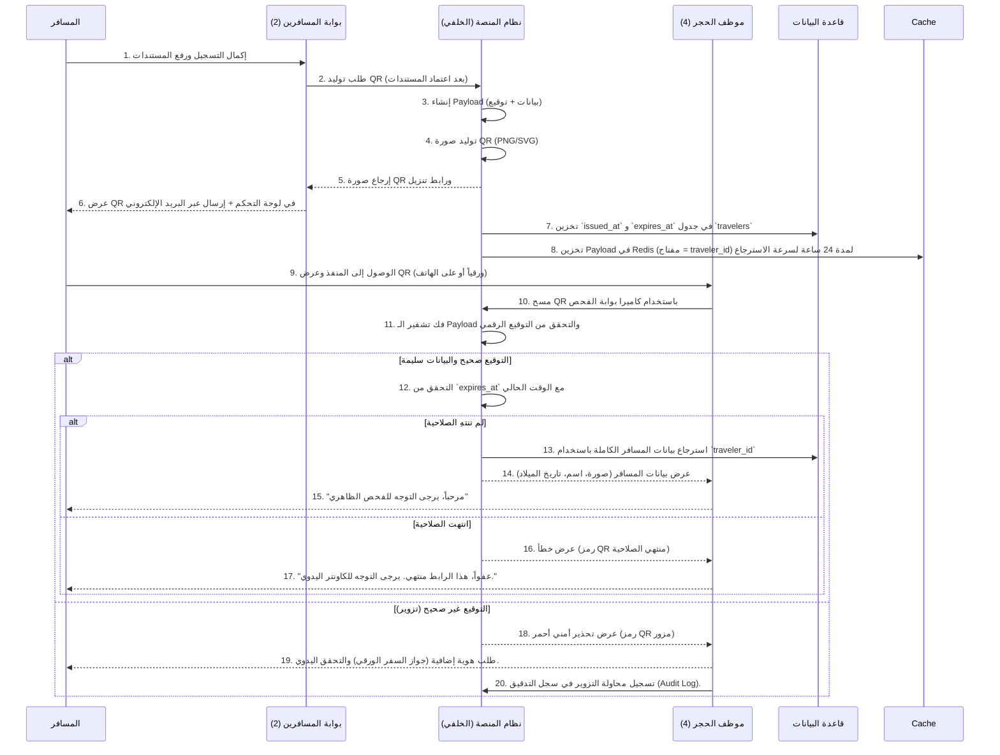

### 📄 `QR_Code_Process.md` (دورة حياة رمز QR - WF-04)

```markdown
# WF-04: دورة حياة رمز QR (QR Code Lifecycle)

## 1. الهدف
توثيق دورة حياة رمز QR المستخدم في منصة الحجر الصحي القومي، بدءاً من توليده عند إكمال المسافر للتسجيل المسبق، مروراً بعرضه ومسحه ضوئياً في المنفذ، وانتهاءً بانتهاء صلاحيته أو إلغائه. يمثل رمز QR  المفتاح الرقمي  الذي يربط المسافر بملفه الصحي في النظام.

## 2. الممثلون (Actors)
-  المسافر (Traveler) : يقوم بتنزيل أو طباعة رمز QR.
-  نظام المنصة (NQP System) : يقوم بتوليد وتشفير وإدارة رمز QR.
-  موظف الحجر الصحي (Port Officer) : يقوم بمسح رمز QR للتحقق من الهوية والبيانات.
-  موظف الجوازات (Passport Control) : (اختياري) يستطيع مسح QR للتحقق السريع.

## 3. هيكل بيانات رمز QR (QR Payload)
رمز QR ليس مجرد رقم عشوائي، بل هو  كائن JSON مشفر ومضغوط  يحتوي على بيانات أساسية وآمنة.

| الحقل | النوع | الوصف | مثال |
| :--- | :--- | :--- | :--- |

| `traveler_id` | UUID | المعرف الفريد للمسافر في قاعدة البيانات`"123e4567-e89b-12d3-a456-426614174000"` |

| `passport_hash` | String | بصمة (SHA-256) لرقم جواز السفر (للتحقق من التطابق دون تخزين الرقم في الـ QR نفسه). | `"5e884898da28047151d0e56f8dc6292773603d0d6aabbdd62a11ef721d1542d8"` |

| `issued_at` | Timestamp (ISO) | وقت إصدار رمز QR. | `"2024-07-23T10:00:00+03:00"` |

| `expires_at` | Timestamp (ISO) | وقت انتهاء صلاحية رمز QR. | `"2024-07-24T10:00:00+03:00"` |

| `signature` | String | توقيع رقمي (HMAC-SHA256) للبيانات السابقة باستخدام مفتاح سري خاص بالمنصة، لمنع التزوير. | `"a8f5f167f44f4964e6c998d..."` |

>  ملاحظة تقنية : يتم تشفير الـ Payload باستخدام `Base64URL` لتقليل حجم البيانات وضمان توافقها مع معايير QR (إصدار 2 أو 3).

## 4. سير العمل الرئيسي (Happy Path)



## 5. المسارات البديلة (Alternate Paths)

### A1. إلغاء رمز QR قبل الوصول (Revocation)
-  السيناريو : يكتشف المسافر خطأ في بياناته، أو يتم تحديث متطلبات السفر، أو يتم اكتشاف حالة إيجابية للمسافر بعد إصدار الـ QR.
-  الإجراء : يقوم المسؤول (أو نظام الترصد) بتحديث حالة المسافر إلى (`REVOKED`). 
-  التأثير : عند مسح الـ QR في المنفذ، سيعرض النظام رسالة: "تم إلغاء هذا الرمز. يرجى مراجعة الإدارة." مع ظهور سبب الإلغاء للموظف.

### A2. QR غير مقروء (Scan Failure)
-  السيناريو : ورق QR تالف، أو هاتف المسافر بطيء، أو إضاءة الكاميرا ضعيفة.
-  الإجراء : يطلب النظام من الموظف إدخال  رقم جواز السفر  يدوياً كبديل.
-  الاستمرارية : يقوم النظام بالبحث عن المسافر باستخدام رقم الجواز ويسحب بياناته بنفس الطريقة، مع إضافة علامة في السجل بأنه تم (دخول يدوي).

### A3. انتهاء صلاحية QR أثناء الرحلة (Expired during travel)
-  السيناريو : مدة صلاحية QR هي 24 ساعة فقط قبل الوصول المتوقع للرحلة. إذا تأخرت الرحلة لأكثر من 24 ساعة.
-  الإجراء : يقوم النظام تلقائياً بتمديد صلاحية QR لمدة 6 ساعات إضافية في حالة تأخر الرحلة المسجلة، ويُرسل إشعاراً للمسافر بالتمديد. إذا تجاوز التأخير 30 ساعة، يُطلب من المسافر إعادة التسجيل.

## 6. خريطة استخدام QR في المنصة

| البوابة/النظام | كيفية الاستخدام | وقت الاستخدام |
| :--- | :--- | :--- |
|  بوابة المسافرين (2)  | يتم توليده وعرضه وتنزيله. | قبل السفر (مرحلة ما قبل الوصول). |
|  بوابة موظفي الحجر (4)  | مسح ضوئي لجلب البيانات بسرعة. | لحظة الوصول إلى المنفذ. |
|  تطبيق المتابعة (Mobile)  | (مستقبلي) يمكن استخدام QR كرمز للتعافي للمرور من نقاط التفتيش الداخلية. | بعد التعافي. |
|  بوابة العيادات (5)  | (داخلي) يمكن للطبيب مسح QR من ملف المريض لفتح السجل بسرعة. | أثناء الزيارة. |

## 7. اعتبارات الأمن والخصوصية
-  مقاومة التزوير : التوقيع الرقمي يجعل من المستحيل تقريباً إنشاء QR مزور ما لم يكن المهاجم يمتلك المفتاح السري للمنصة.
-  البيانات الحساسة : لا يحتوي QR أبداً على (رقم الجواز كامل، العنوان، رقم الهاتف)؛ بل يحتوي على (معرف) فقط، ويتم استرجاع البيانات من الخادم الآمن عند المسح، مما يمنع تسرب المعلومات إذا التقط شخص آخر صورة للـ QR.
-  انتهاء الصلاحية التلقائي : يتم حذف الـ Payload من Redis فور انتهاء الصلاحية، ويتم مسح البيانات المخزنة مؤقتاً من الأجهزة بعد 5 دقائق من عرضها للموظف.

## 8. مؤشرات الأداء (KPIs) الخاصة بـ QR
-  نسبة نجاح المسح (Scan Success Rate) : يجب أن تتجاوز 98% من المحاولات.
-  متوسط زمن الاستجابة (Response Time) : من لحظة مسح QR إلى عرض بيانات المسافر على شاشة الموظف، يجب ألا يتجاوز 300 مللي ثانية (بسبب استخدام Redis Cache).
-  عدد محاولات التزوير المكتشفة : تُستخدم لتحسين خوارزميات الكشف الأمني.
```

---

